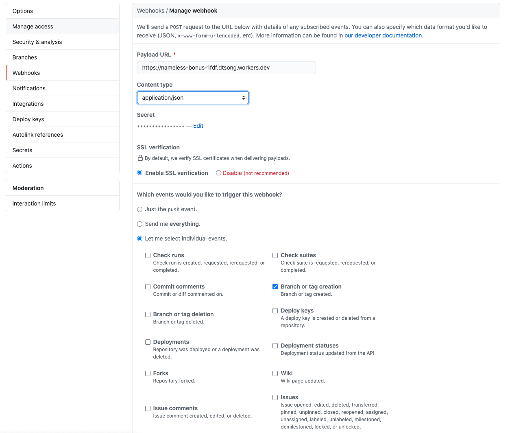

# GitHub SMS notifications using Twilio



## Overview

In this tutorial, you will learn to build an SMS notification system on Workers to receive updates on a GitHub repository. Your Worker will send you a text update using Twilio when there is new activity on your repository.

You will learn how to:

- Build webhooks using Workers.
- Integrate Workers with GitHub and Twilio.
- Use Worker secrets with Wrangler.

---

## Generate a project

Start by using `wrangler generate` to create a Worker project in the command line:
<pre class="CodeBlock CodeBlock-with-rows CodeBlock-scrolls-horizontally CodeBlock-is-light-in-light-theme CodeBlock--language-sh" language="sh">Generate a project<code>
$ wrangler generate github-twilio-notifications

$ cd github-twilio-notifications

</code></pre>

Inside of your new `github-sms-notifications` directory, `index.js` represents the entry point to your Cloudflare Workers application. You will configure this file for most of the tutorial.

You will also need a GitHub account and a repository for this tutorial. If you do not have either setup, [create a new GitHub account](https://github.com/join) and [create a new repository](https://docs.github.com/en/github/getting-started-with-github/create-a-repo) to continue with this tutorial.

First, create a webhook for your repository to post updates to your Worker. Inside of your Worker, you will then parse the updates. Finally, you will send a `POST` request to Twilio to send a text message to you.

You can reference the finished code at this [GitHub repository](https://github.com/davidtsong/github-twilio-notifications/).

---

## Configure GitHub

To start, configure a GitHub webhook to post to your Worker when there is an update to the repository:

1.  Go to your Github repository's **Settings** > **Webhooks** > **Add webhook**.

2.  Set the Payload URL to the `/webhook` path on your Worker URL. You can find your worker URL by populating [your account id in the `wrangler.toml`](/workers/get-started/guide/#6-preview-your-project) file and then [running `wrangler publish` in your command line](/workers/get-started/guide/#8-publish-your-project) to generate a live URL for your Worker.

3.  In the **Content type** dropdown, select _application/json_.

4.  In the **Secret** field, input a secret key of your choice.

5.  In **Which events would you like to trigger this webhook?**, select **Let me select individual events**. Select the events you want to get notifications for (such as **Pull requests**, **Pushes**, and **Branch or tag creation**).

6.  Select **Add webhook** to finish configuration.

---

## Parsing the response

With your local environment set up, parse the repository update with your Worker. If you experience any difficulty, refer to the finished [`index.js`](https://github.com/davidtsong/GitHub-twilio-notifications/blob/master/index.js).

Your generated `index.js` should look like this:
<pre class="CodeBlock CodeBlock-with-rows CodeBlock-scrolls-horizontally CodeBlock-is-light-in-light-theme CodeBlock--language-js" language="js">index.js<code>
addEventListener('fetch', event =&gt {

  event.respondWith(handleRequest(event.request));

});

/**

 * Respond with hello worker text

 * @param {Request} request

 */

async function handleRequest(request) {

  return new Response('Hello worker!', {

    headers: { 'content-type': 'text/plain' },

  });

}

</code></pre>

Begin by modifying the starter code to handle a `POST` response and renaming the request handler. Use the `request.method` property of [`Request`](/workers/runtime-apis/request/) to check if the request is a `POST` request, and send an error response if the request is not a `POST` request. The `simpleResponse` function is an easy wrapper for you to respond with requests using your Worker.
<pre class="CodeBlock CodeBlock-with-rows CodeBlock-scrolls-horizontally CodeBlock-is-light-in-light-theme CodeBlock--language-js" language="js">index.js<code>
function simpleResponse(statusCode, message) {

  let resp = {

    message: message,

    status: statusCode,

  };

  return new Response(JSON.stringify(resp), {

    headers: { 'Content-Type': 'application/json' },

    status: statusCode,

  });

}

addEventListener('fetch', event =&gt {

  event.respondWith(githubWebhookHandler(event.request));

});

async function githubWebhookHandler(request) {

  if (request.method !== 'POST') {

    return simpleResponse(200, 'Please send a POST request :)');

  }

}

</code></pre>

Next, validate that the request is sent with the right secret key. GitHub attaches a hash signature for [each payload using the secret key](https://developer.github.com/webhooks/securing/). Use a helper function called `checkSignature` on the request to ensure the hash is correct. Then, you can access data from the webhook by parsing the request as JSON.
<pre class="CodeBlock CodeBlock-with-rows CodeBlock-scrolls-horizontally CodeBlock-is-light-in-light-theme CodeBlock--language-js" language="js">index.js - githubWebhookHandler()<code>
async function githubWebhookHandler(request) {

  if (request.method !== 'POST') {

    return simpleResponse(200, 'Please send a POST request :)');

  }

  try {

    const formData = await request.json();

    const headers = await request.headers;

    const action = headers.get('X-GitHub-Event');

    const repo_name = formData.repository.full_name;

    const sender_name = formData.sender.login;

    if (!checkSignature(formData, headers)) {

      return simpleResponse(403, 'Wrong password, try again :P');

    }

  } catch (e) {

    return simpleResponse(200, `Error:  ${e}`);

  }

}

</code></pre>

The `checkSignature` function will use the crypto library to hash the received payload with your known secret key to ensure it matches the request hash. GitHub uses an HMAC hexdigest to compute the hash in the sha1 format.
<pre class="CodeBlock CodeBlock-with-rows CodeBlock-scrolls-horizontally CodeBlock-is-light-in-light-theme CodeBlock--language-js" language="js">index.js<code>
const crypto = require('crypto');

async function createHexSignature(requestBody) {

  let hmac = crypto.createHmac('sha1', SECRET_TOKEN);

  hmac.update(requestBody, 'utf-8');

  return hmac.digest('hex');

}

async function checkSignature(formData, headers) {

  let expectedSignature = await createHexSignature(formData);

  let actualSignature = headers.get('X-Hub-Signature');

  return expectedSignature === actualSignature;

}

</code></pre>

Since our project relies on importing a library, use [webpack](/workers/cli-wrangler/webpack/) and update your `wrangler.toml` file to set `type = "webpack"`.

Your `wrangler.toml` file should look like this:
<pre class="CodeBlock CodeBlock-with-rows CodeBlock-scrolls-horizontally CodeBlock-is-light-in-light-theme CodeBlock--language-toml" language="toml">"wrangler.toml"<code>
name = &quot;nameless-bonus-1fdf&quot;

type = &quot;webpack&quot;

account_id = &quot;xxxxxxxxx&quot;

workers_dev = true

route = &quot;&quot;

zone_id = &quot;&quot;

</code></pre>

---

## Sending a text with Twilio

You will send a text message to you about your repository activity using Twilio. You need a Twilio account and a phone number that can receive text messages. [Refer to the Twilio guide to get set up](https://www.twilio.com/sms/api). (If you are new to Twilio, they have [an interactive game](https://www.twilio.com/quest) where you can learn how to use their platform and get some free credits for beginners to the service.)

You can then create a helper function to send text messages by sending a `POST` request to the Twilio API endpoint. [Refer to the Twilio reference](https://www.twilio.com/docs/sms/api/message-resource#create-a-message-resource) to learn more about this endpoint.

Construct your headers and body in the format shown in the Twilio reference page. Change the `from` value to your Twilio phone number.
<pre class="CodeBlock CodeBlock-with-rows CodeBlock-scrolls-horizontally CodeBlock-is-light-in-light-theme CodeBlock--language-js" language="js">index.js - sendText()<code>
async function sendText(message) {

  const endpoint = 'https://api.twilio.com/2010-04-01/Accounts/' + ACCOUNT_SID + '/Messages.json';

  let encoded = new URLSearchParams();

  encoded.append('To', RECIPIENT);

  encoded.append('From', '+19388887573');

  encoded.append('Body', message);

  let token = btoa(ACCOUNT_SID + ':' + AUTH_TOKEN);

  const request = {

    body: encoded,

    method: 'POST',

    headers: {

      'Authorization': `Basic ${token}`,

      'Content-Type': 'application/x-www-form-urlencoded',

    },

  };

  let result = await fetch(endpoint, request);

  result = await result.json();

  return new Response(JSON.stringify(result), request);

}

</code></pre>

To make this work, you need to set some secrets to hide your `ACCOUNT_SID` and `AUTH_TOKEN` from the source code. You can set secrets with [`wrangler secret put`](/workers/cli-wrangler/commands/#put) in your command line.
<pre class="CodeBlock CodeBlock-with-rows CodeBlock-scrolls-horizontally CodeBlock-is-light-in-light-theme CodeBlock--language-sh" language="sh"><code>
$ wrangler secret put ACCOUNT_SID

</code></pre>

Use Wrangler to set your Twilio `ACCOUNT_SID`, `RECIPIENT`(your number), Twilio `AUTH_TOKEN`, and `SECRET_TOKEN` (for GitHub) secrets to the respective values.

Modify your `githubWebhookHandler` to send a text message using the `sendText` function you just made.
<pre class="CodeBlock CodeBlock-with-rows CodeBlock-scrolls-horizontally CodeBlock-is-light-in-light-theme CodeBlock--language-js" language="js"><code>
async function githubWebhookHandler(request) {

  if (request.method !== 'POST') {

    return simpleResponse(200, 'Please send a POST request :)');

  }

  try {

    const formData = await request.json();

    const headers = await request.headers;

    const action = headers.get('X-GitHub-Event');

    const repo_name = formData.repository.full_name;

    const sender_name = formData.sender.login;

    if (!checkSignature(formData, headers)) {

      return simpleResponse(403, 'Wrong password, try again :P');

    }

    return await sendText(`${sender_name} casted spell: ${action} onto your repo ${repo_name}`);

  } catch (e) {

    return simpleResponse(200, `Error:  ${e}`);

  }

}

</code></pre>

Run the `wrangler publish` command to deploy your Workers script:
<pre class="CodeBlock CodeBlock-with-rows CodeBlock-scrolls-horizontally CodeBlock-is-light-in-light-theme CodeBlock--language-sh" language="sh"><code>
$ wrangler publish

</code></pre>

Now when you make an update (that you configured in the GitHub **Webhook** settings) to your repository, you will get a text soon after. If you have never used git before, refer to this [quick guide](https://www.datacamp.com/community/tutorials/git-push-pull) to pushing to your repository.

You can reference the finished code [on GitHub](https://github.com/davidtsong/github-twilio-notifications/).

By completing this tutorial, you have learned how to build webhooks using Workers, integrate Workers with GitHub and Twilio, and use Worker secrets with Wrangler.

## Related resources

- [Authorize users with Auth0](/workers/tutorials/authorize-users-with-auth0/)
- [Build a JAMStack app](/workers/tutorials/build-a-jamstack-app/)
- [Build a QR code generator](/workers/tutorials/build-a-qr-code-generator/)
