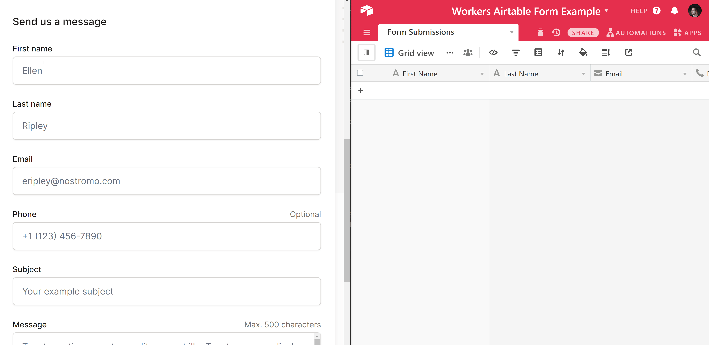
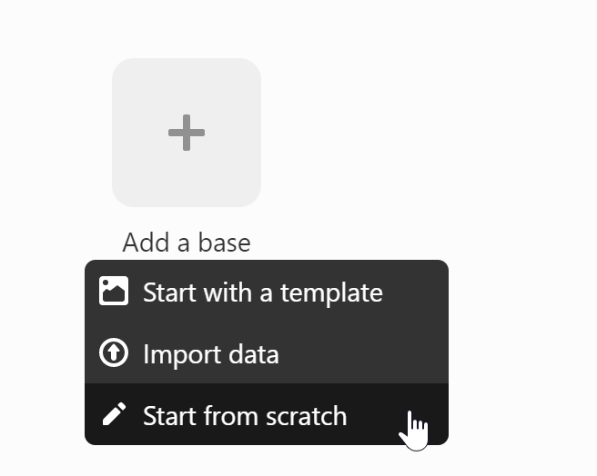
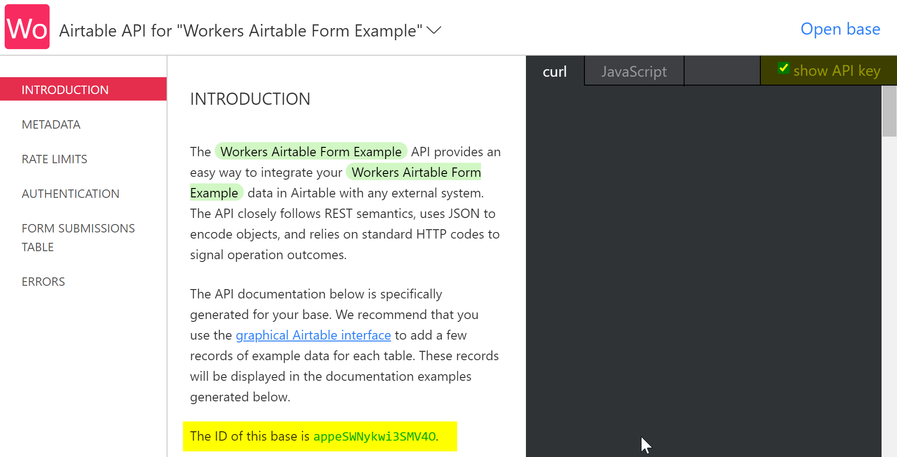
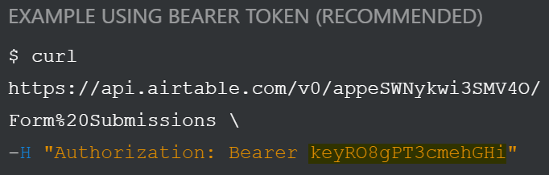

# Handle form submissions with Airtable



## Overview

Cloudflare Workers excels as a performant serverless functions platform. This makes it a great fit for handling form submissions from your front-end applications, particularly when you need to send those submissions to an external API or database.

In this tutorial, you will use Workers and [Airtable](https://airtable.com) to persist form submissions from a front-end user interface. Airtable is a great, free-to-use spreadsheet solution that has an approachable API for developers. Workers will handle incoming form submissions and use Airtable's [REST API](https://airtable.com/api) to asynchronously persist the data in an Airtable base (Airtable's term for a spreadsheet) for later reference.



[The source for this project can be found on GitHub](https://github.com/cloudflare/workers-airtable-form). Note that this codebase includes both a front-end component (built with [React](https://reactjs.org) and [Tailwind CSS](https://tailwindcss.com)) and a serverless function for handling the interaction with Airtable.

[The front-end portion of this site](https://airtable-form-example.pages.dev) does not require any specific React experience. It uses a basic HTML5 form, showing that you can use Workers to handle any kind of form, whether entirely in HTML, or client-side, JavaScript-heavy forms, such as with React or other front-end frameworks.

## Create a form

For this tutorial, you will be building a contact form. You can customize the fields, but the form this tutorial references will collect a first name, last name, email address, phone number, subject, and a message.

If this is your first time building a form and you would like to follow a tutorial to create a form with Cloudflare Pages, refer to the [HTML forms](/pages/tutorials/forms) Pages tutorial. Then continue with [Create a serverless function](/workers/tutorials/handle-form-submissions-with-airtable/).

The simplified HTML markup for this form:

```html
<form action="https://workers-airtable-form.signalnerve.workers.dev/submit" method="POST">
  <div>
    <label for="first_name">First name</label>
    <input type="text" name="first_name" id="first_name" autocomplete="given-name" placeholder="Ellen" required />
  </div>

  <div>
    <label for="last_name">Last name</label>
    <input type="text" name="last_name" id="last_name" autocomplete="family-name" placeholder="Ripley" required />
  </div>

  <div>
    <label for="email">Email</label>
      <input id="email" name="email" type="email" autocomplete="email" placeholder="eripley@nostromo.com" required />
    </div>
  </div>

  <div>
    <label for="phone">
      Phone
      <span>Optional</span>
    </label>
    <input type="text" name="phone" id="phone" autocomplete="tel" placeholder="+1 (123) 456-7890" />
  </div>

  <div>
    <label for="subject">Subject</label>
    <input type="text" name="subject" id="subject" placeholder="Your example subject" required />
  </div>

  <div>
    <label for="message">
      Message
      <span>Max 500 characters</span>
    </label>
    <textarea id="message" name="message" rows="4" placeholder="Tenetur optio quaerat expedita vero et illo. Tenetur nam explicabo dolor voluptatem eveniet. Commodi est beatae id voluptatum porro laudantium. Quam placeat accusamus vel officiis vel. Et perferendis dicta ut perspiciatis quos iste. Tempore autem molestias voluptates in sapiente enim doloremque." required></textarea>
  </div>

  <div>
    <button type="submit">
      Submit
    </button>
  </div>
</form>
```

For example, if you fill in the `first_name` input with the text `"Hello"`, submitting the `<form>` via the Submit button will submit data to the `/new_submission` URL with the `first_name=Hello` request payload.

The `<form>` used in the example front-end UI builds on these basics, adding some CSS classes via Tailwind CSS, and adding the fields needed for a Contact-style form: First name, Last name, Email, Phone, Subject, and Message.


The code for this form can be [found on GitHub](https://github.com/cloudflare/workers-airtable-form/blob/main/frontend/src/Form.js). Of particular note is the `form` action, which has a placeholder for your serverless function URL, and the `method` attribute, which tells the form to submit information using the [HTTP `POST`](https://developer.mozilla.org/en-US/docs/Web/HTTP/Methods/POST) method.

Code is provided as an example below, including the first `<input>`, to show that the `name` is set to the value `first_name`, as well as the standard `button` with `type="submit"`:

```html
<form action="SERVERLESS_FN_URL" method="POST" class="...">
  <div>
    <label for="first_name" class="..."> First name </label>
    <div class="...">
      <input
        type="text"
        name="first_name"
        id="first_name"
        autocomplete="given-name"
        placeholder="Ellen"
        required
        class="..."
      />
    </div>
  </div>

  <!-- Rest of form -->

  <button type="submit" class="...">Submit</button>
</form>
```

If you would like to follow along with this example, you can directly copy the `<form>` code from the [`Form` component](https://github.com/cloudflare/workers-airtable-form/blob/main/frontend/src/Form.js) into your own project, or use the codebase and plug in your own serverless function, following the next section in the tutorial.

## Create a serverless function

To handle the form submission, you will create and deploy a Workers serverless function that parses the incoming form data and prepares it for submission to Airtable.

To begin, use Wrangler to create a new function, called `airtable-form-handler`, and navigate to it in your terminal:

```sh
---
header: Creating a new Workers function
---
$ wrangler init airtable-form-handler
$ cd airtable-form-handler
```



If you have chosen to work with the [sample codebase on GitHub](https://github.com/cloudflare/workers-airtable-form), you can find a sample function in the `worker` directory.



In the `wrangler.toml` file of your project's directory, add your Cloudflare account ID. [Refer to the Get started guide](/workers/get-started/guide#7-configure-your-project-for-deployment) to find your Cloudflare account ID.

```toml
---
filename: wrangler.toml
highlight: [4]
---
name = "airtable-form-handler"
type = "javascript"

account_id = "yourAccountId"
```

## Configure an Airtable base

When your serverless function is completed, it will send data up to an Airtable base via Airtable's REST API.

If you do not have an Airtable account, create one (the free plan is sufficient to complete this tutorial). In Airtable's dashboard, create a new base by selecting **Start from scratch**:



After you have created a new base, you can set it up for use with the front-end form. Delete the existing columns, and create six columns, with the following field types:

| Field name   | Airtable field type |
| ------------ | ------------------- |
| First Name   | "Single line text"  |
| Last Name    | "Single line text"  |
| Email        | "Email"             |
| Phone Number | "Phone number"      |
| Subject      | "Single line text"  |
| Message      | "Long text"         |

The completed fields should look like the below screenshot in the Airtable UI. Note that the field names are case-sensitive: if you change them to anything else, you will need to exactly match your new field names in the API request you make to Airtable later in the tutorial.


Finally, give your base's table a name. Right-click the table name at the top left of the screen (it will likely have a name like Table 1) and give it a more descriptive name, like Form Submissions.


With your new Airtable base set up, you can copy the values from Airtable's UI that you need to make API requests.

Refer to [Airtable's API page](https://airtable.com/api) and select your new base. In the API documentation page, find your **Airtable base ID** (the highlighted text in the below screenshot). You can also check the **Show API key** checkbox in the top right of the window, to easily access your Airtable API key from the same page.



Further down the page, you will begin to see example requests, showing you how to authenticate with the Airtable API externally, by providing an `Authorization` header in the format `Bearer $API_KEY`. The key after `Bearer` is your Airtable API key — make sure to keep it a secret.



To make this API key available in your codebase, use the [`wrangler secret`](/workers/wrangler/cli-wrangler/commands/#secret) command. The `secret` command encrypts and stores environment variables for use in your function, without revealing them to users.

Run `wrangler secret put`, passing `AIRTABLE_API_KEY` as the name of your secret:

```sh
---
header: Setting the AIRTABLE_API_KEY secret with Wrangler
---
$ wrangler secret put AIRTABLE_API_KEY
Enter the secret text you would like assigned to the variable AIRTABLE_API_KEY on the script named airtable-form-handler:
******
🌀  Creating the secret for script name airtable-form-handler
✨  Success! Uploaded secret AIRTABLE_API_KEY.
```

Before you continue, review the keys that you should have from Airtable:

1.  **Airtable Table Name:** the name for your table, like Form Submissions.
2.  **Airtable Base ID:** the alphanumeric base ID found at the top of your base's API page.
3.  **Airtable API Key:** the private API key found in example API requests on the Airtable API documentation page.

## Submit data to Airtable

With your Airtable base set up, and the keys and IDs you need to communicate with the API ready, you will now set up your Workers function and persist data from your form into Airtable.

In `index.js`, begin by setting up a simple Workers handler that can respond to requests. When the URL requested has a pathname of `/submit`, you will handle a new form submission, otherwise, you will redirect to `FORM_URL`, a constant representing your front-end form URL (for example, [airtable-form-example.pages.dev](https://airtable-form-example.pages.dev)):

```js
---
filename: index.js
---
addEventListener('fetch', event => {
  event.respondWith(handleRequest(event.request))
})

const FORM_URL = "https://airtable-form-example.pages.dev"

async function handleRequest(request) {
  const url = new URL(request.url)

  if (url.pathname === "/submit") {
    return submitHandler(request)
  }

  return Response.redirect(FORM_URL)
}
```

The `submitHandler` has two functions. First, it will parse the form data coming from your HTML5 form. Once the data is parsed, use the Airtable API to persist a new row (a new form submission) to your table:

```js
---
filename: index.js
---
const submitHandler = async request => {
  if (request.method !== "POST") {
    return new Response("Method Not Allowed", {
      status: 405
    })
  }

  const body = await request.formData();

  const {
    first_name,
    last_name,
    email,
    phone,
    subject,
    message
  } = Object.fromEntries(body)

  // The keys in "fields" are case-sensitive, and
  // should exactly match the field names you set up
  // in your Airtable table, such as "First Name".
  const reqBody = {
    fields: {
      "First Name": first_name,
      "Last Name": last_name,
      "Email": email,
      "Phone Number": phone,
      "Subject": subject,
      "Message": message
    }
  }

  await createAirtableRecord(reqBody)
  return Response.redirect(FORM_URL)
}
```

While the majority of this function is concerned with parsing the request body (the data being sent as part of the request), there are two important things to note. First, if the HTTP method sent to this function is not `POST`, you will return a new response with the status code of [`405 Method Not Allowed`](https://httpstatuses.com/405).

The variable `reqBody` represents a collection of fields, which are key-value pairs for each column in your Airtable table. By formatting `reqBody` as an object with a collection of fields, you are creating a new record in your table with a value for each field.

After you call `createAirtableRecord` (the function you will define next), you will redirect the client back to `FORM_URL`. This function can be changed, for example, to redirect to a Thank You page, or something similar.

The `createAirtableRecord` function accepts a `body` parameter, which conforms to the Airtable API's required format — namely, a JavaScript object containing key-value pairs under `fields`, representing a single record to be created on your table:

```js
---
filename: index.js
---
const createAirtableRecord = body => {
  return fetch(`https://api.airtable.com/v0/${AIRTABLE_BASE_ID}/${encodeURIComponent(AIRTABLE_TABLE_NAME)}`, {
    method: 'POST',
    body: JSON.stringify(body),
    headers: {
      Authorization: `Bearer ${AIRTABLE_API_KEY}`,
      'Content-type': `application/json`
    }
  })
}
```

To make an authenticated request to Airtable, you need to provide three constants that represent data about your Airtable account, base, and table name. You have already set `AIRTABLE_API_KEY` using `wrangler secret`, since it is a value that should be encrypted. The **Airtable base ID** and **table name** are values that can be publicly shared in places like GitHub. Use Wrangler's [`vars`](/workers/wrangler/cli-wrangler/configuration/#vars) feature to pass public environment variables from your `wrangler.toml` file.

Add a `vars` table at the end of your `wrangler.toml` file:

```toml
---
filename: wrangler.toml
highlight: [7]
---
name = "workers-airtable-form"
type = "javascript"

account_id = "yourAccountId"
workers_dev = true

[vars]
AIRTABLE_BASE_ID = "exampleBaseId"
AIRTABLE_TABLE_NAME = "Form Submissions"
```

With all these fields submitted, it is time to deploy your Workers serverless function and get your form communicating with it. First, publish your function:

```sh
---
header: Publishing the serverless function
---
$ wrangler publish
✨  Built successfully, built project size is 10 KiB.
✨  Successfully published your script to
 https://workers-airtable-form.cloudflare.workers.dev
```

You will notice that your function is deployed to a unique URL — for example, `https://workers-airtable-form.cloudflare.workers.dev`. This represents the first part of your front-end form's `action` attribute — the second part is the path for your form handler, which is `/submit`. In your front-end UI, configure your `form` tag as seen below:

```html
<form
  action="https://workers-airtable-form.cloudflare.workers.dev/submit"
  method="POST"
  class="..."
>
  <!-- The rest of your HTML form -->
</form>
```

After you have deployed your new form (refer to the [HTML forms](/pages/tutorials/forms) tutorial if you need help creating a form), you should be able to submit a new form submission and see the value show up immediately in Airtable:


## Conclusion

With this tutorial completed, you have created a Workers serverless function that can accept form submissions and persist them to Airtable. You have learned how to parse form data, set up environment variables, and use the `fetch` API to make requests to external services outside of your Workers function.

You can find the source for this project — both the front-end UI and the serverless function that communicates with Airtable — [on GitHub](https://github.com/cloudflare/workers-airtable-form).

## Related resources

- [Build a Slackbot](/workers/tutorials/build-a-slackbot)
- [Build a To-Do List Jamstack App](/workers/tutorials/build-a-jamstack-app)
- [Build a blog using Nuxt.js and Sanity.io on Cloudflare Pages](/pages/tutorials/build-a-blog-using-nuxt-and-sanity)
- [James Quick's video on building a Cloudflare Workers + Airtable integration](https://www.youtube.com/watch?v=tFQ2kbiu1K4)
