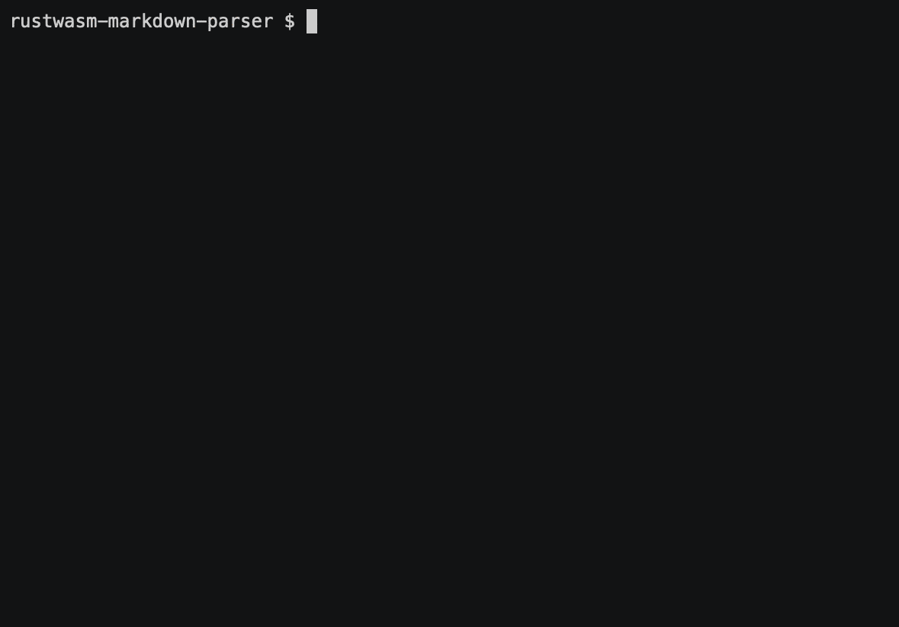

# Hello World in Rust

In this tutorial, you will learn how to generate, build, preview, configure, and publish a Rust-generated WebAssembly serverless function that parses Markdown for Cloudflare Workers.



## Generate

Cloudflare's command-line tool for managing Workers projects, [Wrangler](https://github.com/cloudflare/wrangler), supports various templates — pre-built collections of code that make it easy to get started writing Workers. You will use the [rustwasm-worker template](https://github.com/cloudflare/rustwasm-worker-template/) to start building your project.

In the command line, generate your Workers project by passing in a project name and the template URL to base your project on:
<pre class="CodeBlock CodeBlock-with-rows CodeBlock-scrolls-horizontally CodeBlock-is-light-in-light-theme CodeBlock--language-sh" language="sh"><code>
~ $ wrangler generate rustwasm-markdown-parser https://github.com/cloudflare/rustwasm-worker-template/

</code></pre>

This command creates a directory called `rustwasm-markdown-parser` which you can now `cd` into.

Wrangler templates are git repositories. If you want to create your own templates, or use one from the [Template Gallery](/workers/examples/), there is a variety of options to help you get started.

## Workers Playground

You can test how your Workers function will execute when it is deployed by using the [`dev` command](/workers/cli-wrangler/commands/#dev):
<pre class="CodeBlock CodeBlock-with-rows CodeBlock-scrolls-horizontally CodeBlock-is-light-in-light-theme CodeBlock--language-sh" language="sh"><code>
rustwasm-markdown-parser $ wrangler dev

</code></pre>

Using the `dev` command will establish a connection between localhost and an edge server that operates your Worker in development.

## Building

Begin building your project by pulling in a dependency from the `crates.io` ecosystem called `pulldown-cmark`.
Add the following content to your `Cargo.toml` file:
<pre class="CodeBlock CodeBlock-with-rows CodeBlock-scrolls-horizontally CodeBlock-is-light-in-light-theme CodeBlock--language-toml" language="toml"><code>
## Cargo.toml

[dependencies]

pulldown-cmark = &quot;0.4.0&quot;

</code></pre>

Use the code in the `string-to-string` example from the `pulldown-cmark` GitHub repository. Change your `src/lib.rs` to look like this:
<pre class="CodeBlock CodeBlock-with-rows CodeBlock-scrolls-horizontally CodeBlock-is-light-in-light-theme CodeBlock--language-rust" language="rust">src/lib.rs<code>
mod utils;

use cfg_if::cfg_if;

use wasm_bindgen::prelude::*;

use pulldown_cmark::{Parser, Options, html};

cfg_if! {

    // When the `wee_alloc` feature is enabled, use `wee_alloc` as the global

    // allocator.

    if #[cfg(feature = &quot;wee_alloc&quot;)] {

        extern crate wee_alloc;

        #[global_allocator]

        static ALLOC: wee_alloc::WeeAlloc = wee_alloc::WeeAlloc::INIT;

    }

}

#[wasm_bindgen]

pub fn parse() -&gt String {

    let markdown_input: &amp;str = &quot;Hello world, this is a ~~complicated~~ *very simple* example.&quot;;

    println!(&quot;Parsing the following Markdown string:\n{}&quot;, markdown_input);

    // Set up options and parser. Strikethroughs are not part of the CommonMark standard

    // and we therefore must enable it explicitly.

    let mut options = Options::empty();

    options.insert(Options::ENABLE_STRIKETHROUGH);

    let parser = Parser::new_ext(markdown_input, options);

    // Write to String buffer.

    let mut html_output: String = String::with_capacity(markdown_input.len() * 3 / 2);

    html::push_html(&amp;mut html_output, parser);

    // Check that the output is what you expected.

    let expected_html: &amp;str = &quot;&ltp&gtHello world, this is a &ltdel&gtcomplicated&lt/del&gt &ltem&gtvery simple&lt/em&gt example.&lt/p&gt\n&quot;;

    assert_eq!(expected_html, &amp;html_output);

    format!(&quot;\nHTML output:\n{}&quot;, &amp;html_output)

}

</code></pre>

Update your `worker/worker.js` to use the new code:
<pre class="CodeBlock CodeBlock-with-rows CodeBlock-scrolls-horizontally CodeBlock-is-light-in-light-theme CodeBlock--language-js" language="js"><code>
addEventListener('fetch', event =&gt {

  event.respondWith(handleRequest(event.request));

});

const { parse } = wasm_bindgen;

const instance = wasm_bindgen(wasm);

/**

 * Fetch and log a request

 * @param {Request} request

 */

async function handleRequest(request) {

  await instance;

  const output = parse();

  let res = new Response(output, { status: 200 });

  res.headers.set('Content-type', 'text/html');

  return res;

}

</code></pre>

If `wrangler dev` is running, you will see the output of your Rust program in your browser a few seconds after you save it in your editor. Wrangler watches your project for changes then compiles your Rust to WebAssembly and outputs compiler errors.

## Publish

You have completed writing a Cloudflare Workers function with Rust-generated Wasm.

Wrangler has built-in support for bundling, uploading, and releasing your Cloudflare Workers application. To do this, run `wrangler publish`, which will build and publish your code:

## Related resources

In this tutorial, you built and published a Rust-generated WebAssembly serverless function that parses Markdown. If you would like to review the full source code for this application, you can find it [on GitHub](https://github.com/granjef3/rustwasm-markdown-parser).

If you enjoyed this tutorial, below you can find other tutorials for building on Cloudflare Workers:

- [Authorize users with Auth0](/workers/tutorials/authorize-users-with-auth0/)
- [Build a JAMStack app](/workers/tutorials/build-a-jamstack-app/)
- [Build a QR code generator](/workers/tutorials/build-a-qr-code-generator/)

If you want to get started building your own projects, review the existing list of [Quickstart templates](/workers/get-started/quickstarts/).
