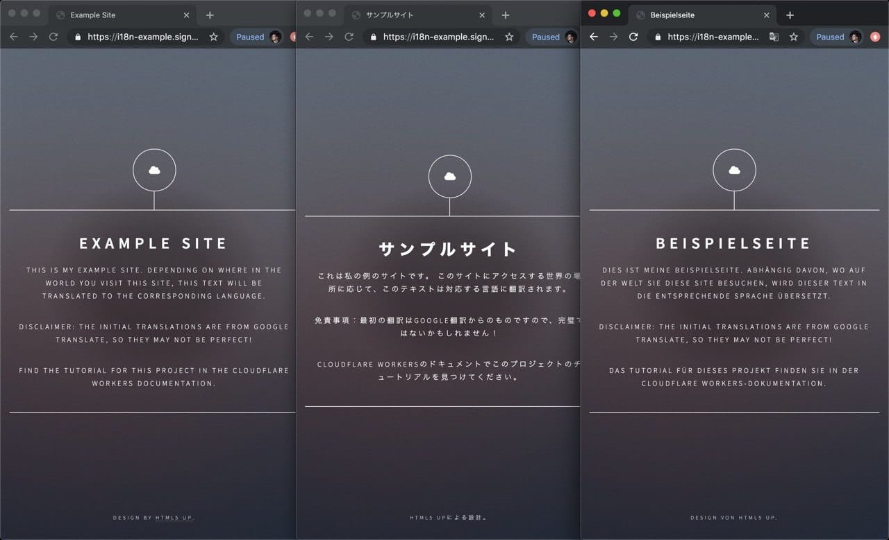
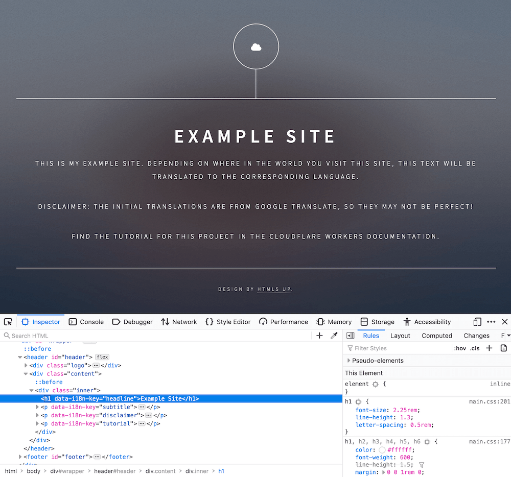

# Localize a website with HTMLRewriter



## Overview

The [`HTMLRewriter`](/workers/runtime-apis/html-rewriter/) class built into the Cloudflare Workers runtime allows for parsing and rewriting of HTML at the Cloudflare edge. This gives developers the ability to efficiently and transparently customize their Workers applications.

In this tutorial, you will build an example internationalization and localization engine (commonly referred to as **i18n** and **l10n**) for your application, serve the content of your site, and automatically translate the content based your visitors’ location in the world.

## Setup

This tutorial is designed to use an existing website. To simplify this process, you will use a free HTML5 template from [HTML5 UP](https://html5up.net). With this website as the base, you will use the `HTMLRewriter` functionality in the Workers platform to overlay an i18n layer, automatically translating the site based on the user’s language.

If you would like to deploy your own version of the site, you can find the source [on GitHub](https://github.com/signalnerve/i18n-example-workers). Instructions on how to deploy this application can be found in the project’s README.

## Generate a project

To generate a new project, use `wrangler generate --site` to create a new application, calling it `i18n-example`:
<pre class="CodeBlock CodeBlock-with-rows CodeBlock-scrolls-horizontally CodeBlock-is-light-in-light-theme CodeBlock--language-sh" language="sh"><code>
~/ $ wrangler generate i18n-example --site

~/ $ cd i18n-example

~/i18n-example $
</code></pre>

The `--site` flag tells Wrangler that you want to build a [Workers Sites](/workers/platform/sites/) project. This means that there will be both a Workers script and a static site component, which includes any HTML and page assets that you want to serve to the user. Inside the Worker, you can customize the HTML response using `HTMLRewriter`.

The newly generated `i18n-example` project will contain two folders: `public`, which is your static HTML, and `workers-site`:
<pre class="CodeBlock CodeBlock-with-rows CodeBlock-scrolls-horizontally CodeBlock-is-light-in-light-theme CodeBlock--language-sh" language="sh"><code>
$ ~/i18n-example

ls

public workers-site wrangler.toml
</code></pre>

Inside of the `public` directory, replace the default generated HTML code with the HTML5 UP template seen in the demo screenshot: download a [release](https://github.com/signalnerve/i18n-example-workers/archive/v1.0.zip) (ZIP file) of the code for this project and copy the `public` folder to your own project to get started.

With the static HTML for this project updated, you can focus on the Workers script inside of the `workers-site` folder, at `index.js`.

## Understanding `data-i18n-key`

The `HTMLRewriter` class provided in the Workers runtime allows developers to parse HTML and write simple JavaScript to query and transform every element of the page.

The example website in this tutorial is a basic single-page HTML project that lives in the `public` directory. It includes an `h1` element with the text `Example Site` and a number of `p` elements with different text:

What is unique about this page is the addition of [data attributes](https://developer.mozilla.org/en-US/docs/Learn/HTML/Howto/Use_data_attributes) in the HTML – custom attributes defined on a number of elements on this page. The `data-i18n-key` on the `h1` tag on this page, as well as many of the `p` tags, indicates that there is a corresponding internationalization key, which should be used to look up a translation for this text:
<pre class="CodeBlock CodeBlock-with-rows CodeBlock-scrolls-horizontally CodeBlock-is-light-in-light-theme CodeBlock--language-html" language="html">public/index.html<code>
&lt!-- source clipped from i18n-example site --&gt

&ltdiv class=&quot;inner&quot;&gt

  &lth1 data-i18n-key=&quot;headline&quot;&gtExample Site&lt/h1&gt

  &ltp data-i18n-key=&quot;subtitle&quot;&gtThis is my example site. Depending o...&lt/p&gt

  &ltp data-i18n-key=&quot;disclaimer&quot;&gtDisclaimer: the initial translations...&lt/p&gt

&lt/div&gt

</code></pre>

Using `HTMLRewriter`, you will parse the HTML within the `./public/index.html` page. When a `data-i18n-key` attribute is found, you should use the attribute's value to retrieve a matching translation from the `strings` object. With `HTMLRewriter`, it is easy to query elements to accomplish tasks like finding a data attribute. However, as the name suggests, you can also rewrite elements by taking a translated string and directly inserting it into the HTML.

Another feature of this project is based on the `Accept-Language` header, which exists on incoming requests. You can set the translation language per request, allowing users from around the world to see a locally relevant and translated page.

## Using the HTML Rewriter API

Begin with the `workers-site/index.js` file. Your Workers application in this tutorial will live entirely in this file.

Inside of this file, the default code for running a [Workers Site](/workers/platform/sites/) has been provided. The crucial part of the generated code lives in the `handleEvent` function. The `getAssetFromKV` function retrieves a website asset uploaded from your local `./public` folder, makes it live on Workers KV, and returns it to the user. For now, ignore `getAssetFromKV` (though if you would like to learn more, refer to [the documentation](/workers/platform/sites/start-from-worker/).

To implement translations on the site, take the HTML response retrieved from KV and pass it into a new instance of `HTMLRewriter`. When instantiating `HTMLRewriter`, you can attach handlers using the `on` function. For this tutorial, you will use the `[data-i18n-key]` selector (refer to the [HTMLRewriter documentation](/workers/runtime-apis/html-rewriter/) for more advanced usage) to locate all elements with the `data-i18n-key` attribute, which means that they must be translated. Any matching element will be passed to an instance of your `ElementHandler` class, which will contain the translation logic. With the created instance of `HTMLRewriter`, the `transform` function takes a `response` and can be returned to the client:
<pre class="CodeBlock CodeBlock-with-rows CodeBlock-scrolls-horizontally CodeBlock-is-light-in-light-theme CodeBlock--language-js" language="js">workers-site/index.js<code>
async function handleEvent(event) {

  const response = await getAssetFromKV(event);

  return new HTMLRewriter().on('[data-i18n-key]', new ElementHandler()).transform(response);

}

</code></pre>

## Transforming HTML

Your `ElementHandler` will receive every element parsed by the `HTMLRewriter` instance, and due to the expressive API, it is easy to query each incoming element for information.

In [How it works](#understanding-data-i18n-key), the documentation describes `data-i18n-key`, a custom data attribute that could be used to find a corresponding translated string for the website’s user interface. In `ElementHandler`, you can define an `element` function, which will be called as each element is parsed. Inside of the `element` function, you can query for the custom data attribute using `getAttribute`:
<pre class="CodeBlock CodeBlock-with-rows CodeBlock-scrolls-horizontally CodeBlock-is-light-in-light-theme CodeBlock--language-js" language="js">workers-site/index.js<code>
class ElementHandler {

  element(element) {

    const i18nKey = element.getAttribute('data-i18n-key');

  }

}

</code></pre>

With `i18nKey` defined, you can use it to search for a corresponding translated string. You will now set up a `strings` object with key-value pairs corresponding to the `data-i18n-key` value. For now, you will define a single example string, `headline`, with a German `string`, `"Beispielseite"` (`"Example Site"`), and retrieve it in the `element` function:
<pre class="CodeBlock CodeBlock-with-rows CodeBlock-scrolls-horizontally CodeBlock-is-light-in-light-theme CodeBlock--language-js" language="js">workers-site/index.js<code>
const strings = {

  headline: 'Beispielseite',

};

class ElementHandler {

  element(element) {

    const i18nKey = element.getAttribute('data-i18n-key');

    const string = strings[i18nKey];

  }

}

</code></pre>

Take your translated `string` and insert it into the original element, using the `setInnerContent` function:
<pre class="CodeBlock CodeBlock-with-rows CodeBlock-scrolls-horizontally CodeBlock-is-light-in-light-theme CodeBlock--language-js" language="js">workers-site/index.js<code>
const strings = {

  headline: 'Beispielseite',

};

class ElementHandler {

  element(element) {

    const i18nKey = element.getAttribute('data-i18n-key');

    const string = strings[i18nKey];

    if (string) {

      element.setInnerContent(string);

    }

  }

}

</code></pre>

To review that everything looks as expected, use the preview functionality built into Wrangler. Call [`wrangler dev`](/workers/cli-wrangler/commands/#dev) to open up a live preview of your project. `wrangler dev` is refreshed after every code change that you make.

You can expand on this simple translation functionality to provide country-specific translations, based on the incoming request’s `Accept-Language` header. By taking this header, parsing it, and passing the parsed language into your `ElementHandler`, you can retrieve a translated string in your user’s home language, provided that it is defined in `strings`.

To implement this:

1.  Update the `strings` object, adding a second layer of key-value pairs and allowing strings to be looked up in the format `strings[country][key]`.
2.  Pass a `countryStrings` object into our `ElementHandler`, so that it can be used during the parsing process.
3.  Grab the `Accept-Language` header from an incoming request, parse it, and pass the parsed language to `ElementHandler`.

To parse the `Accept-Language` header, install the [`accept-language-parser`](https://www.npmjs.com/package/accept-language-parser) NPM package:
<pre class="CodeBlock CodeBlock-with-rows CodeBlock-scrolls-horizontally CodeBlock--language-sh" language="sh"><code>
~/i18n-example $ npm i accept-language-parser

</code></pre>

Once imported into your code, use the package to parse the most relevant language for a client based on `Accept-Language` header, and pass it to `ElementHandler`. Your final code for the project, with an included sample translation for Germany (using Google Translate) looks like this:
<pre class="CodeBlock CodeBlock-with-rows CodeBlock-scrolls-horizontally CodeBlock-is-light-in-light-theme CodeBlock--language-js" language="js">workers-site/index.js<code>
import { getAssetFromKV, defaultKeyModifier } from '@cloudflare/kv-asset-handler';

import parser from 'accept-language-parser';

const DEBUG = false;

addEventListener('fetch', event =&gt {

  event.respondWith(handleEvent(event));

});

const strings = {

  de: {

    title: 'Beispielseite',

    headline: 'Beispielseite',

    subtitle:

      'Dies ist meine Beispielseite. Abhängig davon, wo auf der Welt Sie diese Site besuchen, wird dieser Text in die entsprechende Sprache übersetzt.',

    disclaimer:

      'Haftungsausschluss: Die anfänglichen Übersetzungen stammen von Google Translate, daher sind sie möglicherweise nicht perfekt!',

    tutorial: 'Das Tutorial für dieses Projekt finden Sie in der Cloudflare Workers-Dokumentation.',

    copyright: 'Design von HTML5 UP.',

  },

};

class ElementHandler {

  constructor(countryStrings) {

    this.countryStrings = countryStrings;

  }

  element(element) {

    const i18nKey = element.getAttribute('data-i18n-key');

    if (i18nKey) {

      const translation = this.countryStrings[i18nKey];

      if (translation) {

        element.setInnerContent(translation);

      }

    }

  }

}

async function handleEvent(event) {

  const url = new URL(event.request.url);

  try {

    let options = {};

    if (DEBUG) {

      options = {

        cacheControl: {

          bypassCache: true,

        },

      };

    }

    const languageHeader = event.request.headers.get('Accept-Language');

    const language = parser.pick(['de'], languageHeader);

    const countryStrings = strings[language] || {};

    const response = await getAssetFromKV(event, options);

    return new HTMLRewriter()

      .on('[data-i18n-key]', new ElementHandler(countryStrings))

      .transform(response);

  } catch (e) {

    if (DEBUG) {

      return new Response(e.message || e.toString(), {

        status: 404,

      });

    } else {

      return new Response(`&quot;${defaultKeyModifier(url.pathname)}&quot; not found`, {

        status: 404,

      });

    }

  }

}

</code></pre>

## Publish

Your i18n tool built on Cloudflare Workers is complete and it is time to deploy it to your domain.

To deploy your `*.workers.dev` subdomain, you need to configure the `wrangler.toml` configuration file in your project. First, add your Cloudflare [account ID](/workers/get-started/guide/#6a-obtaining-your-account-id-and-zone-id). Set this ID at the top part of your project’s `wrangler.toml` file:
<pre class="CodeBlock CodeBlock-with-rows CodeBlock-scrolls-horizontally CodeBlock-is-light-in-light-theme CodeBlock--language-toml" language="toml">wrangler.toml<code>
name = &quot;i18n-example&quot;

account_id = &quot;6de123..&quot;

workers_dot_dev = true

</code></pre>

The `[site]` section at the bottom of your `wrangler.toml` file tells Wrangler how to deploy your Workers Site. The `bucket` key tells Wrangler where to find your static assets: by default set to the `public` folder, where you placed your HTML code at the beginning of this tutorial. The `entry-point` key indicates where your Workers script is located and, like `bucket`, the default of `workers-site` should already be correctly configured for your application.

The final version of your project’s `wrangler.toml` file should look like:
<pre class="CodeBlock CodeBlock-with-rows CodeBlock-scrolls-horizontally CodeBlock-is-light-in-light-theme CodeBlock--language-toml" language="toml">wrangler.toml<code>
name = &quot;i18n-example&quot;

type = &quot;webpack&quot;

account_id = &quot;6de123..&quot;

workers_dot_dev = true

[site]

bucket = &quot;./public&quot;

entry-point = &quot;workers-site&quot;

</code></pre>

Using `wrangler`, publish to Cloudflare’s network, using the `publish` command:
<pre class="CodeBlock CodeBlock-with-rows CodeBlock-scrolls-horizontally CodeBlock--language-sh" language="sh"><code>
~/i18n-example $ wrangler publish

</code></pre>

## Related resources

In this tutorial, you built and published an i18n tool using `HTMLRewriter`. To review the full source code for this application, refer to the [repository on GitHub](https://github.com/signalnerve/i18n-example-workers).

If you want to get started building your own projects, review the existing list of [Quickstart templates](/workers/get-started/quickstarts/).
