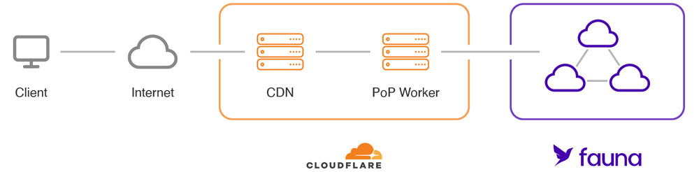
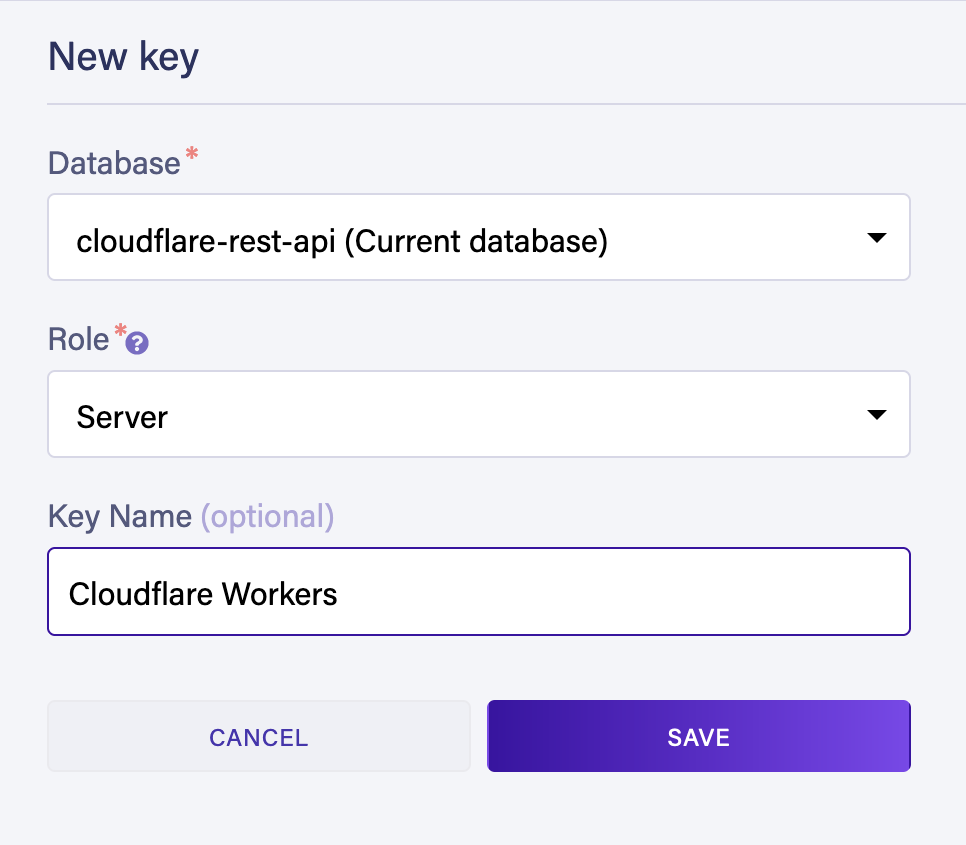
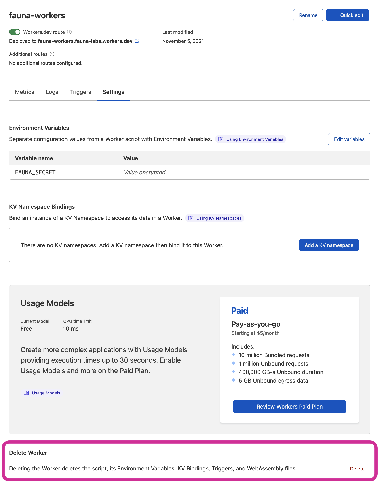
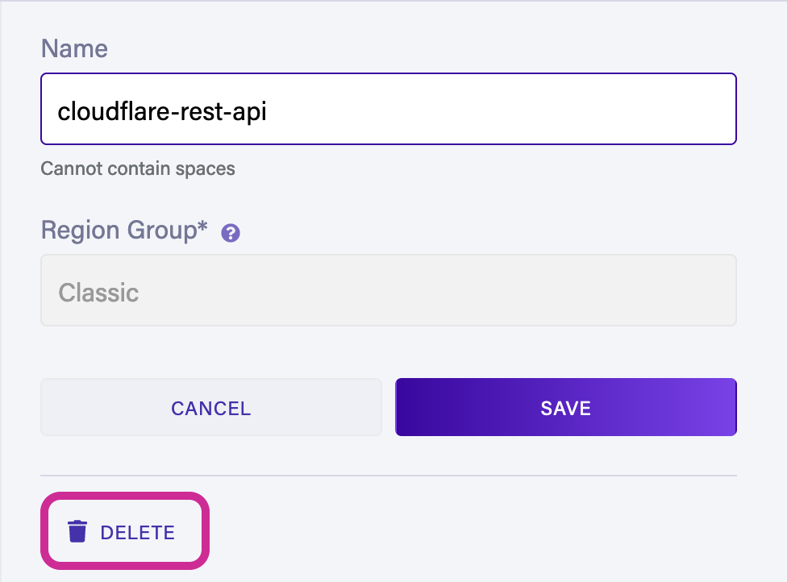

# Create a serverless, globally distributed REST API with Fauna



## Overview

In this tutorial you learn how to store and retrieve data in your Cloudflare Workers applications by building a REST API that manages an inventory catalog using [Fauna][fauna] as its data layer.

### Learning goals

*   How to store and retrieve data from Fauna in your Workers.
*   How to use Wrangler to store secrets securely.
*   How to use [Worktop][worktop] to add routing to your Workers.

Building with Fauna, Workers, and Worktop enables you to create a globally distributed, strongly consistent, fully serverless REST API in a single repository. You can develop and reason about your application as if it were a monolith but gain the resilience and reduced latency of a distributed application running at the edge.

Fauna is a document-based database with a flexible schema. This allows you to define the structure of your data – whatever it may be – and store documents that adhere to that structure. In this tutorial, you will build a product inventory, where each `product` document must contain the following properties:

*   **title** - A human-friendly string that represents the title or name of a product.
*   **serialNumber** - A machine-friendly string that uniquely identifies the product.
*   **weightLbs** - A floating point number that represents the weight in pounds of the product.
*   **quantity** A non-negative integer that represents how many items of a particular product there are in the inventory.

Documents are stored in the **Products** [collection][fauna-collections]. Collections in document databases are groups of related documents.

For this tutorial, all API endpoints are public. However, Fauna also offers multiple avenues for securing endpoints and collections. Refer to [Choosing an authentication strategy with Fauna][fauna-choosing-authentication-strategy] for more information on authenticating users to your applications with Fauna.

## Setting up Fauna

### Creating your database

Open the [Fauna dashboard][fauna-dashboard] in your browser and log into your Fauna account.



If you do not have a Fauna account, you can [sign up][fauna-signup] and deploy this template using the free tier.



In the Fauna dashboard:

1.  Select **Create database**.
2.  Provide a valid name.
3.  Select the **Classic** [Region Group][fauna-region-groups].
4.  Select **Create**.

### Creating the products catalog

Select **New Collection** to create the **Products** collection that stores your inventory documents.

### Creating a server key

You must create a key to connect to the database from your Worker.

Go to the **Security** tab in the Fauna dashboard and create a new key with the **Server** role:

The Fauna dashboard displays the key's secret. Copy and save this server key to use in a later step.



Server keys can read and write all documents in all collections and can call all [user-defined functions][fauna-udfs] (UDFs). Protect server keys and do not commit them to source control repositories.



## Managing your inventory with Workers

Generate a new project using the Wrangler [generate][wrangler-generate] command:
<pre class="CodeBlock CodeBlock-with-rows CodeBlock-scrolls-horizontally CodeBlock-is-light-in-light-theme CodeBlock--language-sh" language="sh">Create a Workers function<code>
$ wrangler generate fauna-workers

$ cd fauna-workers

$ wrangler publish

</code></pre>



You must publish a version of your project before storing your server secret in the next step.



### Adding your Fauna secret as an environment variable

After creating and deploying your Worker, store your Fauna client [secret](/workers/cli-wrangler/commands/#put) safely with the following command:
<pre class="CodeBlock CodeBlock-with-rows CodeBlock-scrolls-horizontally CodeBlock-is-light-in-light-theme CodeBlock--language-sh" language="sh">Storing your Fauna secret<code>
$ wrangler secret put FAUNA_SECRET

</code></pre>

When prompted, paste the Fauna server secret you obtained earlier.

The `FAUNA_SECRET` environment variable is now injected automatically into your Worker code at runtime.

### Installing dependencies

First, install the Fauna JavaScript driver.
<pre class="CodeBlock CodeBlock-with-rows CodeBlock-scrolls-horizontally CodeBlock-is-light-in-light-theme CodeBlock--language-sh" language="sh">Installing the Fauna driver<code>
$ npm install faunadb

</code></pre>

Next, install the [Worktop][worktop] framework for Cloudflare Workers.
<pre class="CodeBlock CodeBlock-with-rows CodeBlock-scrolls-horizontally CodeBlock-is-light-in-light-theme CodeBlock--language-sh" language="sh">Installing Worktop<code>
$ npm install worktop@0.7

$ npm install worktop.build --save-dev

</code></pre>

Worktop solves common needs such as routing, path parameters, and HTTP methods.

Edit `package.json` and add the `build` script:
<pre class="CodeBlock CodeBlock-with-rows CodeBlock-scrolls-horizontally CodeBlock-is-light-in-light-theme CodeBlock--language-json" language="json"><code>
{

  // ...

  &quot;scripts&quot;: {

    &quot;build&quot;: &quot;worktop build index.js&quot;,

    // ...

  }

}

</code></pre>

Edit your `wrangler.toml` file found in your Worker's project directory. Set the type to `"javascript"` (not `"webpack"`) and add the `[build]` and `[build.upload]` sections as shown in the following snippet:
<pre class="CodeBlock CodeBlock-with-rows CodeBlock-scrolls-horizontally CodeBlock-is-light-in-light-theme CodeBlock--language-toml" language="toml">wrangler.toml<code>
type = &quot;javascript&quot;

...

[build]

command = &quot;npm run build&quot;

[build.upload]

format = &quot;service-worker&quot;

</code></pre>

### JavaScript utility functions

Create a `utils.js` file in the project folder and paste the following code:
<pre class="CodeBlock CodeBlock-with-rows CodeBlock-scrolls-horizontally CodeBlock-is-light-in-light-theme CodeBlock--language-js" language="js">utils.js<code>
export function getFaunaError(error) {

  const { code, description } = error.requestResult.responseContent.errors[0];

  let status;

  switch (code) {

    case 'unauthorized':

    case 'authentication failed':

      status = 401;

      break;

    case 'permission denied':

      status = 403;

      break;

    case 'instance not found':

      status = 404;

      break;

    case 'instance not unique':

    case 'contended transaction':

      status = 409;

      break;

    default:

      status = 500;

  }

  return { code, description, status };

}

</code></pre>

The `getFaunaError()` function extracts the [HTTP response status codes][http-status-codes] and description for the most common errors returned by Fauna.

### Base inventory logic

Replace the contents of your `index.js` file with the skeleton of your API:
<pre class="CodeBlock CodeBlock-with-rows CodeBlock-scrolls-horizontally CodeBlock-is-light-in-light-theme CodeBlock--language-js" language="js">index.js (skeleton)<code>
import {Router, listen} from 'worktop';

import faunadb from 'faunadb';

import {getFaunaError} from './utils.js';

const router = new Router();

const faunaClient = new faunadb.Client({

  secret: FAUNA_SECRET,

});

const {Create, Collection, Match, Index, Get, Ref, Paginate, Sum, Delete, Add, Select, Let, Var, Update} = faunadb.query;

router.add('GET', '/', async (request, response) =&gt {

  response.send(200, 'hello world');

});

listen(router.run);

</code></pre>

Examine the initialization of the Fauna client:
<pre class="CodeBlock CodeBlock-with-rows CodeBlock-scrolls-horizontally CodeBlock-is-light-in-light-theme CodeBlock--language-js" language="js">Instantiating the Fauna client<code>
const faunaClient = new faunadb.Client({

  secret: FAUNA_SECRET,

});

</code></pre>

The `FAUNA_SECRET` environment variable is injected into your application automatically at runtime. Workers run on a custom JavaScript runtime instead of Node.js, so you do not need to use `process.env` to access your environment variables.

### Creating product documents

Add your first Worktop route to the `index.js` file. This route accepts `POST` requests to the `/products` endpoint:
<pre class="CodeBlock CodeBlock-with-rows CodeBlock-scrolls-horizontally CodeBlock-is-light-in-light-theme CodeBlock--language-js" language="js">Creating product documents<code>
router.add('POST', '/products', async (request, response) =&gt {

  try {

    const {serialNumber, title, weightLbs} = await request.body();

    const result = await faunaClient.query(

      Create(

        Collection('Products'),

        {

          data: {

            serialNumber,

            title,

            weightLbs,

            quantity: 0

          }

        }

      )

    );

    response.send(200, {

      productId: result.ref.id

    });

  } catch (error) {

    const faunaError = getFaunaError(error);

    response.send(faunaError.status, faunaError);

  }

});

</code></pre>

This route applies an FQL query written in JavaScript that creates a new document in the **Products** collection:
<pre class="CodeBlock CodeBlock-with-rows CodeBlock-scrolls-horizontally CodeBlock-is-light-in-light-theme CodeBlock--language-js" language="js">Create query in FQL inside JavaScript<code>
Create(

  Collection('Products'),

  {

    data: {

      serialNumber,

      title,

      weightLbs,

      quantity: 0

    }

  }

)

</code></pre>

To review what a document looks like, navigate to the **Shell** tab in the Fauna dashboard and run the following query:
<pre class="CodeBlock CodeBlock-with-rows CodeBlock-scrolls-horizontally CodeBlock-is-light-in-light-theme CodeBlock--language-js" language="js">Create query in pure FQL<code>
Create(

  Collection('Products'),

  {

    data: {

      serialNumber: &quot;A48432348&quot;,

      title: &quot;Gaming Console&quot;,

      weightLbs: 5,

      quantity: 0

    }

  }

)

</code></pre>

Fauna returns the created document:
<pre class="CodeBlock CodeBlock-with-rows CodeBlock-scrolls-horizontally CodeBlock-is-light-in-light-theme CodeBlock--language-js" language="js">Newly created document<code>
{

  ref: Ref(Collection(&quot;Products&quot;), &quot;&ltdocument_id&gt&quot;),

  ts: &lttimestamp&gt,

  data: {

    serialNumber: &quot;A48432348&quot;,

    title: &quot;Gaming Console&quot;,

    weightLbs: 5,

    quantity: 0

  }

}

</code></pre>

*   **ref** - A [reference][fql-reference] to the newly created document.
*   **ts** - The timestamp of the new document creation in microseconds.
*   **data** - The  actual content of the document.

Examining the route you create, when the query is successful, the ID of the newly created document is returned in the response body:
<pre class="CodeBlock CodeBlock-with-rows CodeBlock-scrolls-horizontally CodeBlock-is-light-in-light-theme CodeBlock--language-js" language="js">Returning the new document ID<code>
response.send(200, {

  productId: result.ref.id

});

</code></pre>

Finally, if Fauna returns any error, an exception is raised by the client. You catch that exception and respond with the result from the `getFaunaError()` utility function:
<pre class="CodeBlock CodeBlock-with-rows CodeBlock-scrolls-horizontally CodeBlock-is-light-in-light-theme CodeBlock--language-js" language="js">Handling any errors<code>
const faunaError = getFaunaError(error);

response.send(faunaError.status, faunaError);

</code></pre>

### Retrieving product documents

Next, create a route that reads a single document from the **Products** collection.

Add the following route to your `index.js` file. This route accepts `GET` requests at the `/products/:productId` endpoint:
<pre class="CodeBlock CodeBlock-with-rows CodeBlock-scrolls-horizontally CodeBlock-is-light-in-light-theme CodeBlock--language-js" language="js">Retrieving product documents<code>
router.add('GET', '/products/:productId', async (request, response) =&gt {

  try {

    const productId = request.params.productId;

    const result = await faunaClient.query(

      Get(Ref(Collection('Products'), productId))

    );

    response.send(200, result);

  } catch (error) {

    const faunaError = getFaunaError(error);

    response.send(faunaError.status, faunaError);

  }

});

</code></pre>

The FQL query uses the [Get][fql-get] function to retrieve a full document from a document reference:
<pre class="CodeBlock CodeBlock-with-rows CodeBlock-scrolls-horizontally CodeBlock-is-light-in-light-theme CodeBlock--language-js" language="js">Retrieving a document by ID in FQL inside JavaScript<code>
Get(Ref(Collection('Products'), productId))

</code></pre>

If the document exists, return it in the response body:
<pre class="CodeBlock CodeBlock-with-rows CodeBlock-scrolls-horizontally CodeBlock-is-light-in-light-theme CodeBlock--language-js" language="js">Returning the document in the response body<code>
response.send(200, result);

</code></pre>

If not, an error is returned.

### Deleting product documents

The logic to delete product documents is similar to the logic for retrieving products. Add the following route to your `index.js` file:
<pre class="CodeBlock CodeBlock-with-rows CodeBlock-scrolls-horizontally CodeBlock-is-light-in-light-theme CodeBlock--language-js" language="js">Deleting product documents<code>
router.add('DELETE', '/products/:productId', async (request, response) =&gt {

  try {

    const productId = request.params.productId;

    const result = await faunaClient.query(

      Delete(Ref(Collection('Products'), productId))

    );

    response.send(200, result);

  } catch (error) {

    const faunaError = getFaunaError(error);

    response.send(faunaError.status, faunaError);

  }

});

</code></pre>

The only difference with the previous route is that you use the [Delete][fql-delete] function to delete a document by providing its reference.

When the delete operation is successful, Fauna returns the deleted document and the route forwards the deleted document in the response's body. If not, an error is returned.

## Testing and deploying your Worker

Before deploying your Worker, test it locally by using Wrangler's [dev][wrangler-dev] command:
<pre class="CodeBlock CodeBlock-with-rows CodeBlock-scrolls-horizontally CodeBlock-is-light-in-light-theme CodeBlock--language-js" language="js">Testing your Worker locally<code>
wrangler dev
</code></pre>

Once the development server is up and running, you can start making HTTP requests to your Worker.

First, create a new product:
<pre class="CodeBlock CodeBlock-with-rows CodeBlock-scrolls-horizontally CodeBlock-is-light-in-light-theme CodeBlock--language-sh" language="sh">Create a new product<code>
$ curl \

    --data '{&quot;serialNumber&quot;: &quot;H56N33834&quot;, &quot;title&quot;: &quot;Bluetooth Headphones&quot;, &quot;weightLbs&quot;: 0.5}' \

    --header 'Content-Type: application/json' \

    --request POST \

    http://127.0.0.1:8787/products
</code></pre>

You should receive a `200` response similar to the following:
<pre class="CodeBlock CodeBlock-with-rows CodeBlock-scrolls-horizontally CodeBlock-is-light-in-light-theme CodeBlock--language-json" language="json">Create product response<code>
{

  &quot;productId&quot;: &quot;&ltdocument_id&gt&quot;

}

</code></pre>



Copy the `productId` value for use in the remaining test queries.



Next, read the document you just created:
<pre class="CodeBlock CodeBlock-with-rows CodeBlock-scrolls-horizontally CodeBlock-is-light-in-light-theme CodeBlock--language-sh" language="sh">Read a document<code>
$ curl \

    --header 'Content-Type: application/json' \

    --request GET \

    http://127.0.0.1:8787/products/&ltdocument_id&gt
</code></pre>

The response should be the new document serialized to JSON:
<pre class="CodeBlock CodeBlock-with-rows CodeBlock-scrolls-horizontally CodeBlock-is-light-in-light-theme CodeBlock--language-json" language="json">Read product response<code>
{

  &quot;ref&quot;: {&quot;@ref&quot;:{&quot;id&quot;:&quot;&ltdocument_id&gt&quot;,&quot;collection&quot;:{&quot;@ref&quot;:{&quot;id&quot;:&quot;Products&quot;,&quot;collection&quot;:{&quot;@ref&quot;:{&quot;id&quot;:&quot;collections&quot;}}}}}},&quot;ts&quot;:1617887459975000,

  &quot;data&quot;: {

    &quot;serialNumber&quot;: &quot;H56N33834&quot;,

    &quot;title&quot;: &quot;Bluetooth Headphones&quot;,

    &quot;weightLbs&quot;:0.5,

    &quot;quantity&quot;:0

  }

}

</code></pre>

Finally, deploy your Worker using the [`wrangler publish`][wrangler-publish] command:
<pre class="CodeBlock CodeBlock-with-rows CodeBlock-scrolls-horizontally CodeBlock-is-light-in-light-theme CodeBlock--language-sh" language="sh">Deploying your Worker<code>
$ wrangler publish

</code></pre>

This publishes the Worker to your `*.workers.dev` subdomain.

## Updating inventory quantity

As the last step, implement a route to update the quantity of a product in your inventory, which is `0` by default.

This will present a problem. To calculate the total quantity of a product, you first need to determine how many items there currently are in your inventory. If you solve this in two queries, first reading the quantity and then updating it, the original data might change.

Fauna solves this by reading and updating the quantity of a product in a single FQL transaction. It is important to mention that all FQL queries are, in fact, transactions. If anything fails, all changes are reverted back thanks to Fauna's ACID properties.

Add the following route to your `index.js` file. This route responds to HTTP `PATCH` requests on the `/products/:productId/add-quantity` URL endpoint:
<pre class="CodeBlock CodeBlock-with-rows CodeBlock-scrolls-horizontally CodeBlock-is-light-in-light-theme CodeBlock--language-js" language="js">Updating inventory quantity<code>
router.add('PATCH', '/products/:productId/add-quantity', async (request, response) =&gt {

  try {

    const productId = request.params.productId;

    const {quantity} = await request.body();

    const result = await faunaClient.query(

      Let(

        {

          productRef: Ref(Collection('Products'), productId),

          productDocument: Get(Var('productRef')),

          currentQuantity: Select(['data', 'quantity'], Var('productDocument'))

        },

        Update(

          Var('productRef'),

          {

            data: {

              quantity: Add(

                Var('currentQuantity'),

                quantity

              )

            }

          }

        )

      )

    );

    response.send(200, result);

  } catch (error) {

    const faunaError = getFaunaError(error);

    response.send(faunaError.status, faunaError);

  }

});

</code></pre>

Examine the FQL query in more detail:
<pre class="CodeBlock CodeBlock-with-rows CodeBlock-scrolls-horizontally CodeBlock-is-light-in-light-theme CodeBlock--language-js" language="js">Update query in FQL inside JavaScript<code>
Let(

  {

    productRef: Ref(Collection('Products'), productId),

    productDocument: Get(Var('productRef')),

    currentQuantity: Select(['data', 'quantity'], Var('productDocument'))

  },

  Update(

    Var('productRef'),

    {

      data: {

        quantity: Add(

          Var('currentQuantity'),

          quantity

        )

      }

    }

  )

)

</code></pre>

This query uses the FQL [Let][fql-let] function to set some variables for use later in the query:

*   **productRef** - The **Ref** of the document to update.
*   **productDocument** - The full product document that will be updated.
*   **currentQuantity** - The currently available quantity of the product. You extract the property by using the FQL [Select][fql-select] function.

You can access the values of variables created by `Let` in any subsequent FQL expressions by using the FQL [Var][fql-var] function.

After declaring the variables, `Let` accepts an FQL expression as a second parameter. This expression is where you update your document:
<pre class="CodeBlock CodeBlock-with-rows CodeBlock-scrolls-horizontally CodeBlock-is-light-in-light-theme CodeBlock--language-js" language="js">Updating a product document<code>
Update(

  Var('productRef'),

  {

    data: {

      quantity: Add(

        Var('currentQuantity'),

        quantity

      )

    }

  }

)

</code></pre>

The FQL [Update][fql-update] function only updates the provided properties of a document. In this example, only the `quantity` property is updated.

Finally, this query calculates the new total quantity by adding the value of `quantity` to `currentQuantity` using the FQL [Add][fql-add] function.



Even if multiple Workers update this quantity from different parts of the world, Fauna guarantees the consistency of the data across all Fauna regions. [This article][fauna-blog-consistency-without-clocks] explains how Fauna's distributed protocol works without the need for atomic clocks.



Test your update route:
<pre class="CodeBlock CodeBlock-with-rows CodeBlock-scrolls-horizontally CodeBlock-is-light-in-light-theme CodeBlock--language-sh" language="sh">Update product inventory<code>
$ curl \

    --data '{&quot;quantity&quot;: 5}' \

    --header 'Content-Type: application/json' \

    --request PATCH \

    http://127.0.0.1:8787/products/&ltdocument_id&gt/add-quantity
</code></pre>

The response should be the entire updated document with five additional items in the quantity:
<pre class="CodeBlock CodeBlock-with-rows CodeBlock-scrolls-horizontally CodeBlock-is-light-in-light-theme CodeBlock--language-json" language="json">Update product response<code>
{

  &quot;ref&quot;: {&quot;@ref&quot;:{&quot;id&quot;:&quot;&ltdocument_id&gt&quot;,&quot;collection&quot;:{&quot;@ref&quot;:{&quot;id&quot;:&quot;Products&quot;,&quot;collection&quot;:{&quot;@ref&quot;:{&quot;id&quot;:&quot;collections&quot;}}}}}},

  &quot;ts&quot;: 1617890383200000,

  &quot;data&quot;: {

    &quot;serialNumber&quot;: &quot;H56N33834&quot;,

    &quot;title&quot;: &quot;Bluetooth Headphones&quot;,

    &quot;weightLbs&quot;: 0.5,

    &quot;quantity&quot;: 5

  }

}

</code></pre>

Update your Worker by publishing it to Cloudflare.
<pre class="CodeBlock CodeBlock-with-rows CodeBlock-scrolls-horizontally CodeBlock-is-light-in-light-theme CodeBlock--language-sh" language="sh">Updating your Worker in Cloudflare<code>
$ wrangler publish

</code></pre>

## Complete code

At this point, your code should look as follows:

### `wrangler.toml`

Click to expand

<pre class="CodeBlock CodeBlock-with-rows CodeBlock-scrolls-horizontally CodeBlock-is-light-in-light-theme CodeBlock--language-toml" language="toml"><code>
name = &quot;fauna-workers&quot;

type = &quot;javascript&quot;

account_id = &quot;&quot;

workers_dev = true

route = &quot;&quot;

zone_id = &quot;&quot;

compatibility_date = &quot;2021-11-10&quot;

[build]

command = &quot;npm run build&quot;

[build.upload]

format = &quot;service-worker&quot;

</code></pre>

### `index.js`

Click to expand

<pre class="CodeBlock CodeBlock-with-rows CodeBlock-scrolls-horizontally CodeBlock-is-light-in-light-theme CodeBlock--language-js" language="js"><code>
// Copyright Fauna, Inc.

// SPDX-License-Identifier: MIT-0

import {Router, listen} from 'worktop';

import faunadb from 'faunadb';

import {getFaunaError} from './utils.js';

const router = new Router();

const faunaClient = new faunadb.Client({

  secret: FAUNA_SECRET,

});

const {Create, Collection, Match, Index, Get, Ref, Paginate, Sum, Delete, Add, Select, Let, Var, Update} = faunadb.query;

router.add('GET', '/', async (request, response) =&gt {

  response.send(200, 'hello world');

});

router.add('POST', '/products', async (request, response) =&gt {

  try {

    const {serialNumber, title, weightLbs} = await request.body();

    const result = await faunaClient.query(

      Create(

        Collection('Products'),

        {

          data: {

            serialNumber,

            title,

            weightLbs,

            quantity: 0

          }

        }

      )

    );

    response.send(200, {

      productId: result.ref.id

    });

  } catch (error) {

    const faunaError = getFaunaError(error);

    response.send(faunaError.status, faunaError);

  }

});

router.add('GET', '/products/:productId', async (request, response) =&gt {

  try {

    const productId = request.params.productId;

    const result = await faunaClient.query(

      Get(Ref(Collection('Products'), productId))

    );

    response.send(200, result);

  } catch (error) {

    const faunaError = getFaunaError(error);

    response.send(faunaError.status, faunaError);

  }

});

router.add('DELETE', '/products/:productId', async (request, response) =&gt {

  try {

    const productId = request.params.productId;

    const result = await faunaClient.query(

      Delete(Ref(Collection('Products'), productId))

    );

    response.send(200, result);

  } catch (error) {

    const faunaError = getFaunaError(error);

    response.send(faunaError.status, faunaError);

  }

});

router.add('PATCH', '/products/:productId/add-quantity', async (request, response) =&gt {

  try {

    const productId = request.params.productId;

    const {quantity} = await request.body();

    const result = await faunaClient.query(

      Let(

        {

          productRef: Ref(Collection('Products'), productId),

          productDocument: Get(Var('productRef')),

          currentQuantity: Select(['data', 'quantity'], Var('productDocument'))

        },

        Update(

          Var('productRef'),

          {

            data: {

              quantity: Add(

                Var('currentQuantity'),

                quantity

              )

            }

          }

        )

      )

    );

    response.send(200, result);

  } catch (error) {

    const faunaError = getFaunaError(error);

    response.send(faunaError.status, faunaError);

  }

});

listen(router.run);

</code></pre>

### `util.js`

Click to expand

<pre class="CodeBlock CodeBlock-with-rows CodeBlock-scrolls-horizontally CodeBlock-is-light-in-light-theme CodeBlock--language-js" language="js"><code>
// Copyright Fauna, Inc.

// SPDX-License-Identifier: MIT-0

export function getFaunaError(error) {

  const { code, description } = error.requestResult.responseContent.errors[0];

  let status;

  switch (code) {

    case 'unauthorized':

    case 'authentication failed':

      status = 401;

      break;

    case 'permission denied':

      status = 403;

      break;

    case 'instance not found':

      status = 404;

      break;

    case 'instance not unique':

    case 'contended transaction':

      status = 409;

      break;

    default:

      status = 500;

  }

  return { code, description, status };

}

</code></pre>

## Cleaning up

To remove the resources you create in this tutorial, delete your Worker in the Cloudflare dashboard > **Workers** > **Manage Workers** > **your Worker** > **Settings** > **Delete**:

Finally, delete your Fauna database from its settings in the Fauna dashboard:

## Related resources

In this tutorial, you learned how to use Fauna with Cloudflare Workers to create a globally distributed, strongly consistent, next-generation serverless REST API that serves data quickly to a worldwide audience.

To build your own production-ready applications, refer to the [Fauna Workers quickstart](https://github.com/fauna-labs/fauna-workers). The quickstart implements suggested practices like a least-privilege security model and business logic encapsulation in user-defined functions.

If you would like to speak directly with a Fauna expert about building your applications on Cloudflare Workers with Fauna, [contact][fauna-contact] Fauna.

[fauna]: https://fauna.com/?utm_source=Cloudflare&utm_medium=referral&utm_campaign=Q4_CF_2021

[fauna-blog-consistency-without-clocks]: https://fauna.com/blog/consistency-without-clocks-faunadb-transaction-protocol?utm_source=Cloudflare&utm_medium=referral&utm_campaign=Q4_CF_2021

[fauna-choosing-authentication-strategy]: https://fauna.com/blog/choosing-an-authentication-strategy-with-fauna?utm_source=Cloudflare&utm_medium=referral&utm_campaign=Q4_CF_2021

[fauna-collections]: https://docs.fauna.com/fauna/current/learn/introduction/key_concepts#collections?utm_source=Cloudflare&utm_medium=referral&utm_campaign=Q4_CF_2021

[fauna-contact]: https://www2.fauna.com/cloudflare-contact?utm_source=Cloudflare&utm_medium=referral&utm_campaign=Q4_CF_2021

[fauna-dashboard]: https://dashboard.fauna.com/?utm_source=Cloudflare&utm_medium=referral&utm_campaign=Q4_CF_2021

[fauna-default-roles]: https://docs.fauna.com/fauna/current/security/keys.html?utm_source=Cloudflare&utm_medium=referral&utm_campaign=Q4_CF_2021

[fauna-region-groups]: https://docs.fauna.com/fauna/current/api/fql/region_groups#how-to-use-region-groups?utm_source=Cloudflare&utm_medium=referral&utm_campaign=Q4_CF_2021

[fauna-signup]: https://dashboard.fauna.com/signup?utm_source=Cloudflare&utm_medium=referral&utm_campaign=Q4_CF_2021

[fauna-udfs]: https://docs.fauna.com/fauna/current/learn/understanding/user_defined_functions?utm_source=Cloudflare&utm_medium=referral&utm_campaign=Q4_CF_2021

[fql]: https://docs.fauna.com/fauna/current/api/fql/?utm_source=Cloudflare&utm_medium=referral&utm_campaign=Q4_CF_2021

[fql-add]: https://docs.fauna.com/fauna/current/api/fql/functions/add?lang=shell&utm_source=Cloudflare&utm_medium=referral&utm_campaign=Q4_CF_2021

[fql-delete]: https://docs.fauna.com/fauna/current/api/fql/functions/delete?lang=shell&utm_source=Cloudflare&utm_medium=referral&utm_campaign=Q4_CF_2021

[fql-get]: https://docs.fauna.com/fauna/current/api/fql/functions/get?lang=shell&utm_source=Cloudflare&utm_medium=referral&utm_campaign=Q4_CF_2021

[fql-let]: https://docs.fauna.com/fauna/current/api/fql/functions/let?lang=shell&utm_source=Cloudflare&utm_medium=referral&utm_campaign=Q4_CF_2021

[fql-reference]: https://docs.fauna.com/fauna/current/api/fql/functions/ref?lang=shell&utm_source=Cloudflare&utm_medium=referral&utm_campaign=Q4_CF_2021

[fql-select]: https://docs.fauna.com/fauna/current/api/fql/functions/select?lang=shell&utm_source=Cloudflare&utm_medium=referral&utm_campaign=Q4_CF_2021

[fql-update]: https://docs.fauna.com/fauna/current/api/fql/functions/update?lang=shell&utm_source=Cloudflare&utm_medium=referral&utm_campaign=Q4_CF_2021

[fql-var]: https://docs.fauna.com/fauna/current/api/fql/functions/var?lang=shell&utm_source=Cloudflare&utm_medium=referral&utm_campaign=Q4_CF_2021

[fauna-js-docs]: https://github.com/fauna/faunadb-js#using-with-cloudflare-workers

[http-status-codes]: https://developer.mozilla.org/en-US/docs/Web/HTTP/Status

[worktop]: https://github.com/lukeed/worktop

[wrangler-dev]: /workers/cli-wrangler/commands/#dev

[wrangler-generate]: /workers/cli-wrangler/commands/#generate

[wrangler-publish]: /workers/cli-wrangler/commands/#publish
