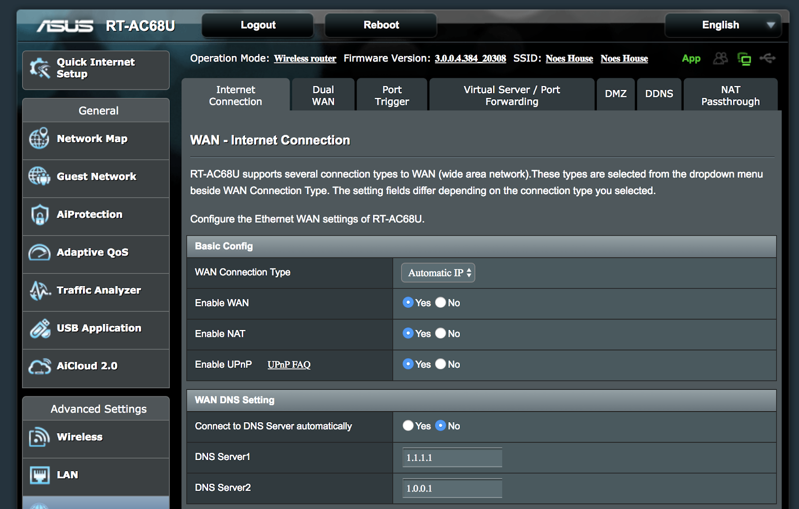

# Router setup instructions

## Block malware

Follow this quick guide to start using 1.1.1.1 for Families on your router.

1. Go to the IP address used to access your router's admin console in your browser.

   * Linksys and Asus routers typically use [http://192.168.1.1](http://192.168.1.1)
   * Netgear routers typically use [http://192.168.0.1](http://192.168.0.1) or [http://192.168.1.1](http://192.168.1.1)
   * D-Link routers typically use [http://192.168.0.1](http://192.168.0.1)
   * Ubiquiti routers typically use [http://unifi.ubnt.com](http://unifi.ubnt.com)

1. Enter the router password.

1. Find the place in the admin console where DNS settings are set.
1. Replace the existing addresses with:

  ```txt
  1.1.1.2
  1.0.0.2
  2606:4700:4700::1112
  2606:4700:4700::1002
  ```

1. Save the updated settings.

### Using DNS-Over-TLS on OpenWRT

It is possible to encrypt DNS traffic out from your router using DNS-over-TLS if it is running OpenWRT. For more details, see our blog post on the topic: [Adding DNS-Over-TLS support to OpenWRT (LEDE) with Unbound](https://blog.cloudflare.com/dns-over-tls-for-openwrt/).

### Ubiquiti UniFi controller

<StreamVideo id="510f09dad9812cd7ac009ebcab75068e"/>

1. Go to [http://unifi.ubnt.com](http://unifi.ubnt.com).
1. Enter your email and password.
1. Click on the name of the network you are managing.
1. Click **Launch**.
1. Click on the **Settings** icon in the lower left-hand corner.
1. From the Settings menu, click **Networks**.
1. Click **Edit by the name of the Network**.
1. Scroll to where it says DHCP Name Server. If Auto is selected, select **Manual** instead.
1. In the boxes called DNS Server 1, 2, 3, etc. put:

  ```txt
  1.1.1.2
  1.0.0.2
  2606:4700:4700::1112
  2606:4700:4700::1002
  ```

1. Click **Save**.

### Google Wi-Fi

1. Open the Google Wifi app on your phone.
1. Click the **Settings** tab > **Network & general**.
1. Click on **Advanced networking** > **DNS**.
1. Remove any IP addresses that may be already listed and in their place enter:

  ```txt
  1.1.1.2
  1.0.0.2
  2606:4700:4700::1112
  2606:4700:4700::1002
  ```

1. Click **Save**.

### Asus Router

1. Go to https://192.168.1.1/.

  

1. Under **Advanced Settings**, click on **WAN**.
1. In **Internet Connection** > **WAN DNS Setting** > **DNS servers**, add:

  ```txt
  1.1.1.2
  1.0.0.2
  2606:4700:4700::1112
  2606:4700:4700::1002
  ```

## Block Malware and Adult Content

Follow this quick guide to start using 1.1.1.1 for Families on your router.

1. Go to the IP address used to access your router's admin console in your browser.
   * Linksys and Asus routers typically use [http://192.168.1.1](http://192.168.1.1)
   * Netgear routers typically use [http://192.168.0.1](http://192.168.0.1) or [http://192.168.1.1](http://192.168.1.1)
   * D-Link routers typically use [http://192.168.0.1](http://192.168.0.1)
   * Ubiquiti routers typically use [http://unifi.ubnt.com](http://unifi.ubnt.com)
1. Enter the router password.
1. Find the place in the admin console where DNS settings are set.
1. Replace the existing addresses with:

  ```txt
  1.1.1.3
  1.0.0.3
  2606:4700:4700::1113
  2606:4700:4700::1003
  ```

1. Save the updated settings.

### Ubiquiti UniFi Controller

<StreamVideo id="510f09dad9812cd7ac009ebcab75068e"/>

1. Go to [http://unifi.ubnt.com](http://unifi.ubnt.com).
1. Enter your email and password.
1. Click on the name of the network you are managing.
1. Click **Launch**.
1. Click on the **Settings** icon in the lower left-hand corner.
1. From the Settings menu, choose **Networks**.
1. Click **Edit** by the name of the Network.
1. Scroll to where it says **DHCP Name Server**. If **Auto** is selected, select **Manual** instead.
1. In the boxes called DNS Server 1, 2, 3, etc. put:

  ```txt
  1.1.1.3
  1.0.0.3
  2606:4700:4700::1113
  2606:4700:4700::1003
  ```

1. Click **Save**.

### Google Wi-Fi

1. Open the Google Wifi app on your phone.
1. Click **Settings** > **Network & general**.
1. Click **Advanced networking** > **DNS**.
1. Remove any IP addresses that may be already listed and in their place enter:

  ```txt
  1.1.1.3
  1.0.0.3
  2606:4700:4700::1113
  2606:4700:4700::1003
  ```

1. Click **Save**.

### Asus Router

1. Go to https://192.168.1.1/.

  

1. Under **Advanced Settings**, click on **WAN**.
1. In **Internet Connection tab** > **WAN DNS Setting** > **DNS servers**, add:

  ```txt
  1.1.1.3
  1.0.0.3
  2606:4700:4700::1113
  2606:4700:4700::1003
  ```