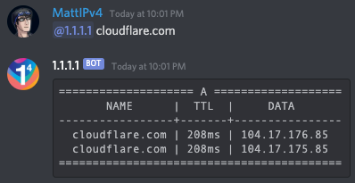
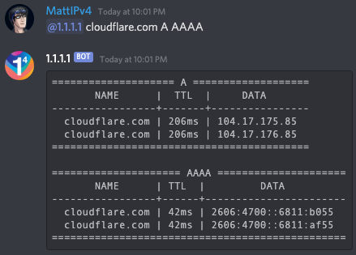

# DNS over Discord

Ever wanted to make DNS requests from the comfort of your Discord server? Well now you can, thanks to the [@1.1.1.1 bot](https://bit.ly/DNS-over-Discord).

To start using the DNS over Discord bot, invite it to your Discord server using this link: [https://bit.ly/DNS-over-Discord](https://bit.ly/DNS-over-Discord)

The bot only requires basic permissions to read messages in your server and send messages to reply to the DNS queries.

Once the bot is in your server, you can mention it (@1.1.1.1) followed by a domain name to begin making DNS requests. Provide DNS record types after the domain name to get back results for each record type. You can also use an asterisk ("*") in place of a record type to get back DNS results for all supported types.

If you ever need help with the usage of the DNS over Discord bot, mention it (@1.1.1.1) with no other arguments and it will return a help message with example usage for all supported features of the bot.

Example:

    @1.1.1.1 cloudflare.com

Returns:

Example:

    @1.1.1.1 cloudflare.com A AAAA

Returns:

DNS over Discord supports the following record types, with `*` being supported to fetch them all:

    A
    NS
    CNAME
    MX
    TXT
    AAAA
    SRV
    CAA
