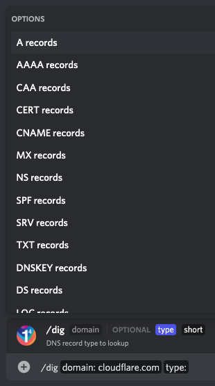
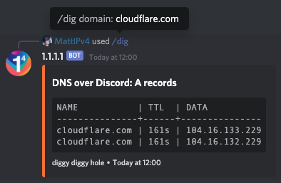
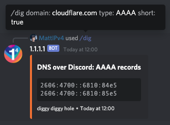
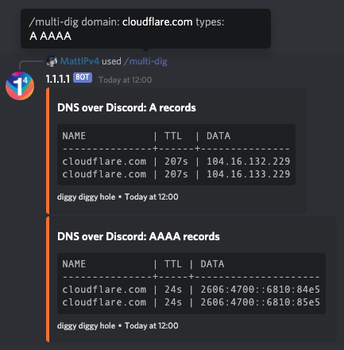
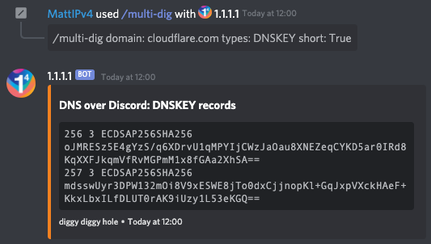
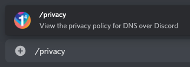

# DNS over Discord

Ever wanted to make DNS requests from the comfort of your Discord server? Well now you can, thanks to the [@1.1.1.1 bot](https://cfl.re/3nM6VfQ).

To start using the DNS over Discord bot, invite it to your Discord server using this link: [https://cfl.re/3nM6VfQ](https://cfl.re/3nM6VfQ)

## dig command

Once the bot is in your server, type `/dig` to being using the bot's main command -- performing DNS lookups.
This will provide a native interface within Discord that allows you to specify the domain to lookup, an optional DNS record type and an optional flag for a short result.

Due to limitations in Discord, the `/dig` command can only offer 10 different DNS record types, and will default to 'A' records if none is specified.

### Supported record types

*   A
*   AAAA
*   CAA
*   CERT
*   CNAME
*   MX
*   NS
*   SPF
*   SRV
*   TXT

*For all DNS record types, use the `/multi-dig` command.*

### Examples

\
_`/dig domain: cloudflare.com`_

\
_`/dig domain: cloudflare.com type: AAAA short: True`_

## multi-dig command

Want to lookup multiple DNS record types at once, or record types not available in `/dig`?
The `/multi-dig` command allows you to specify any supported DNS record type, and multiple types separated by a space.

When providing DNS record types for the `/multi-dig` command, Discord will not prompt you with options.
Please provide a space-separated list of valid DNS record types to lookup, any invalid options will be silently dropped.
'A' records will be used as the default if no valid types are given.

### Supported record types

*   A
*   AAAA
*   CAA
*   CERT
*   CNAME
*   DNSKEY
*   DS
*   LOC
*   MX
*   NAPTR
*   NS
*   PTR
*   SMIMEA
*   SPF
*   SRV
*   SSHFP
*   TLSA
*   TXT
*   URI

*Use '\*' (asterisk) in place of a record type to get DNS results for all supported types.*

### Examples

\
_`/multi-dig domain: cloudflare.com types: A AAAA`_

\
_`/multi-dig domain: cloudflare.com types: DNSKEY short: True`_

## Other commands

The bot also has a set of helper commands available to get more information about the bot and quick links.

### help command

The `/help` command provides in-Discord documentation about all the commands available in the 1.1.1.1 DNS over Discord bot.

\
_`/help`_

### privacy command

The `/privacy` command displays the privacy policy notice for using the 1.1.1.1 DNS over Discord bot.
This notice can also be viewed at [https://dns-over-discord.v4.wtf/privacy](https://dns-over-discord.v4.wtf/privacy).

\
_`/privacy`_

### github command

The DNS over Discord bot is open-source, and the `/github` command provides a quick link to access the GitHub repository.
The GitHub repository can be accessed at [https://github.com/MattIPv4/DNS-over-Discord/](https://github.com/MattIPv4/DNS-over-Discord/).

\
_`/github`_

### invite command

The `/invite` command provides the user with a quick link to invite the 1.1.1.1 DNS over Discord bot to another Discord server.
The bot can be invited at any time with [https://cfl.re/3nM6VfQ](https://cfl.re/3nM6VfQ).

\
_`/invite`_
