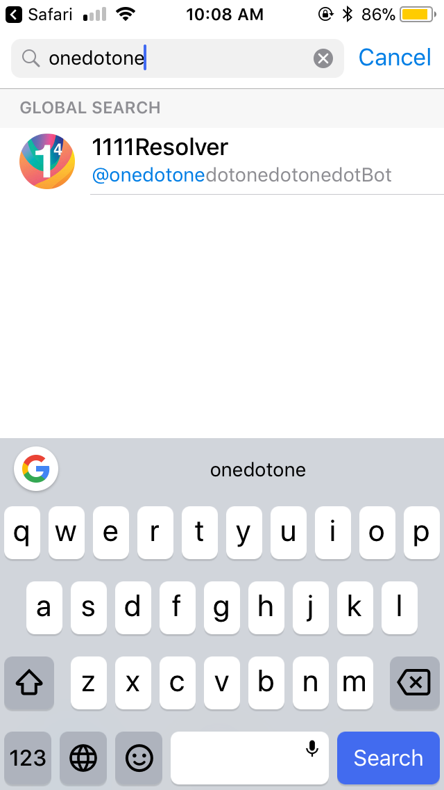
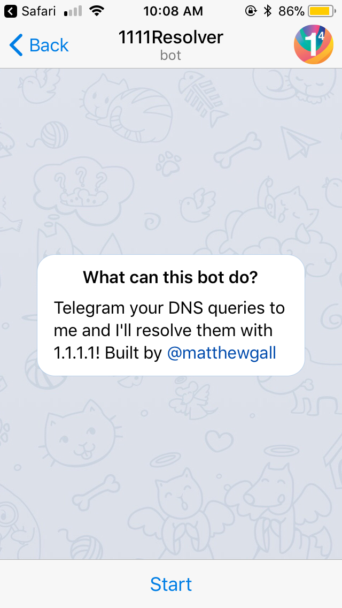

# DNS over Telegram

To perform DNS over Telegram, you will need the Telegram app. For the unfamiliar, Telegram is an end-to-end encrypted messaging app. You can download it on [telegram.org](https://telegram.org/).

First, you will need to add the 1.1.1.1 bot to your friends list in Telegram. Open the Telegram app, click on 'contacts' and search for `onedotonedotonedotonedotbot`.



When the 1.1.1.1 bot appears in the search results, click on it.

Then press `start`.



You can send a single domain name, which will default to returning the AAAA record.

Example:


Or you can send a record type followed by a domain name. The record types supported are:

```txt
A
AAAA
CAA
CNAME
DS
DNSKEY
MX
NS
NSEC
NSEC3
RRSIG
SOA
TXT
```

Example:


