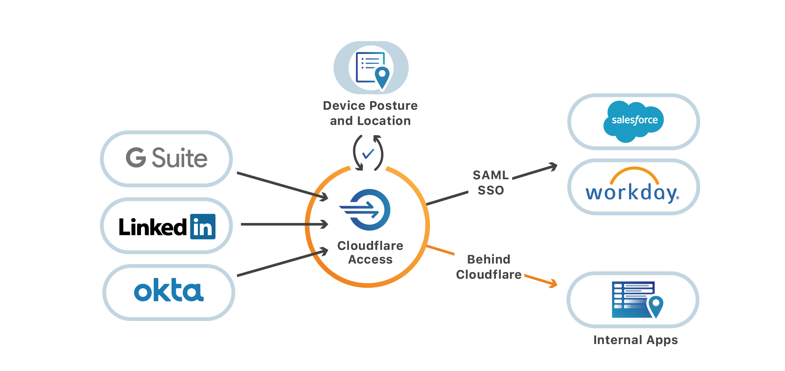

# How Access works

<DirectoryListing path="/how-access-works"/>

Cloudflare Access evaluates requests to internal and SaaS applications and determines whether visitors are granted access based on pre-defined rules.

Instead of placing internal tools on private networks (VPNs), teams deploy them in any environment, including hybrid or multi-cloud models, and secure them consistently with Cloudflare’s Edge network. Unlike VPNs, deploying Access does not require exposing new holes in corporate firewalls.

Once apps are secured behind the Edge, administrators build rules in Access to decide who should be able to reach them. When users need to connect to those apps, they are prompted to authenticate with any configured identity providers. Cloudflare Access checks their login against established rules of allowed users and, if permitted, allows the request to proceed.

Access also supports other common connections and protocols, including SSH and RDP. To prevent attackers addressing IPs directly, Access seamlessly integrates with Cloudflare Argo Tunnel, which runs in your infrastructure to connect the applications and machines to Cloudflare. Argo Tunnel makes outbound-only calls to the Cloudflare network—this enables organizations to replace complex firewall rules with just one: disable all inbound connections.
With all login activity tracked through Cloudflare, all events are logged, allowing administrators to see rich information about who attempted to reach applications.

## Self-Hosted Applications

Access connects teams to their internal applications through a secure outbound connection, Argo Tunnel, which runs in your infrastructure and connects the applications and machines to Cloudflare. Tunnel makes outbound-only calls to the Cloudflare network, which allows organizations to replace complex firewall rules with just one: disable all inbound connections.

Administrators then build rules to decide who should authenticate to and reach the tools protected by Access. Whether those resources are virtual machines powering business operations or internal web applications, like Jira or iManage, when a user needs to connect, they pass through Cloudflare first.

When users request access to an internal application behind Cloudflare Access, they are prompted to authenticate with their team’s SSO. If the request is valid, the user instantly connects to the application. Access integrates with popular identity providers, like GSuite and Okta, so that you don’t have to manage a new set of credentials.

Every request made to those internal tools hits Cloudflare first, where we enforce identity-based policies. Access evaluates and logs every request to those apps for identity, giving administrators more visibility and security than a traditional VPN.

## SaaS Applications

Many applications rely on a popular standard, SAML, to securely exchange identity data and user attributes between two systems. Cloudflare Access uses that relationship to force SaaS logins through Cloudflare’s network by acting as the SAML identity provider.

When users attempt to log in to the application, the application sends the user to log in with Cloudflare Access. Access then redirects the user to the identity provider, in the same way that it does when users request a site that uses Cloudflare’s reverse proxy. This way, Access can apply the additional contextual rules and log the event.

The way Access provides a standard proof of identity is by generating a JWT for every login. The JWT is then converted through Cloudflare Workers into a SAML assertion that is sent to the SaaS application. The application receiving the SAML assertion will then treat Access as the identity provider, even though it is aggregating identity signals from the user’s SSO provider and other sources into the JWT, and sending that summary to the app via SAML.
