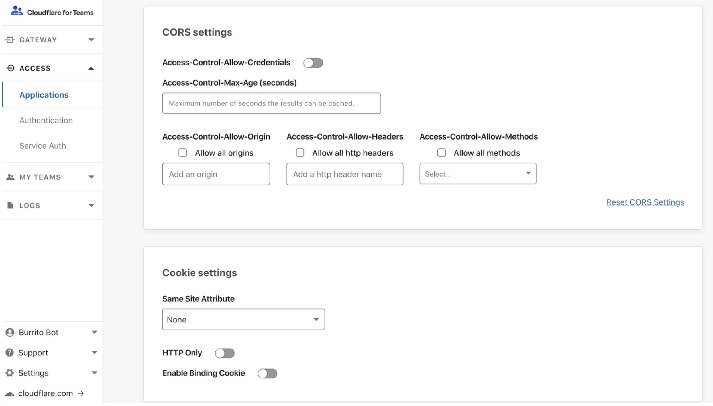

# Configure Browser Cookies Settings

<Aside type='warning' header='⚠️ THIS PAGE IS OUTDATED'>

We're no longer maintaining this page. **It will be deleted on Feb 8, 2021**. Please visit the new [Cloudflare for Teams documentation](https://developers.cloudflare.com/cloudflare-one/teams-docs-changes) instead.

</Aside>

Cloudflare Access provides optional security settings that can be added to the browser cookies generated by Access for an authenticated user. The three enhanced browser cookie settings available are:

* HttpOnly flag
* Binding cookie
* SameSite

All three settings can be enabled in an Application’s settings menu.

To reach the settings menu:

1. Navigate to the [Teams Dashboard](https://dash.teams.cloudflare.com).
2. Select **Applications**.
3. Locate the application for which you would like to enable these settings.
4. Click **Edit**.
5. Select **Settings**.

## HTTP Only

The HTTP Only flag is a cookie attribute that prevents the cookie from being accessed by any client-side scripts, reducing the likelihood of XSS attacks.

### When not to use HttpOnly

Do not enable HttpOnly if:
* You are using the Access application for non-browser based tools
* You have software that relies on being able to access a user’s cookie generated by Access

## Enable Binding Cookie

The Binding Cookie is an additional cookie created when a user successfully authenticates, shared with Cloudflare to verify identity, and then stripped before it reaches the origin server. The Binding Cookie associates the browser with the Access token; the association protects against compromised authorization tokens because the origin webapp would never see this binding cookie. This protects against session hijack style attacks.

### When not to use the Binding Cookie
* Do not use the Binding Cookie for non-browser based Access applications that rely on protocols like SSH, RDP, etc.

## SameSite Attribute

The [SameSite](https://web.dev/samesite-cookies-explained/) Attribute selector is a cookie attribute that restricts the cookie to only being sent if the cookie’s defined site matches the site being requested in the browser. This adds protection against CSRF attacks.

The selector options are[[1](#source)]:
* **None** - Cookies will be sent in all contexts, i.e sending cross-origin is allowed.
* **Lax** - Cookies are allowed to be sent with top-level navigations and will be sent along with GET requests initiated by third party websites.
* **Strict** - Cookies will only be sent in a first-party context and not be sent along with requests initiated by third party websites.

See [here](https://developer.mozilla.org/en-US/docs/Web/HTTP/Headers/Set-Cookie/SameSite) for specific behaviors of these options.

## When not to use SameSite
* If you have additional sites or applications that rely on a specific application’s authorization cookie.

#### References

###### 1.  Source: [SameSite Cookies](https://developer.mozilla.org/en-US/docs/Web/HTTP/Headers/Set-Cookie/SameSite)
