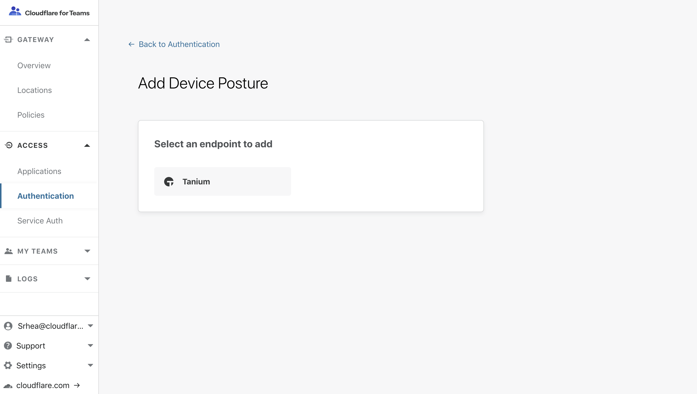
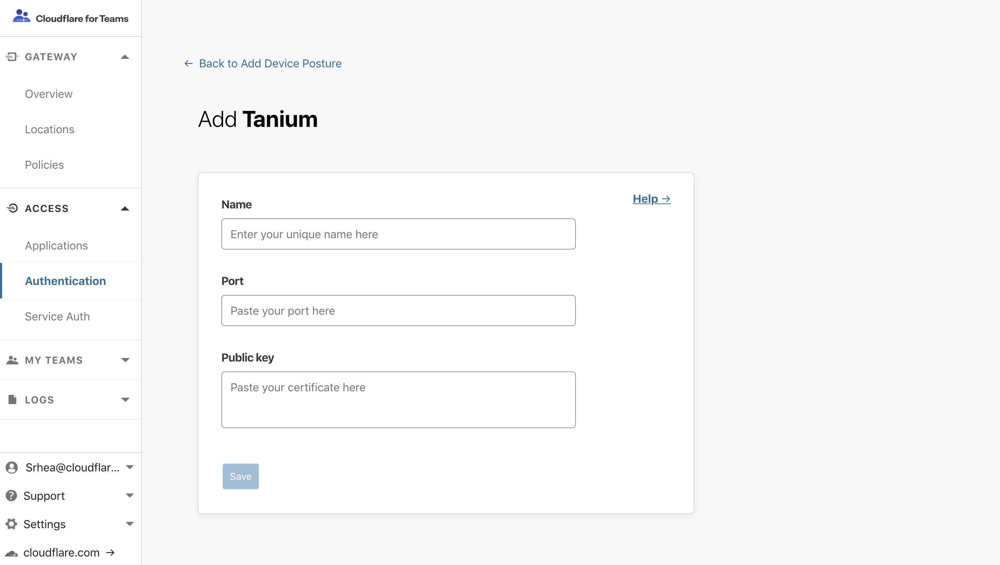

# Device posture

<Aside type='warning' header='⚠️ THIS PAGE IS OUTDATED'>

We're no longer maintaining this page. **It will be deleted on Feb 8, 2021**. Please visit the new [Cloudflare for Teams documentation](https://developers.cloudflare.com/cloudflare-one/teams-docs-changes) instead.

</Aside>

Cloudflare Access can integrate with endpoint protection providers to check requests for device posture. When configured, users will only be allowed to connect to a protected application when they are using a managed or healthy device, as determined by the endpoint security provider.

|Guide|Description|
|---|---|
|[Tanium™](#tanium)|Guide to integrating Tanium™ Endpoint Identity.|
|[Azure AD®](#azure-ad)|Guide to integrating Azure AD® managed device requirements.|

## Tanium

Cloudflare Access can use endpoint data from [Tanium™](https://www.tanium.com/) to determine if a request should be allowed to reach a protected resource.

### Tanium Configuration

Tanium's Endpoint Identity feature can share information about a device that is attempting to authenticate through Cloudflare Access, including patch status, management status, and vulnerabilities score.

First, configure your Tanium deployment using the [step-by-step documentation](https://docs.tanium.com/endpoint_identity/endpoint_identity/userguide.html) provided.

Once complete, return to the Cloudflare for Teams dashboard to integrate with your Cloudflare Access account.

### Cloudflare Access Configuration

Cloudflare Access relies on a secure exchange between a user's browser and the Tanium agent to read data from the Tanium client. When users attempt to connect to a resource protected by Access with a Tanium rule, Cloudflare Access will validate the user's identity, and the browser will connect to the Tanium agent before making a decision to grant access.

<Aside>

The integration does not currently support Safari.
</Aside>

### Integrating Tanium Identity

| Requirements |
| ------------ |
| You will need an active Tanium™ Core Platform deployment that runs version 7.2 or later. |

Integrate your Tanium deployment with Cloudflare Access using public keys generated in the Tanium step-by-step documentation linked above.

1. On the Teams dashboard, navigate to **Access > Authentication**.

2. Select the **Device Posture** tab.

    

3. Click *+Add* to start configuring the Tanium integration.

3. Select **Tanium** from the list of providers.

    

4. In the next screen, give a name to the Tanium integration.

 "Tanium" will work, or, if you prefer, you can choose a more specific name.

    

5. Input `17472` for the port value.

 This is the default port used by the Tanium endpoints to communicate inbound and outbound with Cloudflare Access. You may need to modify it to reflect your organization's deployment.

6. Input the public certificate generated in the Tanium step-by-step documentation above.

 Adding the certificate allows Cloudflare to validate that the response from the Tanium agent is valid.

### Building policy rules with Tanium endpoint signal

With Tanium integrated, you can build policies that enforce decisions using signal from the endpoint.

| Signal | Value | Description |
|--|--|--|
| Managed | Boolean | Validates that the device is managed in your organization's Tanium account. |

1. On the Teams dashboard, navigate to **Access > Applications**.
2. [Create a new Application](/getting-started/applications/) or edit an existing application.
3. [Build a policy](/getting-started/policies/) that contains a rule with an Allow action that includes identity.

 For example, a rule that allows users to connect if they are members of your team's email domain.

4. Add an additional rule that contains a Require action that includes Device Posture and choose Tanium.

 The Tanium rule will require that the device connecting is managed in your Tanium deployment and has checked into the Tanium server in the last 7 days.

5. Save the rule.

The rule above will only allow users who are part of your team's email domain and running the Tanium agent to connect to the protected resource.

## Azure AD

Cloudflare Access can integrate with Azure AD's Conditional Access feature to require that users connect to certain applications from managed devices. To enable, you must integrate Azure AD with Cloudflare Access as a cloud app that requires managed device connections. You can use Cloudflare Access' [per-app IdP feature](/configuring-identity-providers/#configuring-applications-to-specific-identity-providers) to segment which Access applications require Azure AD with managed devices and which only require Azure AD.

### Azure AD Configuration

When you [integrate Cloudflare Access with Azure AD](https://docs.microsoft.com/en-us/azure/active-directory/manage-apps/what-is-single-sign-on), Azure AD treats Cloudflare as a single cloud application, even if you have multiple applications secured with Cloudflare Access. To introduce device posture requirements, Cloudflare Access can reuse that same integration.

If you want to allow users to reach certain applications with only Azure AD logins, and no device requirement, you will need to maintain two distinct integrations. One integration with Cloudflare will require device management and the other will only require Azure AD logins.

You can configure which applications secured by Cloudflare Access use which integration in the steps below.

1. Follow the [instructions](/configuring-identity-providers/azuread/) to integrate Cloudflare Access as a cloud app with Azure AD.

2. Repeat this step a second time if you want to maintain an integration that does not require Azure AD device management. We recommend giving each a distinct name that will be used in the steps below.

    <!--  -->

3. Next, [create a new](https://docs.microsoft.com/en-us/azure/active-directory/conditional-access/require-managed-devices)  Conditional Access policy in Azure AD. In that policy, you can require that users connect from Managed, Hybrid, or compliant devices.
Apply that policy to the integration with Cloudflare Access.

4. Apply that policy to the integration with Cloudflare Access.

### Cloudflare Access Configuration

In the Cloudflare for Teams dashboard, you can configure which applications require connections from a managed device and which do not.
1. Navigate to an application that requires managed device connections.

2. Open the **Authentication** tab.

3. Toggle the *Azure AD* integration that requires managed device usage.

    <!--  -->