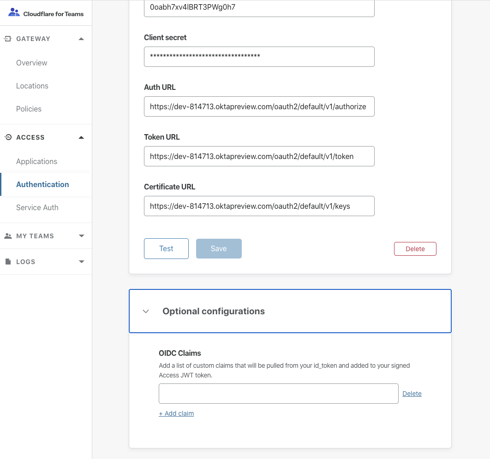

# JSON Web Tokens

<Aside type='warning' header='⚠️ THIS PAGE IS OUTDATED'>

We're no longer maintaining this page. **It will be deleted on Feb 8, 2021**. Please visit the new [Cloudflare for Teams documentation](https://developers.cloudflare.com/cloudflare-one/teams-docs-changes) instead.

</Aside>

To fully secure your application, you must ensure that no one can access your origin server directly and bypass the zero trust security checks Cloudflare Access enforces for the hostname. For example, if someone discovers an exposed external IP they can bypass Cloudflare and attack the origin directly.

Cloudflare signs a JSON Web Token (JWT) when users or services authenticate through Cloudflare Access.

Two tokens are generated:

* **Auth Domain Token**: a token stored at the auth domain that prevents a user from needing to login to each application. The token is stored as a cookie at your account's authentication domain, for example, `https://my-auth-domain.cloudflareaccess.com`.

* **App Token**: a token generated for each application that a user reaches. The token is stored as a cookie on the application, for example, `https://jira.site.com`.

You can use the JWT created by Cloudflare Access to validate requests on your origin.

If you want to learn more about how Access works with JWT, read our [Access with JSON web tokens](../../learning/json-web-tokens) Learning section.

| Best practices |  |
| -------------- | ------ |
| **Only validate tokens using the external endpoint, rather than saving the public key as a hard-coded value.** Cloudflare signs both tokens with a key pair that you can validate using the corresponding public certificate, available at an external endpoint. As a security best practice, Cloudflare rotates the key pair in use periodically. |  |
| **Do not only look for the first certificate of the two in the list.** The ordering of which certificate is current will change. It is possible that clock skew between your server and Cloudflare's would result in a failure when validating a token's IAT or NBF fields. A grace period can help prevent downtime if that is the case.  |

## Manual verification

<Aside>

<b>Before you start</b>

Install [`lokey`](https://github.com/jpf/lokey) and [`jq`](https://stedolan.github.io/jq/download/).

</Aside>

1. Run this command:

    ```bash
    curl -s https://<your auth domain>/cdn-cgi/access/certs | jq .keys[0] | lokey to pem -----BEGIN PUBLIC KEY----- MIIBIjANBgkqhkiG9w0BAQEFAAOCAQ8AMIIBCgKCAQEA01SvMv4TgFIECQgzHaRL DGVaKhRQHjgdiSOpbqhHQMdcNtBIM0HAQbrs7YS6sQCCdZC5wCvlq3xgqdU5J6k YI5OCSsIWXKkobAl6PbXHdN0bJximeiHGa3O0hMREP6RKBoI6ayNmZ3WlVGWY 6ie47KGqN69l7fPKyZvszb4GdpxE0r8gllZZwIuPjzlghXRlrkaP48ucQwo+tq PSSdDdW57TCFmy+G547W5iWZWJIeNkfVu9t6FktvCwSZ1ekum3X7IQcd0O0DWSR Aj9tzNDPkzOeSFxmQkKpWs8Qw7ZBIfLOsO3DCH6VPNhS2cqhw1AAMunh8alDKQU aQIDAQAB -----END PUBLIC KEY-----
    ```

    If an error occurs while running `lokey`, install the [Python six](https://pypi.python.org/pypi/six) library, and try again:

    ```bash
    $ pip install six==1.10.0
    ```

1. Go to [jwt.io](https://jwt.io/).
1. Select the RS256 algorithm.
1. Paste the JWT into the field on the left.
1. Enter the public key in the **Public Key** field.
1. Ensure that the signature says **verified**.

## Programmatic verification

<Aside>

<b>Before you start</b>

Click the **Settings** button to copy the AUD tag from your **Access** app on your Cloudflare dashboard in the _Edit Access Policy_ dialog box:

 Certificate URL: `https://<Your Authentication Domain>/cdn-cgi/access/certs`

 JWT Issuer: `https://<Your Authentication Domain>`

</Aside>

### Golang example

```go
package main


import (
    "context"
    "fmt"
    "net/http"

    "github.com/coreos/go-oidc"
)

var (
    ctx        = context.TODO()
    authDomain = "https://test.cloudflareaccess.com"
    certsURL   = fmt.Sprintf("%s/cdn-cgi/access/certs", authDomain)

    // policyAUD is your application AUD value
    policyAUD = "4714c1358e65fe4b408ad6d432a5f878f08194bdb4752441fd56faefa9b2b6f2"

    config = &oidc.Config{
        ClientID: policyAUD,
    }
    keySet   = oidc.NewRemoteKeySet(ctx, certsURL)
    verifier = oidc.NewVerifier(authDomain, keySet, config)
)

// VerifyToken is a middleware to verify a CF Access token
func VerifyToken(next http.Handler) http.Handler {
    fn := func(w http.ResponseWriter, r *http.Request) {
        headers := r.Header

        // Make sure that the incoming request has our token header
        //  Could also look in the cookies for CF_AUTHORIZATION
        accessJWT := headers.Get("Cf-Access-Jwt-Assertion")
        if accessJWT == "" {
            w.WriteHeader(http.StatusUnauthorized)
            w.Write([]byte("No token on the request"))
            return
        }

        // Verify the access token
        ctx := r.Context()
        _, err := verifier.Verify(ctx, accessJWT)
        if err != nil {
            w.WriteHeader(http.StatusUnauthorized)
            w.Write([]byte(fmt.Sprintf("Invalid token: %s", err.Error())))
            return
        }
        next.ServeHTTP(w, r)
    }
    return http.HandlerFunc(fn)
}

func MainHandler() http.Handler {
    return http.HandlerFunc(func(w http.ResponseWriter, r *http.Request) {
        w.Write([]byte("welcome"))
    })
}

func main() {
    http.Handle("/", VerifyToken(MainHandler()))
    http.ListenAndServe(":3000", nil)
}
```

### Python example

`pip` install the following:

* flask
* requests
* PyJWT

```python
from flask import Flask, request
import requests
import jwt
import json
import os
app = Flask(__name__)


# Your policies audience tag
POLICY_AUD = os.getenv("POLICY_AUD")

# Your CF Access Authentication domain
AUTH_DOMAIN = os.getenv("AUTH_DOMAIN")
CERTS_URL = "{}/cdn-cgi/access/certs".format(AUTH_DOMAIN)

def _get_public_keys():
    """
    Returns:
        List of RSA public keys usable by PyJWT.
    """
    r = requests.get(CERTS_URL)
    public_keys = []
    jwk_set = r.json()
    for key_dict in jwk_set['keys']:
        public_key = jwt.algorithms.RSAAlgorithm.from_jwk(json.dumps(key_dict))
        public_keys.append(public_key)
    return public_keys

def verify_token(f):
    """
    Decorator that wraps a Flask API call to verify the CF Access JWT
    """
    def wrapper():
        token = ''
        if 'CF_Authorization' in request.cookies:
            token = request.cookies['CF_Authorization']
        else:
            return "missing required cf authorization token", 403
        keys = _get_public_keys()

        # Loop through the keys since we can't pass the key set to the decoder
        valid_token = False
        for key in keys:
            try:
                # decode returns the claims that has the email when needed
                jwt.decode(token, key=key, audience=POLICY_AUD)
                valid_token = True
                break
            except:
                pass
        if not valid_token:
            return "invalid token", 403

        return f()
    return wrapper


@app.route('/')
@verify_token
def hello_world():
    return 'Hello, World!'


if __name__ == '__main__':
    app.run()
```

## Support Additional OIDC Claims with your JWT

Access allows you to add additional OIDC claims (if supported by your IdP) to your JWT for enhanced verification. This can be configured for the OpenID authentication option under Optional Configurations


