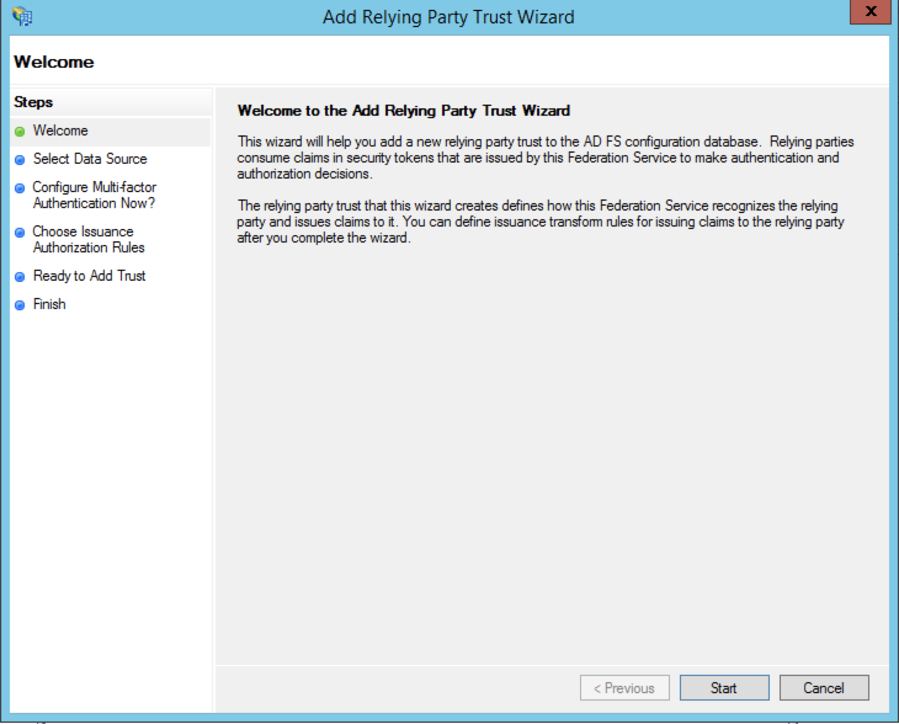
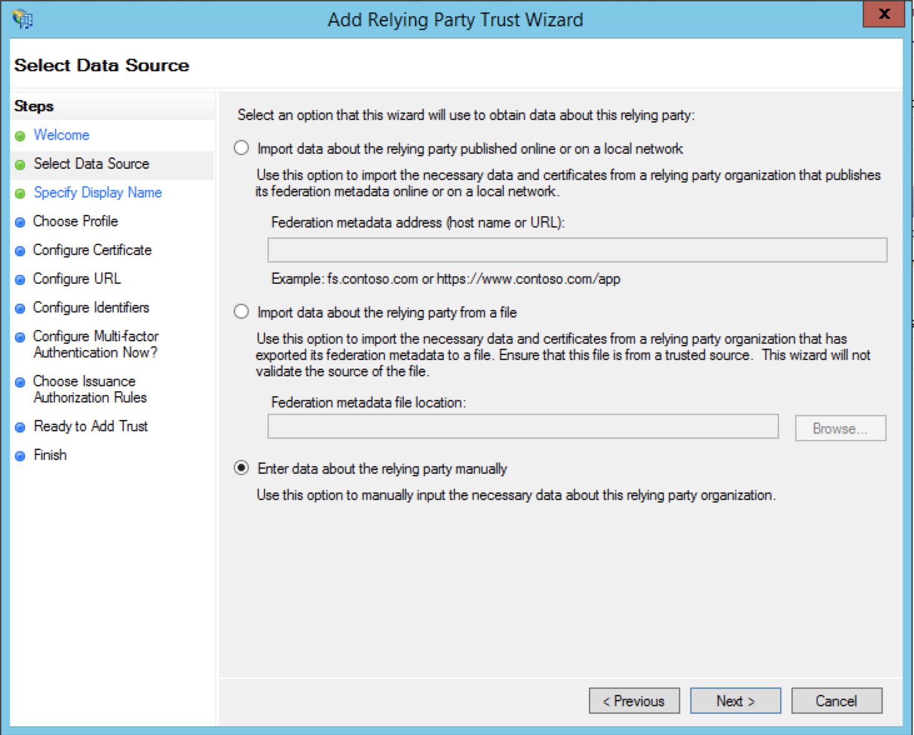
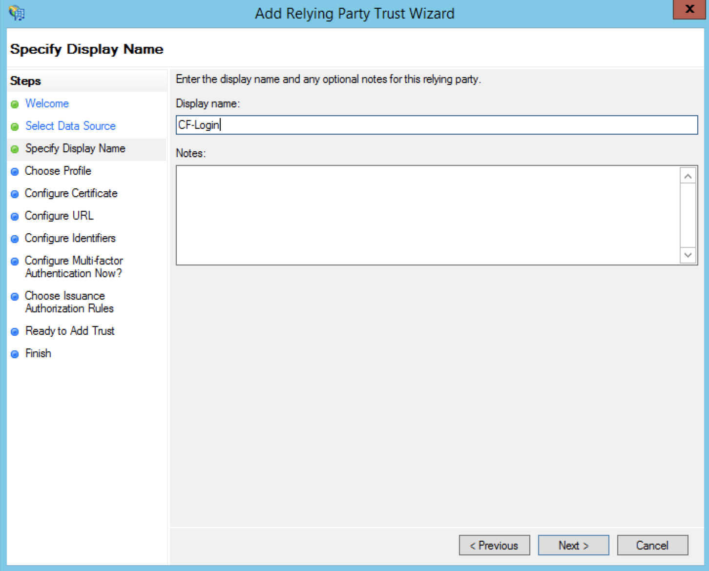
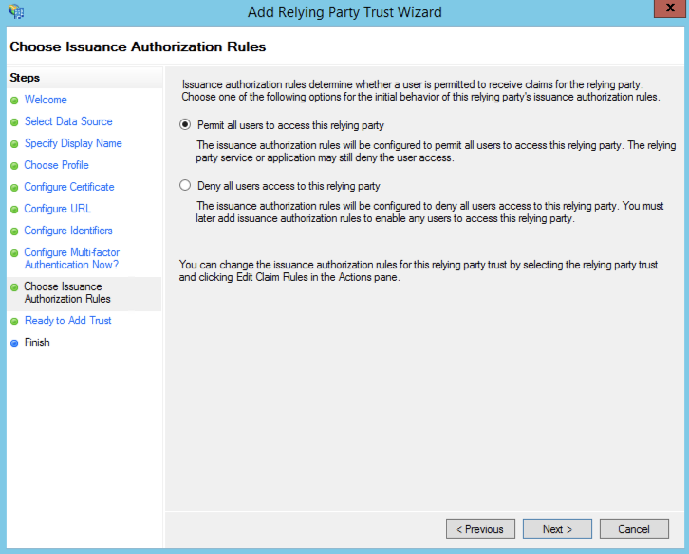
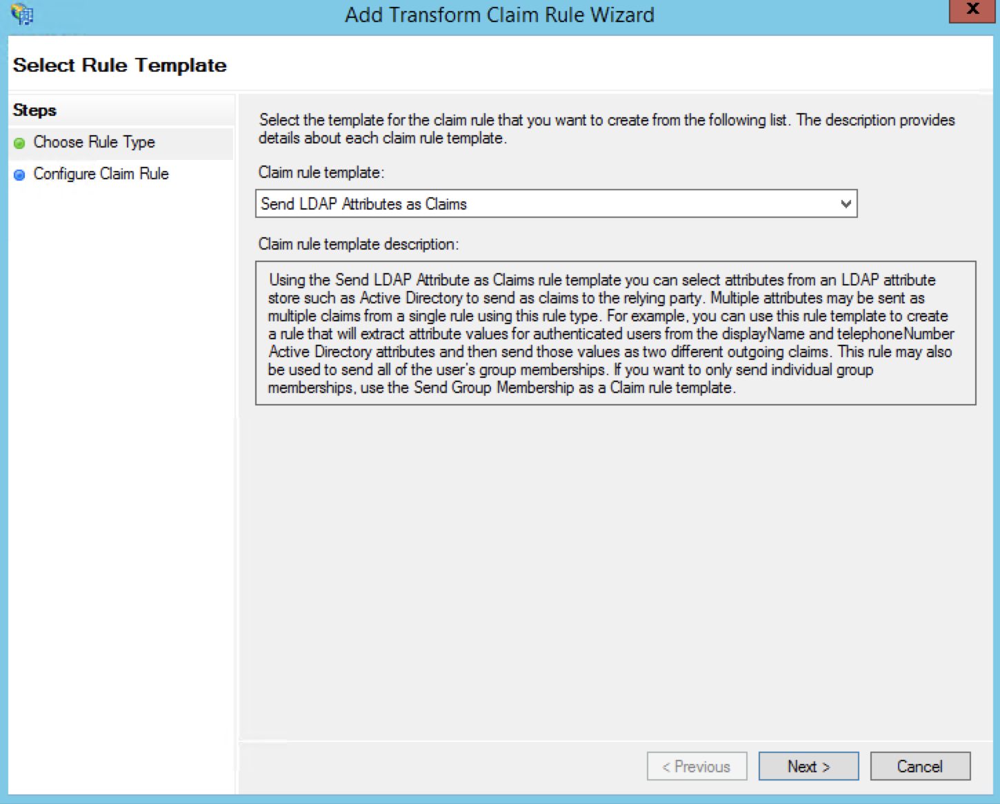
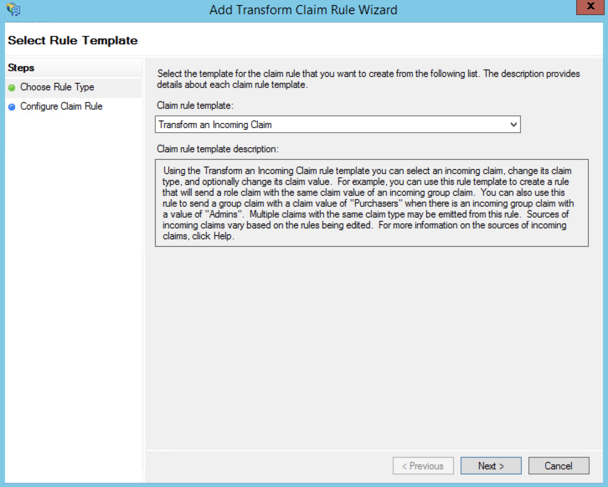
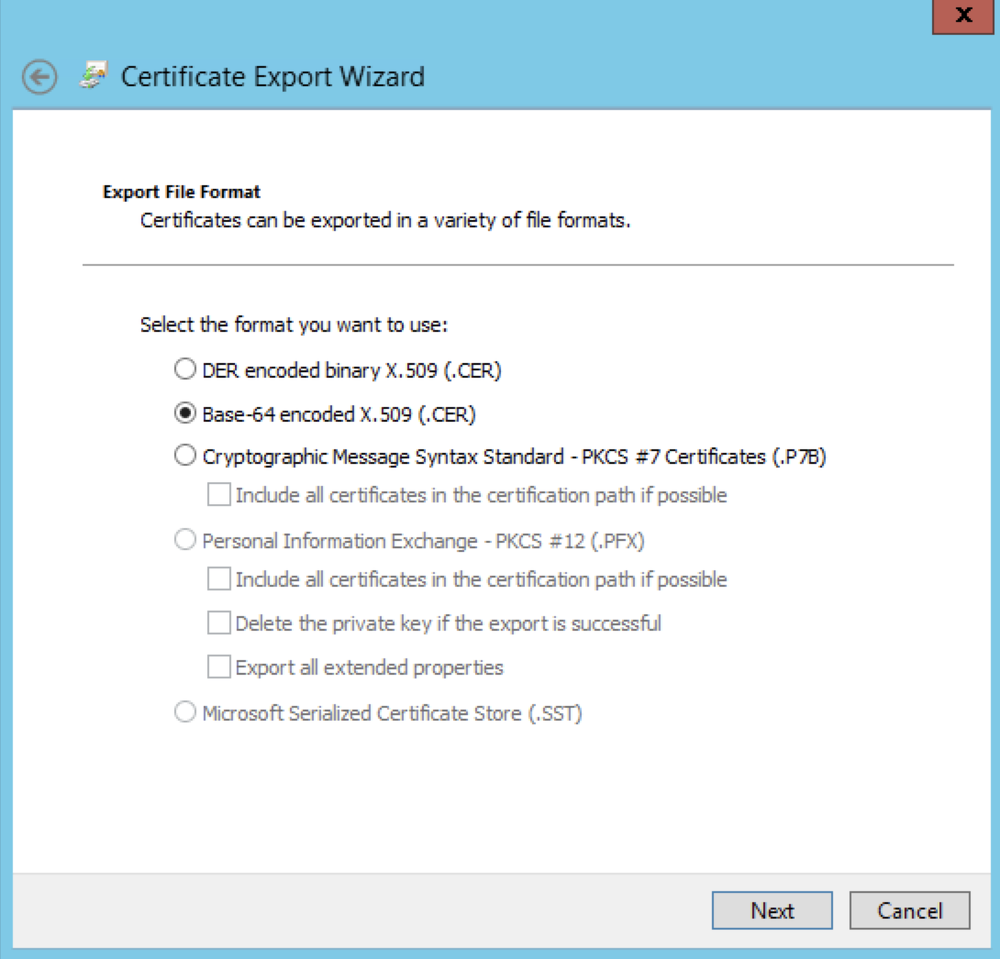
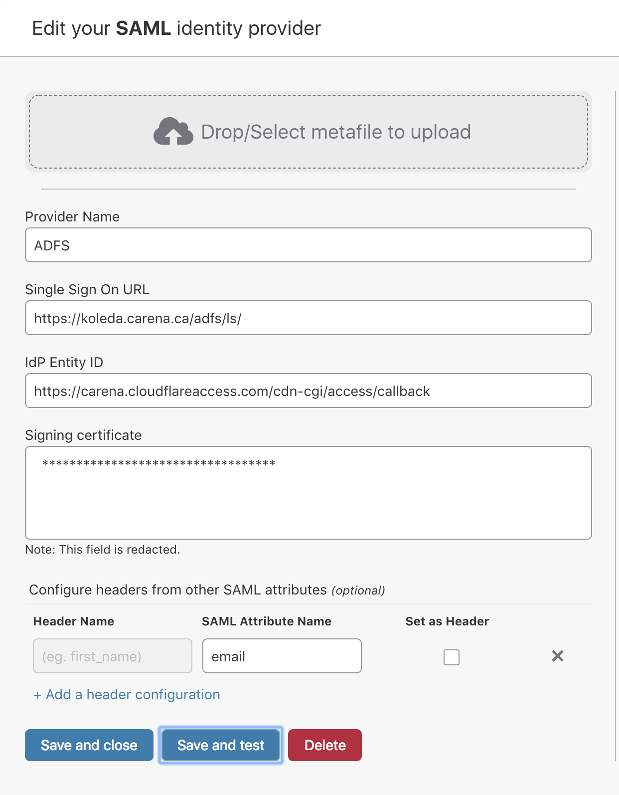

# SAML with Active Directory®


Active Directory is a directory service developed by Microsoft for Windows domain networks. It is included in most Windows Server operating systems as a set of processes and services. Active Directory integrates with Cloudflare Access for using Security Assertion Markup Language (SAML).

## Prerequisites

To begin you need:

* An Active Directory Domain Controller where all users have an email attribute
* Generic SAML enabled for your Access Identity Provider (IdP)
* A Microsoft server running with Active Directory Federation Services (ADFS) installed. All screenshots in these instructions are for Server 2012R2. Similar steps will work for newer versions.
* A browser safe certificate for Active Directory Federation Services (ADFS)

Once you fulfill the requirements above, you are ready to begin. Installation and basic configuration of Active Directory Federation Services (ADFS) is outside the scope of this guide. A detailed guide can be found in a [Microsoft KB](https://docs.microsoft.com/en-us/previous-versions/dynamicscrm-2016/deployment-administrators-guide/gg188612(v=crm.8)).

Then to begin the connection between Cloudflare Access and ADFS create a Relying Party Trust in ADFS.

## Create a Relying Party Trust

You run the Add Relying Party Trust wizard to begin SAML AD integration with Cloudflare Access.

To create a Relying Party Trust:

1. Launch the **ADFS Management** tool in **Windows Server**, and select the **Relying Party Trusts** folder.
2. On the **Actions** sidebar, select **Add Relying Party Trust**.

    The **Add Relying Party Trust Wizard** launches.

    

3. In the left menu, choose **Select Data Source**.

    

4. Select the **Enter data about the relying party manually** option.
5. Click **Next**.

    The **Specify Display Name** step displays.

    

6. Enter a **Display name**.

    Use an easily recognizable name. Include any information regarding this connection in the **Notes** field.

7. Click **Next**.

    The **Choose Profile** step displays.

    

8. Select the **AD FS profile** option.
9. Click **Next**.

    The **Configure Certificate** step displays.

    

10. Leave the **Certificate **options at their defaults.
11. Click **Next**.

    The **Configure URL** step displays.

    

12. Select the **Enable support for the SAML 2.0 WebSSO protocol** option.
13. Enter your callback address for Cloudflare Access in the **Relying party SAML 2.0 SSO service URL** field, include this callback at the end of the path: `/cdn-cgi/access/callback`.

    In your **Cloudflare Access** app, click the **Login Page Domain** field to copy the authorization domain to the clipboard.

    Replace “your-domain” in this example with the authentication domain listed in Cloudflare Access, and include the callback in the path:

    ```txt
    https://your-domain.cloudflareaccess.com/cdn-cgi/access/callback
    ```

14. Click **Next**.

    The **Configure Identifiers** step displays.

    

15. Paste the callback URL in the **Relying party trust identifier** field.
16. Click **Next**.

    In the **Configure Multi-factor Authentication Now?** step, you can configure multi-factor authentication. Our example does not configure multi-factor authentication.

    

17. Click **Next**.

    The **Choose Issuance Authorization Rules** step displays.

    

18. Select the **Permit all users to access this relying party** option.
19. Click **Next**.

    The **Ready to Add Trust** step displays.

    

20. Review your settings.
21. Click **Next**.

Cloudflare now relies on ADFS for user-identity authorization.

The **Edit Claim Rules for CF Login** screen automatically displays.

## Create claim rules

Now you create 2 Claim Rules so that ADFS can take information from Cloudflare and return it to create _Access Policies_.

<Aside>

If you closed the Add Relying Trust wizard, use Explorer to find the <strong>Relying Party Trusts</strong> folder, select the newly created RPT file, and click <strong>Edit Claim Rules</strong> the <strong>Action\*/</strong> sidebar.
</Aside>

To create Claim Rules:

1. In the **Edit Claim Rules for CF Login** window, click  **Add Rule…**.

    

    The **Choose Rule Type** step displays.

    

2. In the **Claim rule template** field, select **Send LDAP Attributes as Claims** from the drop-down list.
3. Click **Next**.

    The **Edit Rule — Send Email** step displays.

    

4. Enter a descriptive **Claim rule name**.
5. Select **Active Directory** from the **Attribute store** drop-down list.
6. Select **E-mail-Addresses** from the **LDAP Attribute** and **Outgoing Claim Type** drop-down lists.
7. Click **OK**.

    You return to the **Choose Rule Type** step.

    

8. Select **Transform an Incoming Claim** from the **Claim rule template** drop-down list to create the second rule.
9. Click **Next**.

    The **Edit - Create Transient Name Identifier** window displays.

    

10. Enter a descriptive **Claim rule name**.
11. Select **E-Mail Address** from the **Incoming claim type** drop-down list.
12. Select **Name ID** from the **Outgoing claim type** drop-down list.
13. Select **Transient Identifier** from the **Outgoing name ID format** drop-down list.
14. Ensure that the **Pass through all claim values** option is selected.
15. Click **OK**.

Both Claim Rules are now available to export to your Cloudflare Access account.

## Export the certificate

Now you’ll configure Cloudflare to recognize ADFS by extracting the _token-signing certificate_ from ADFS.

To export the certificate:

1. In AD, select **Service Folder** and choose the **Certificates folder** containing the certificate to export.
2. In the **Certificates** card, right-click on **Token-signing**, and select **View certificate**.

    

    The **Certificates** window displays.

3. Click the **Details** tab, and select the **Copy to File** option.
4. The **Certificate Export Wizard** displays.

    

5. Click **Next**.

    The **Export File Format** window displays.

    

6. Select the **Base-64 encoded X.509 (.CER)** option.
7. Click **Next**.
8. Enter a name for the file.
9. Click **Next**.
10. Click **Finish**.

    Note the file path for later.

## Configure ADFS to sign SAML responses

To ensure that ADFS signs the full response when communicating with Cloudflare, open your local **Powershell** and enter the following command:

```bash
Set-ADFSRelyingPartyTrust -TargetName "Name of RPT Display Name" -SamlResponseSignature "MessageAndAssertion"
```

## Configure Cloudflare Access

To Cloudflare to accept the claims and assertions sent from ADFS, so that you can create an Access Policy:

1. In **Cloudflare Access**, scroll to **Login Methods**, click **Add** and select the **SAML** icon.

    

    The **Add a SAML identity provider** card displays.

    

2. Enter an IdP **Provider Name**.
3. Under **Single Sign On URL** enter:

    ```txt
    https://hostnameOfADFS/adfs/ls/
    ```

    This is the default location. You can find your federation service identifier in ADFS.

4. In the **IdP Entity ID** field, enter your authorization domain, and include this  callback at the end of the path: `/cdn-cgi/access/callback`.

    You can find your organization’s authorization domain in Cloudflare Access. It begins with a subdomain unique to your organization and ends with the domain `cloudflareaccess.com`, including the callback path specified above, for example:

    ```txt
    https://YourDomain/cdn-cgi/access/callback
    ```

5. Under **Signing certificate** paste the exported certificate.

    There can be no spaces or return characters in the text field.

6. Click **Save** and then **Test**.

    On successful connection to your AD deployment, a confirmation displays.

    

## Download SP metadata (optional)

Some IdPs allow administrators to upload metadata files from their SP (service provider).

To get your Cloudflare metadata file:

1. Download your unique SAML metadata file at the following URL:

    ```txt
    https://auth-domain.cloudflareaccess.com/cdn-cgi/access/saml-metadata
    ```

    Replace authentication domain with your account’s **Login Page Domain** found in the **Access** tab in **Cloudflare Access**.

   In Cloudflare Access, you can find a link to this URL in the **Edit a SAML identity provider** dialog. The link returns a web page with your SAML SP data in XML format.

2. Save the file in XML format.
3. Upload the XML document to your **Active Directory** account.

## Example API Configuration

```json
{
    "config": {
        "issuer_url": "https://example.cloudflareaccess.com/",
        "sso_target_url": "https://adfs.example.com/adfs/ls/",
        "attributes": ["email"],
        "email_attribute_name": "",
        "sign_request": false,
        "idp_public_cert": "MIIDpDCCAoygAwIBAgIGAV2ka+55MA0GCSqGSIb3DQEBCwUAMIGSMQswCQYDVQQGEwJVUzETMBEG\nA1UEC.....GF/Q2/MHadws97cZg\nuTnQyuOqPuHbnN83d/2l1NSYKCbHt24o"
    },
    "type": "saml",
    "name": "adfs saml example"
}
```