# Microsoft Azure AD® (Active Directory)

<Aside type='warning' header='⚠️ THIS PAGE IS OUTDATED'>

We're no longer maintaining this page. **It will be deleted on Feb 8, 2021**. Please visit the new [Cloudflare for Teams documentation](https://developers.cloudflare.com/cloudflare-one/teams-docs-changes) instead.

</Aside>

You can integrate Microsoft Azure AD® (Active Directory) with Cloudflare for Teams and build rules based on user identity and group membership. Users will authenticate with their Azure AD credentials and login to resources protected by Cloudflare Access or enroll into Cloudflare Gateway.

1. Sign in to [the Azure dashboard](https://portal.azure.com/).

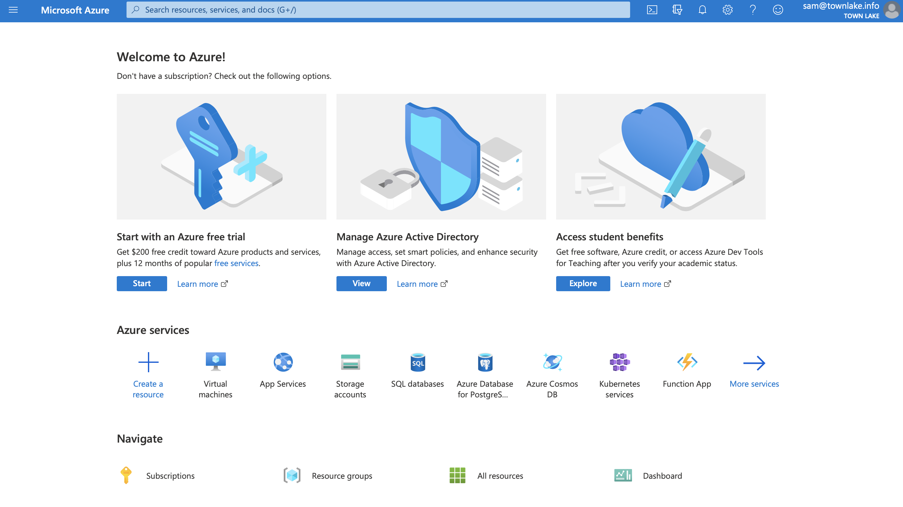

2. Click **Azure Active Directory** in the Azure Services section.

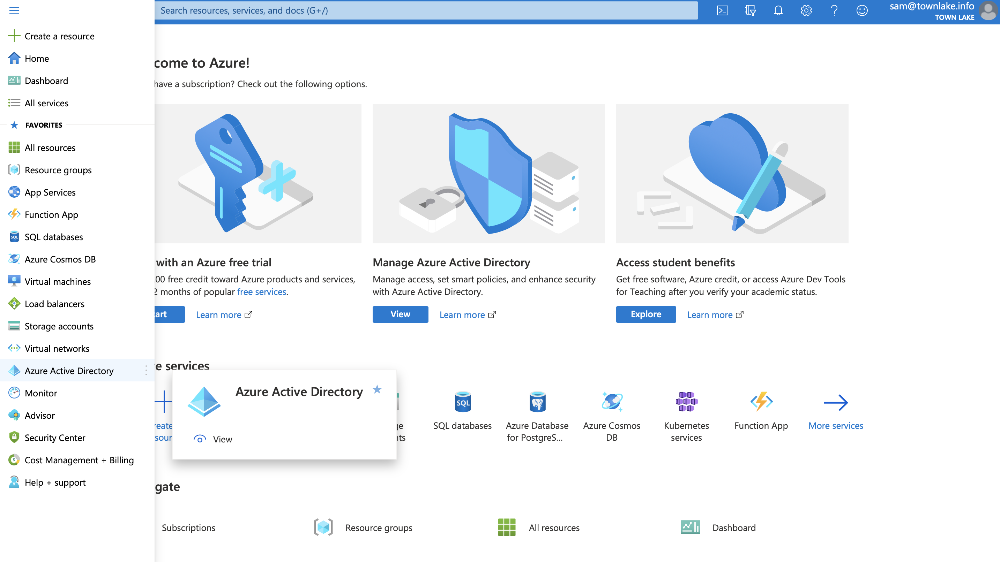

3. On the **Azure AD** dashboard, click **App registrations** in the **Manage** section of the _Azure Active Directory_ pane.

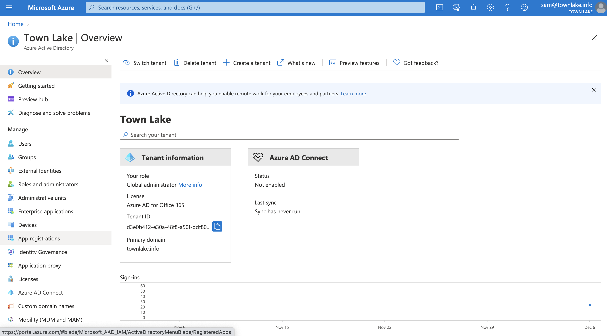

4. Click **+ New registration**.

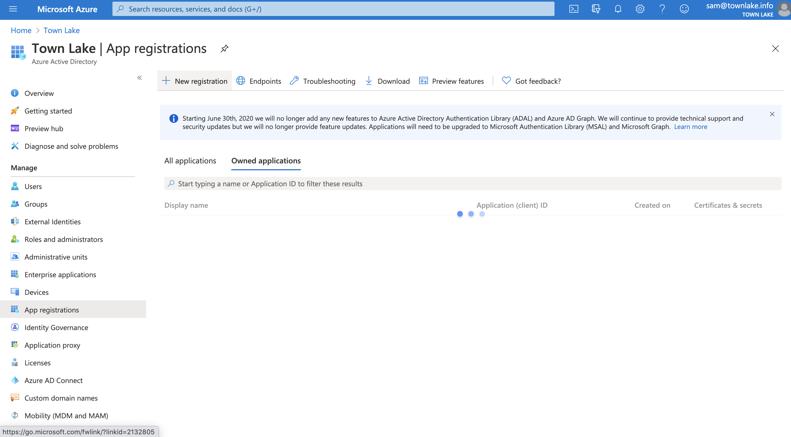

5. Name your application and enter your **Cloudflare Authentication Domain**. The format of the authentication domain will be `https://<your authentication domain>/cdn-cgi/access/callback`). Click **Register**.

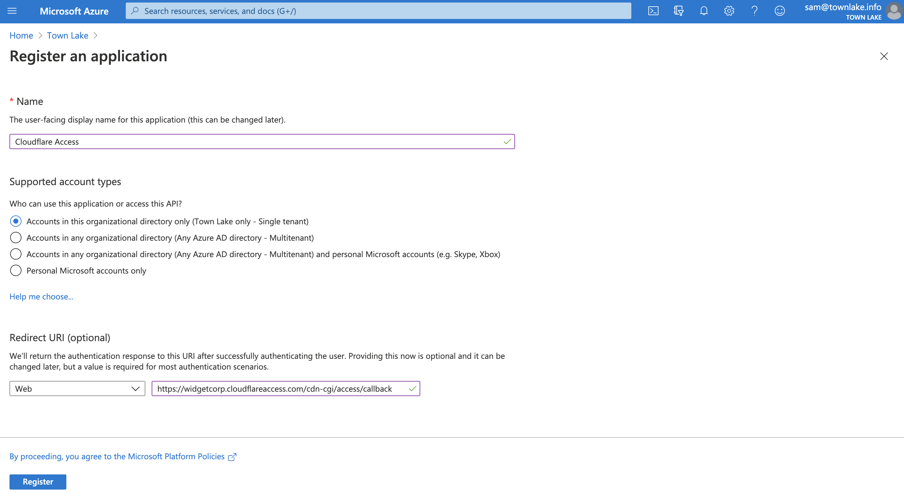

6. On the following screen, copy the `Application (client) ID` and `Directory (tenant ID`. You will need to input these values into the Cloudflare dashboard.

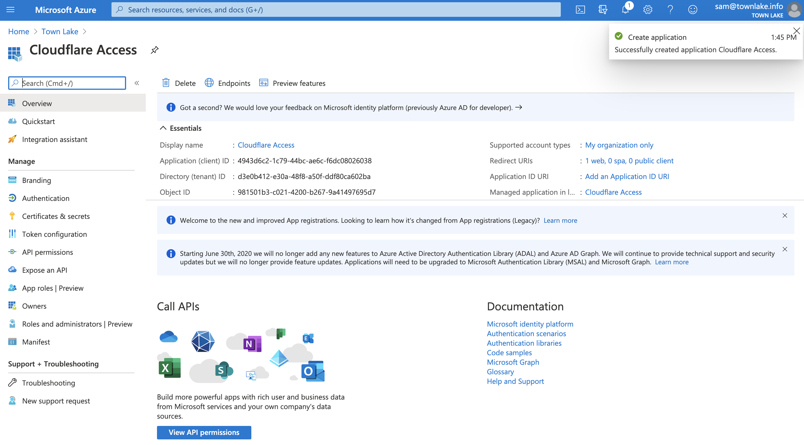

7. In the left hand panel, click **Certificates & Secrets** to create an Application Secret.

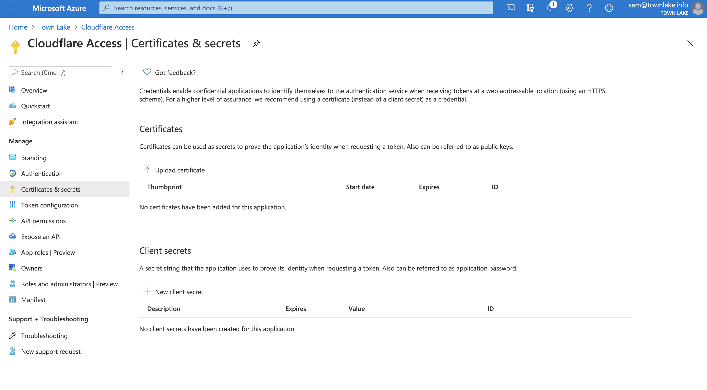

8. Click **+ New client secret**. Name the client secret and choose an expiration. Click **Add**.


Copy the `Value` field of the client secret. Treat this value like a password. This example leaves the value visible so the values in Azure can be seen in the Access configuration.

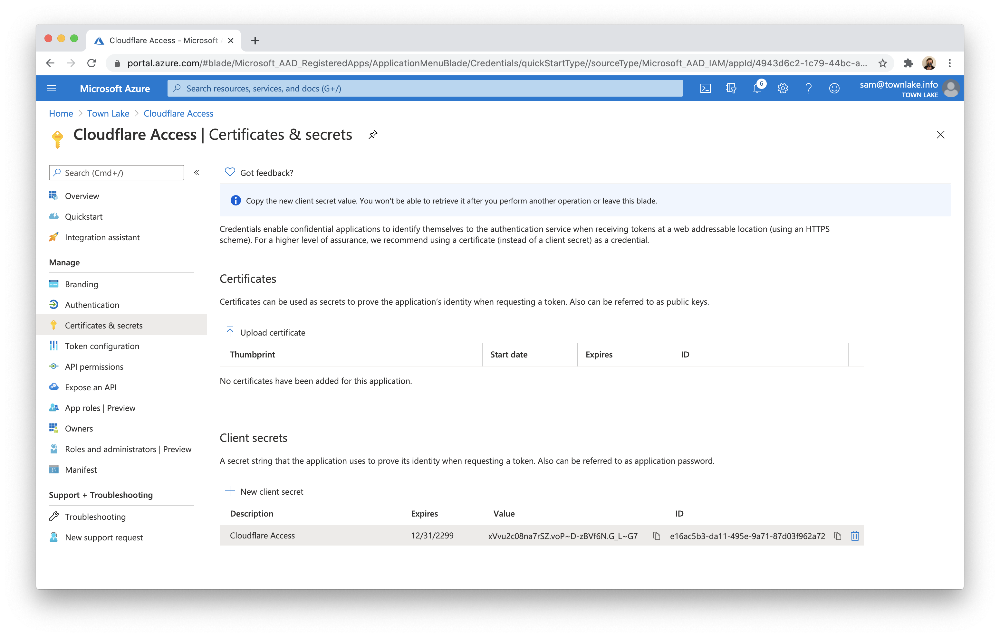

9. In the left hand panel, select **API permissions**. Click **Add a permission**.

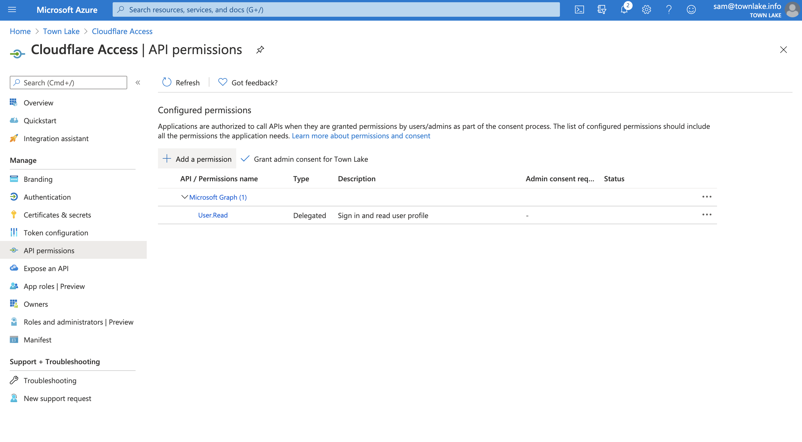

10. Click **Microsoft Graph**.

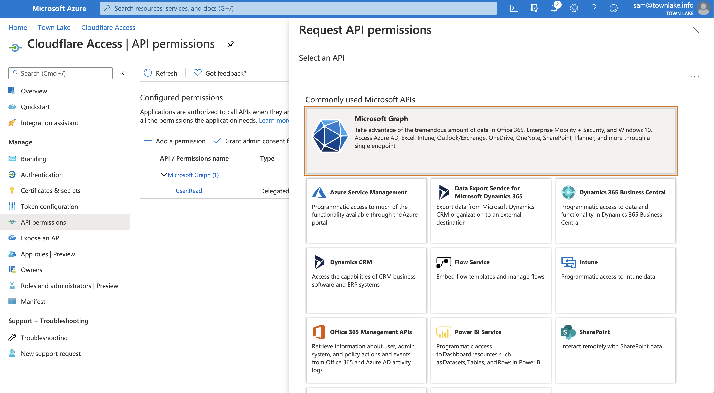

11. Select Delegated permissions. You will need to toggle 7 specific permissions in the next page. Once toggled, click **Add permissions**.

    - email
    - openid
    - profile
    - offline_access
    - User.Read
    - Directory.Read.All
    - Group.Read.All

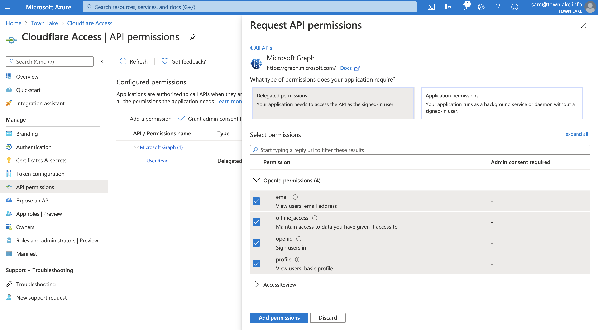

12. On the next page, click the button that begins **Grant Admin Consent for ...**.


13. Return to the Cloudflare for Teams dashboard. Select `Authentication` under the Access section of the sidebar. In the `Login` tab, click **+ Add**. Choose `Azure AD` on the next page.

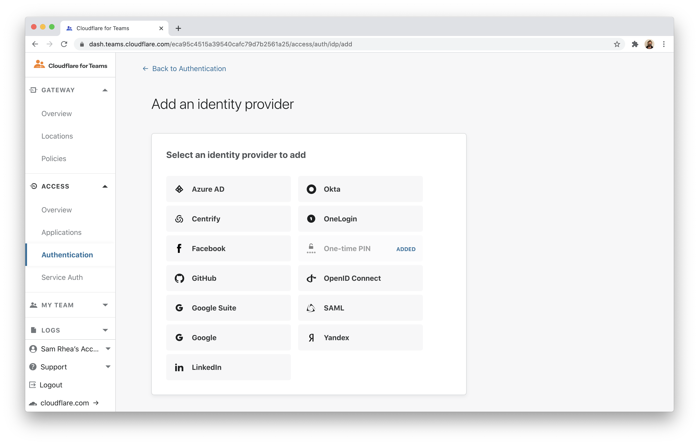

14. Input the `Application ID`, `Application secret`, and `Directory ID` values from Azure.

If you are using Azure AD groups, toggle **Support Groups** slider **On** in the **Edit your Azure AD identity provider** window.

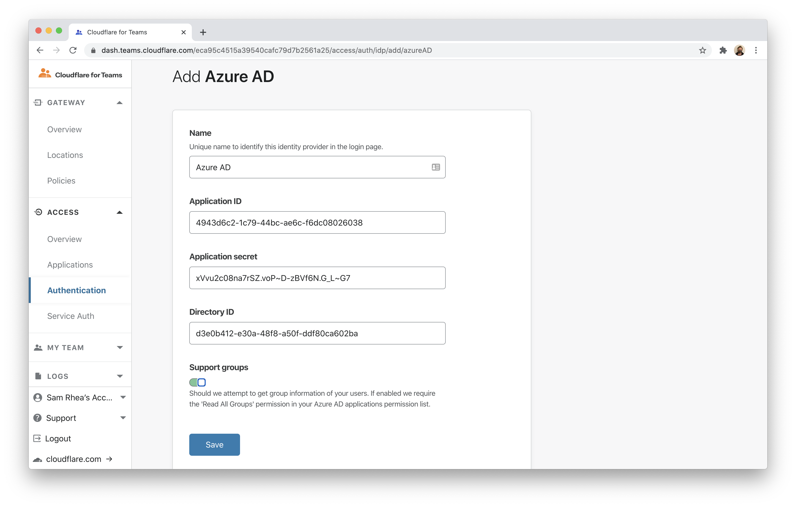

15. Click **Save and Test** to check your connection to the IdP.


## Using AzureAD Groups

AzureAD exposes directory groups in a format that consists of random strings, the `Object Id`, that is distinct from the `Name`. In the example below, the group named "Admins" has an ID of "61503835-b6fe-4630-af88-de551dd59a2".


When configuring Access to use Azure groups, you must input the `Object Id`.


## Example API Configuration

```json
{
    "config": {
        "client_id": "<your client id>",
        "client_secret": "<your client secret",
        "directory_id": "<your azure directory uuid",
        "support_groups": true
    },
    "type": "azureAD",
    "name": "my example idp"
}
```
