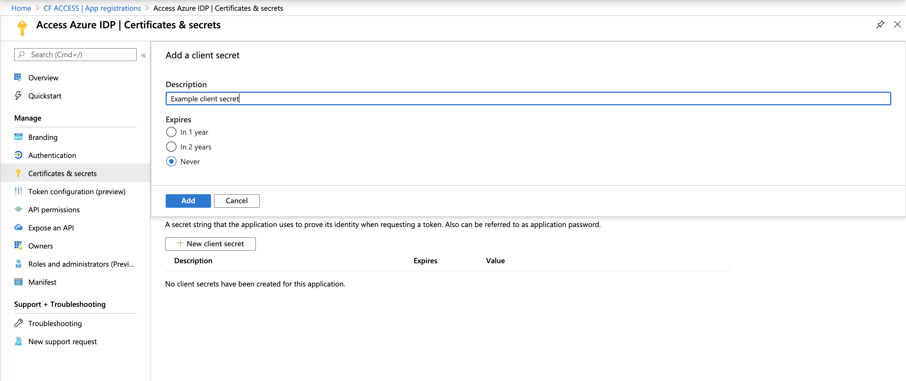
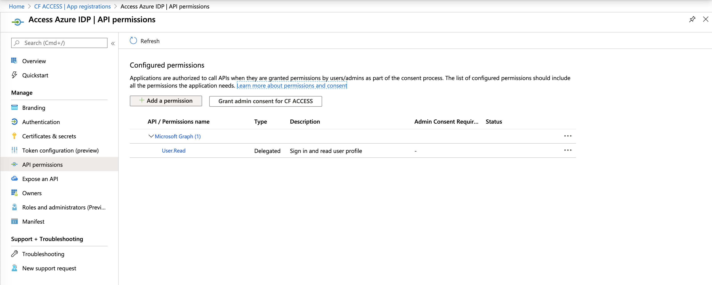
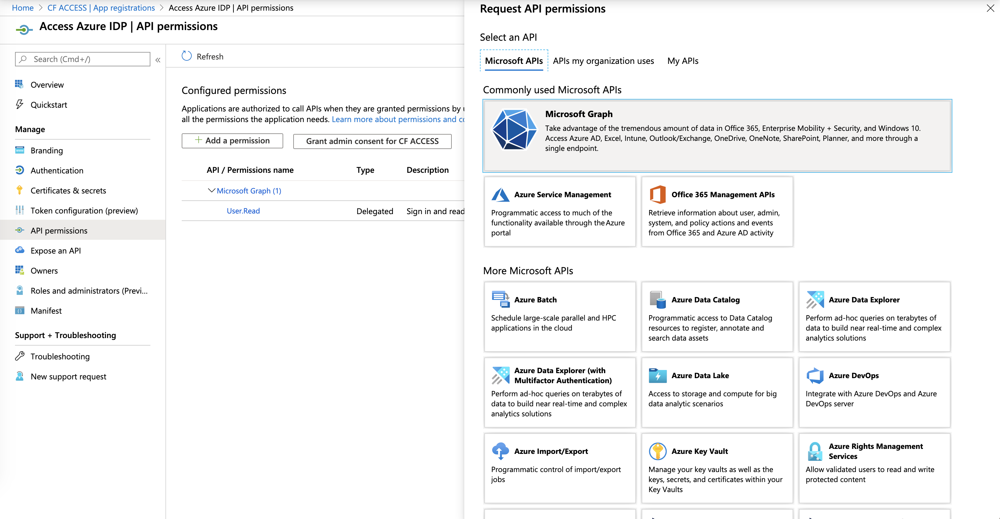

# Microsoft Azure AD® (Active Directory)


These steps help you set up Azure AD as your identity provider (IdP).

<Aside>

Azure AD integrates with the Office365 identity service as well as other SaaS applications.
</Aside>

1. Sign in to [the Azure dashboard](https://portal.azure.com/).
2. Click **Azure Active Directory** in the Azure Services section.

    

3. On the **Azure AD** dashboard, click **App registrations** in the **Manage** section of the _Azure Active Directory_ pane.
4. Click **+ New application registration**.

    

5. Name your application and enter your **Sign-on URL** (for example, `https://<your authentication domain>/cdn-cgi/access/callback`). Click **Register**.

    

6. Select your new application and copy the **Application ID** and **Directory ID** into your **Cloudflare** dashboard.

    

7. In the left hand panel, click **Manage > Certificates & Secrets** and then click **New client secret**.

8. Give it a **Description** and **Expires** setting and click **Add**.

     

9. Copy the value to the **Application Secret** field in your **Cloudflare** dashboard.

10. In the left hand panel, select **API permissions**, and then click **Add a permission**.

    

11. Click Microsoft Graph.

    

12. Click Microsoft Graph and then delegated permissions. Add the following permissions.

    - email
    - openid
    - profile
    - offline_access
    - User.Read
    - Directory.Read.All
    - Group.Read.All

13. Click **Grant Admin Consent for ...**.

    

14. Return to your **Cloudflare** dashboard.
15. If you are using Azure AD groups, toggle **Support Groups** slider **On** in the **Edit your Azure AD identity provider** window.

    

16. Click **Save and Test** to check your connection to the IdP.

    

## Using AzureAD Groups

AzureAD exposes directory groups in a format that consists of random strings, the `Object Id`, that is distinct from the `Name`. In the example below, the group named "Admins" has an ID of "61503835-b6fe-4630-af88-de551dd59a2".


When configuring Access to use Azure groups, you must input the `Object Id`.


## Example API Configuration

```json
{
    "config": {
        "client_id": "<your client id>",
        "client_secret": "<your client secret",
        "directory_id": "<your azure directory uuid",
        "support_groups": true
    },
    "type": "azureAD",
    "name": "my example idp"
}
```
