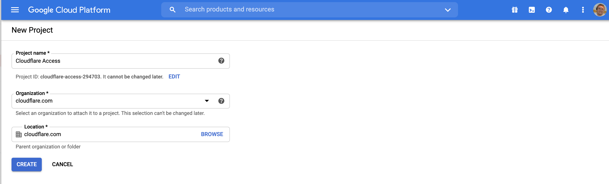
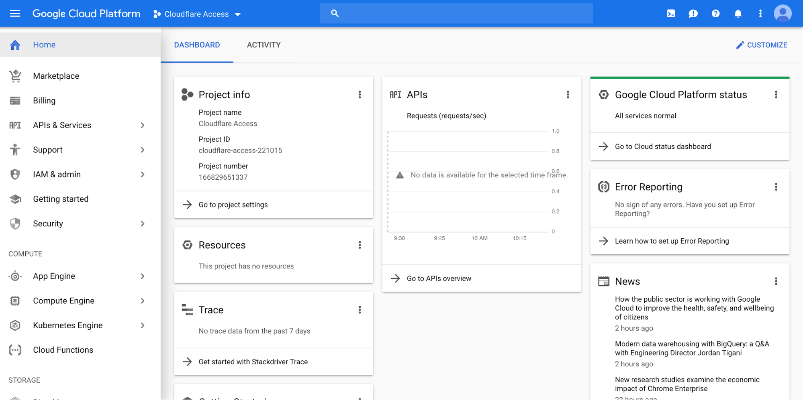
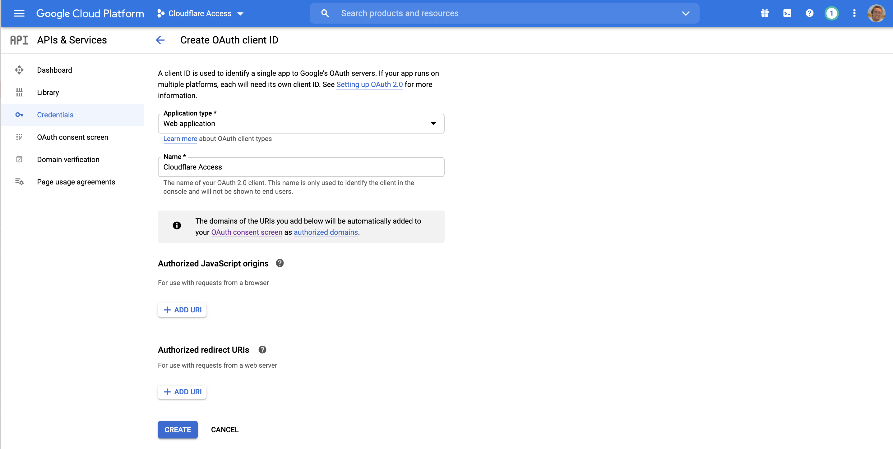
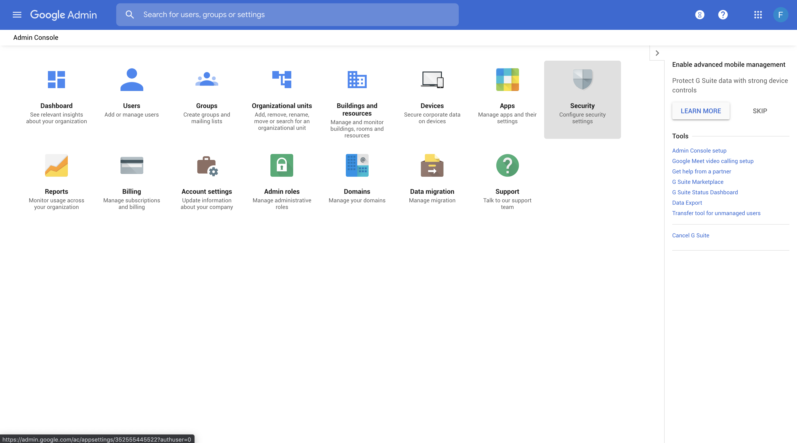
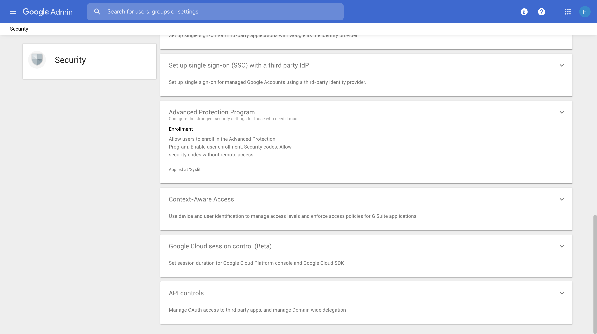

# Google Workspace


Google Workspace provides OpenID Connect (OIDC) Identity Provider support that you can use with many SaaS apps in the Google Workspace Marketplace, and adds support for SAML 2.0 (Security Assertion Markup Language) for more than 15 popular SaaS providers. Cloudflare Access supports Google Workspace as an IdP.

<Aside>

You must be an administrator for the Google Workspace organization you are connecting in order to connect your Google Workspace account to Cloudflare.
</Aside>

## Set up Google Workspace as your IdP

Use these steps to set up Google Workspace as your IdP.

1. Log in to the **Google Cloud** console at [https://console.cloud.google.com/](https://console.cloud.google.com/).

    This console is separate from your Google Workspace Admin console.

1. Create a new Google Cloud Platform (GCP) project.

1. Enter **Cloudflare Access** in the **Project Name** field.
1. Ensure that the setting in the **Location** field matches your Google Workspace domain.

    

   The GCP dashboard displays.

1. In the APIs card, click **→ Go to APIs overview**.
    

1. Follow the Admin SDK link [here](https://console.cloud.google.com/apis/api/admin.googleapis.com/overview) and click enable.

    

1. Return to the APIs overview page. Select **Credentials** in the left menu pane.

    

1. Click **Create credentials > OAuth client ID**.

1. Click **Configure Consent Screen**.

1. In **User type**, select the **Internal** option.

    

1. Enter an **Application Name**.
1. Scroll to the **Authorized Domains** field, and enter `cloudflareaccess.com`.
1. Click **Save**.

    The Scopes menu displays.
1. No Scopes typically need to be configured.
1. Once consent screen is configured. Navigate to **Credentials**
1. Click **Create Credentials > OAuth Client ID**
1. Set the **application type** as Web Application
1. Enter a name for your application.

    

1. In **Authorized JavaScript Origins**, enter the authentication domain from **Cloudflare Access**.

    For example, `https://EXAMPLE.cloudflareaccess.com`. Where `EXAMPLE` is your account name in Access.

1. Enter your authentication domain in the **Authorized redirect URIs** field, and add this to the end of the path: `/cdn-cgi/access/callback`

    For example: `https://EXAMPLE.cloudflareaccess.com/cdn-cgi/access/callback`

    A window displays with your **OAuth Client ID** and **Client Secret**. Copy these to enter in your **Cloudflare Access** app.

1. Return to your Google Workspace Admin console, and click **MORE CONTROLS** at the bottom of the window.
1. Click **Security**.

    

    The Security page displays.

1. Click **Advanced Settings > Manage API client access**.

    

1. Enter your copied Client ID in the **Client Name** field.
1. Paste these URLs in the **One or More API Scopes** field:

    ```txt
    https://www.googleapis.com/auth/admin.directory.group.member.readonly, https://www.googleapis.com/auth/admin.directory.group.readonly
    ```
    

1. Click **Authorize**.
1. In the **Cloudflare Access** app, under click **Add** under **Login Methods**, and select Google Workspace as your IdP.
1. Paste in the **Client ID** and **Client Secret**.
1. In the Cloudflare Access **Configuration** panel, enter your Google domain, including the TLD.
1. Click **Save and Test**.

    On success, a confirmirmation displays that your connection works.

    

## Example API Configuration

```json
{
    "config": {
        "client_id": "<your client id>",
        "client_secret": "<your client secret",
        "apps_domain": "mycompany.com"
    },
    "type": "google-apps",
    "name": "my example idp"
}
