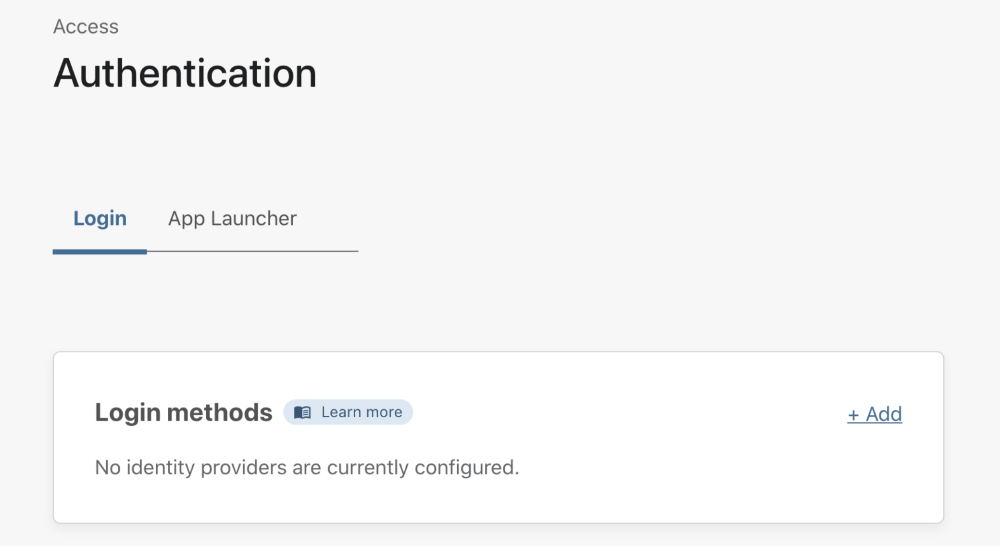
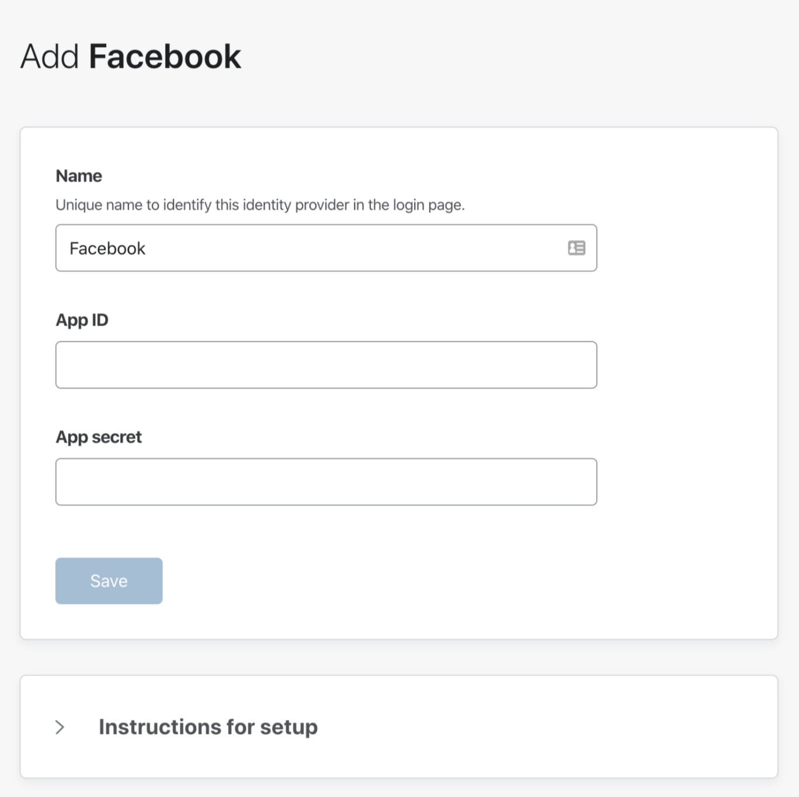

# Configuring identity providers

You can integrate your organization's identity providers (IdPs) with Cloudflare Access. Your team can simultaneously use multiple providers, reducing friction when working with partners or contractors.

Cloudflare Access supports social identity providers that do not require administrator accounts, open source providers, and corporate providers. Cloudflare also supports using signed AuthN requests with SAML providers.

Adding an identity provider as a login method requires configuration both on the [Teams dashboard](https://dash.teams.cloudflare.com) and with the identity provider. Consult our IdP-specific documentation to learn more about what you need to set up.

## Setting up IdPs on the Teams dashboard

1. Navigate to **Access > Authentication** on the [Teams dashboard](https://dash.teams.cloudflare.com).
2. In the **Login methods** card, click *+Add*.

3. Select the identity provider you want to set up. You can integrate multiple providers of the same type.

4. Fill in the necessary fields to set up your identity provider.

Each identity provider will have different required fields for you to fill in. If you need help, step-by-step instructions can be expanded below the input form.

If you do not see your identity provider listed, but they support SAML or OAuth, these providers can typically still be enabled. If they support SAML select the SAML option. If they support OAuth select the **OpenID Connect** option.

4. Once you have filled in the necessary fields, click **Save**.

### Using The API

We recommend that you use our dashboard to configure your identity providers. However, if you would like to use the [Cloudflare API](https://api.cloudflare.com/), each of the identity provider topics covered here include an example API configuration snippet as well.

## Customize the Login Page

You can customize the page users will see when attempting to visit an application that is behind Access.

To do so:

1. On the Teams dash, navigate to **Authentication > Login Page**.

2. Click **Customize**.

3. In the **Configuration card** you will be able to:
  * Choose an *Organization name*.
  * Link to a *custom logo*.
  * Choose a *custom header text*.
  * Choose a *custom footer text*.
  * Choose a *background color*.