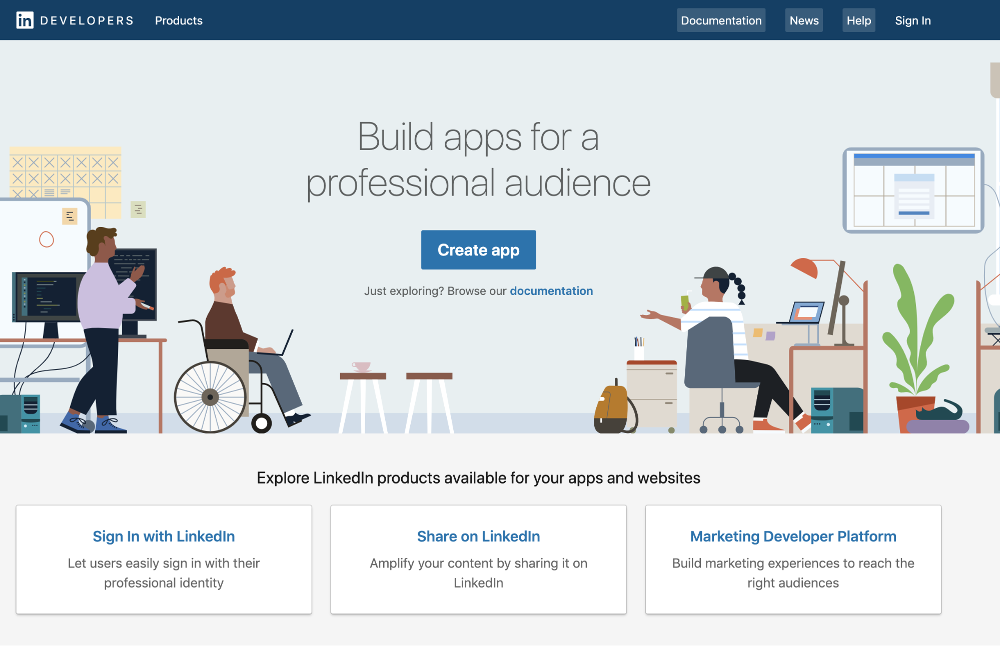
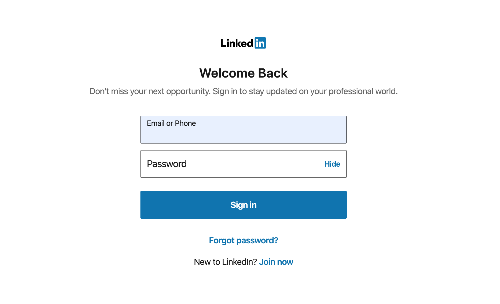
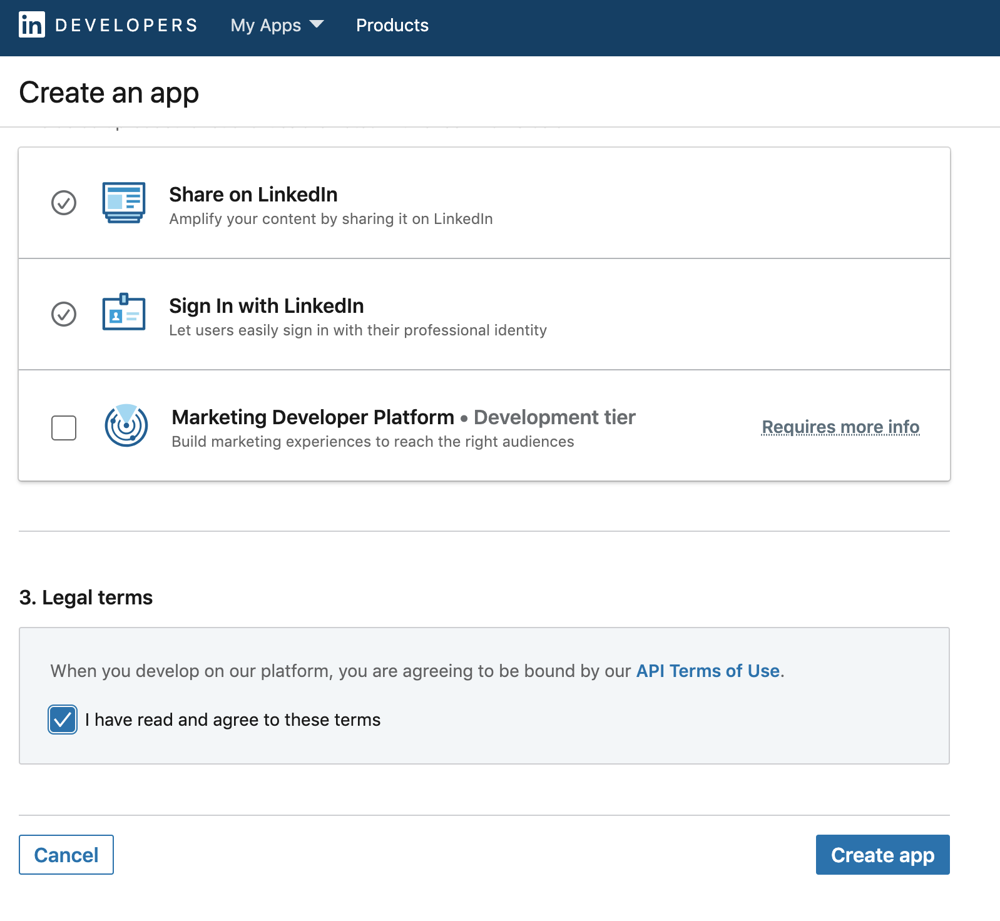

# LinkedIn

<Aside type='warning' header='⚠️ THIS PAGE IS OUTDATED'>

We're no longer maintaining this page. **It will be deleted on Feb 8, 2021**. Please visit the new [Cloudflare for Teams documentation](https://developers.cloudflare.com/cloudflare-one/teams-docs-changes) instead.

</Aside>

Cloudflare Access allows your users to use LinkedIn as their identity provider (IdP).

## Set up LinkedIn as an IdP

Configuring LinkedIn as a Cloudflare Access IdP requires a LinkedIn account.

To configure LinkedIn as an IdP:

1. Go to [the LinkedIn Developer Portal](https://www.linkedin.com/developers).
2. Click **Create App**.

    

3. Sign in to your LinkedIn account.

    

    The **Create an app** screen displays.

    

4. Enter an **App name** for your application.
5. Enter the URL for your business page.
6. Click **Upload a logo** and navigate to your company logo image file.
7. Click **OK**.
8. (optional) Select the **Share on LinkedIn** option to announce that your clients can use LinkedIn to access your app.

    

9. Select the **Sign In with LinkedIn** option.
10. Click the **API Terms of Use** link to read the terms of use.
11. If you agree to the terms, check the **I have read and agree to these terms** option.
12. Click **Create app**.
13. Go to your account Settings page.

    

14. Click the **Auth** tab.
15. Copy the **Client ID** and **Client Secret**.
16. In your **Cloudflare Access** dashboard, scroll to the **Login Methods** card, click **Add**, and select the **LinkedIn** icon.

    

    The **Add a LinkedIn identity provider** window displays.

    

17. Provide a name for the IdP, and paste in the **Client ID** and **Client Secret**.
18. In the **LinkedIn** **Auth** tab, scroll to **OAuth 2.0 settings** and click the **pencil icon** to edit the settings.

    

19. Enter your authentication domain URL, and add this to the end of the path: `/cdn-cgi/access/callback`

    You can find your authorization domain in Cloudflare Access. It begins with a subdomain unique to your organization and ends with the domain `cloudflareaccess.com`, including the callback path specified above

20. In the Cloudflare Access **Add a LinkedIn identity provider** window, click **Save** and then **Test**.

    On successful connection to your identity provider, a confirmation window displays.

    

## Example API configuration

```json
{
    "config": {
        "client_id": "<your client id>",
        "client_secret": "<your client secret"
    },
    "type": "linkedin",
    "name": "my example idp"
}
```
