# Okta

<Aside type='warning' header='⚠️ THIS PAGE IS OUTDATED'>

We're no longer maintaining this page. **It will be deleted on Feb 8, 2021**. Please visit the new [Cloudflare for Teams documentation](https://developers.cloudflare.com/cloudflare-one/teams-docs-changes) instead.

</Aside>

You can integrate Okta with Cloudflare Access to allow users to reach applications protected by Access with their Okta account.

1. In your Okta dashboard, click **Admin**.

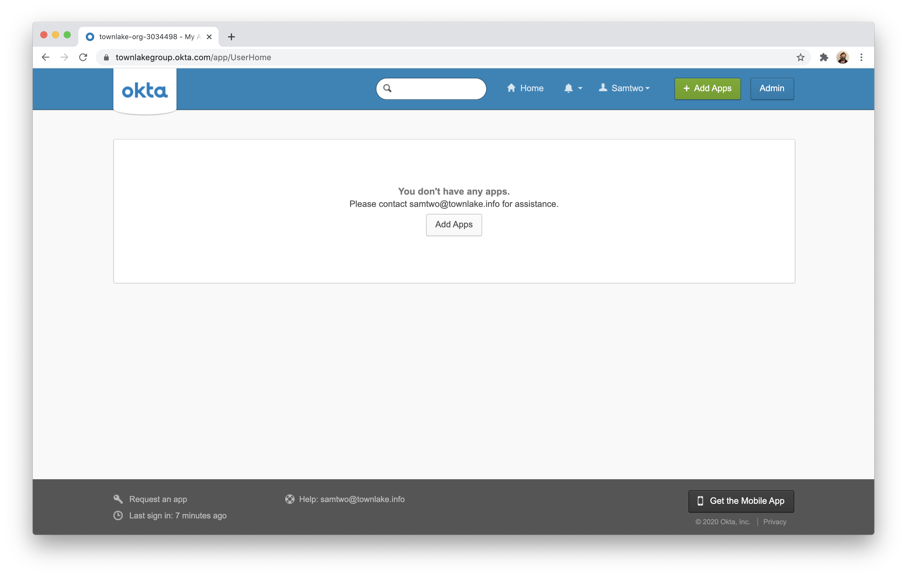

2. Select the `Applications` tab in the Admin dashboard.

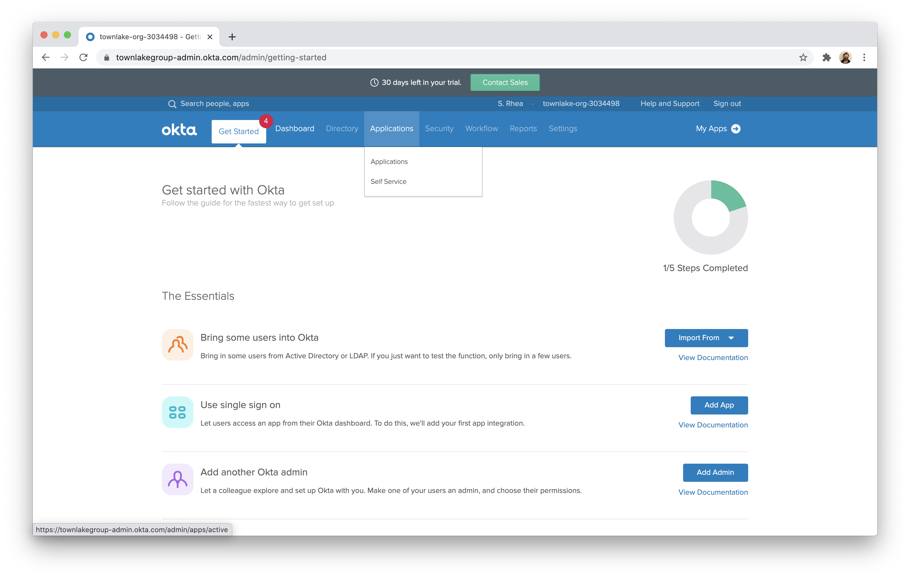

3. Click **Add Application** on the next page.

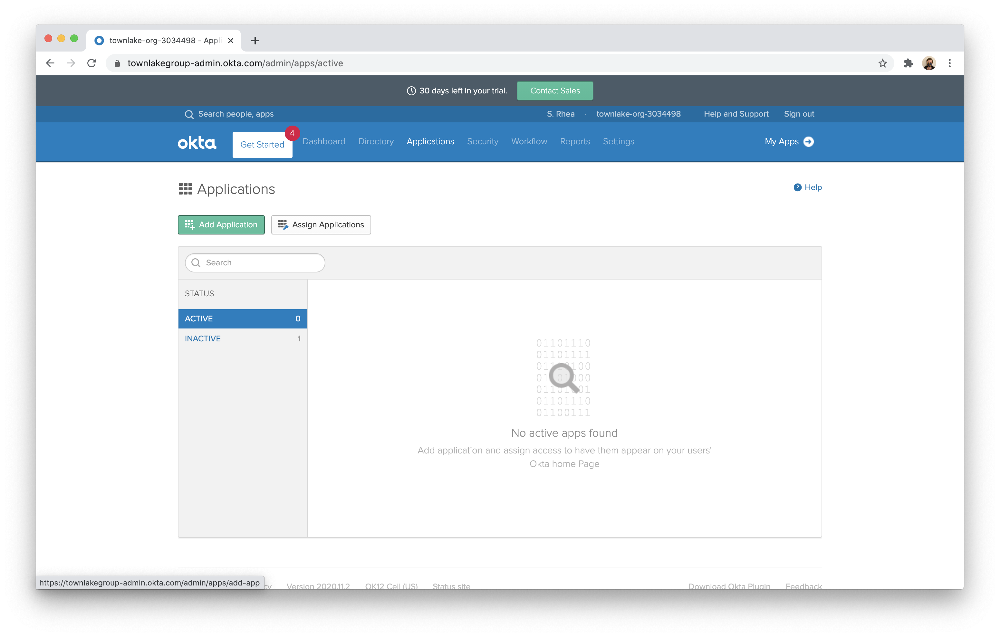

4. Click **Create New App** in the top right corner.

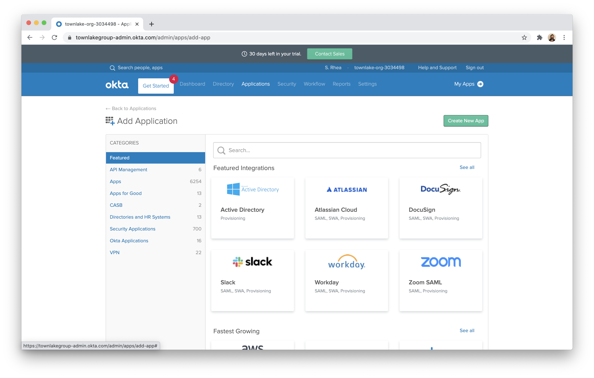

5. Choose `Web` as the Platform and toggle `OpenID Connect`. Click **Create**.

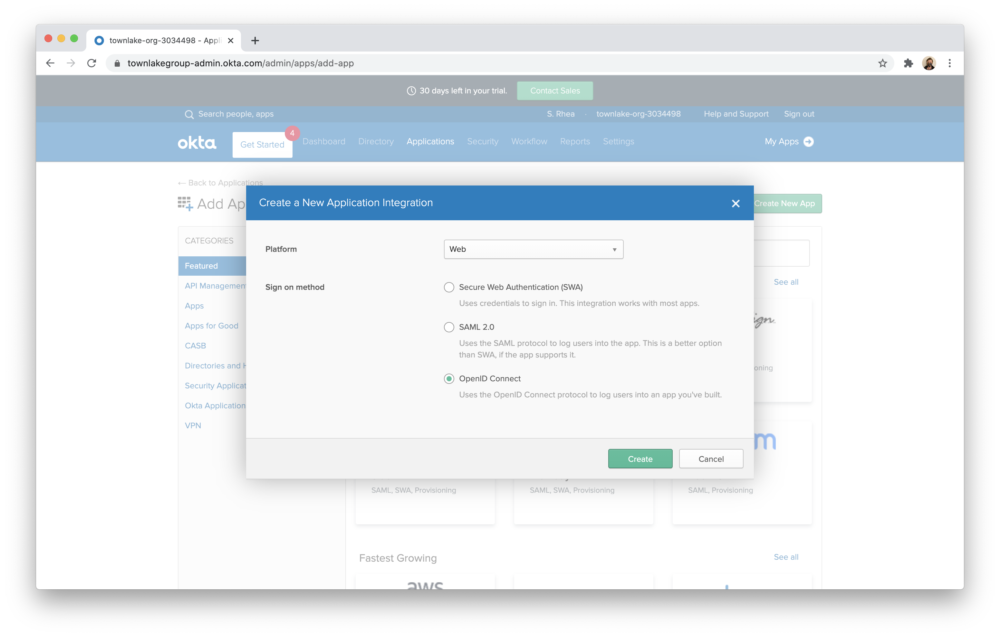

6. You can name the application to be any value. In the `Login redirect URIs` field, input the callback URL of your Cloudflare authentication domain.

The domain will be structured in the following format:

```
https://<your-auth-domain-here>.cloudflareaccess.com
```

In the URI field, input your authentication domain with the path below.

```
https://<your-auth-domain-here>.cloudflareaccess.com/cdn-cgi/access/callback

```

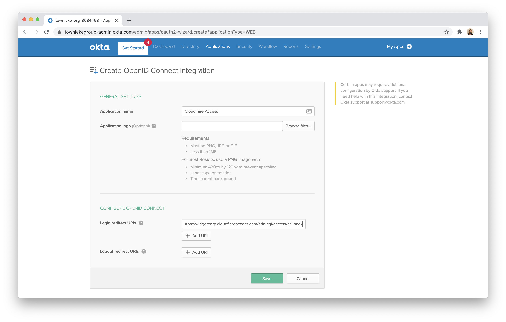

7. Once saved, choose the `Sign On` tab from the application view.

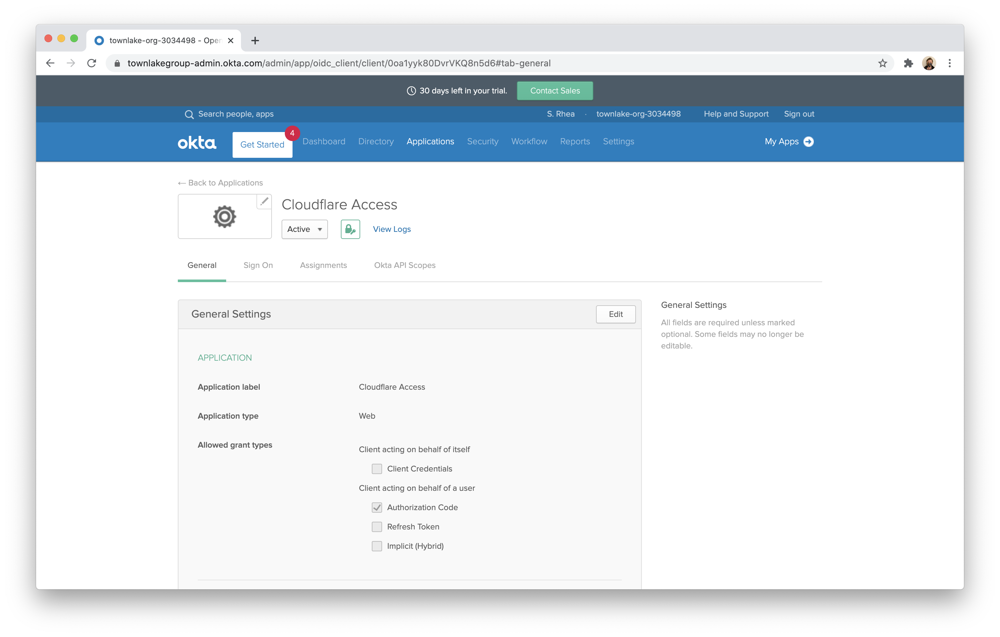

8. Scroll down to the `OpenID ConnectID Token`.

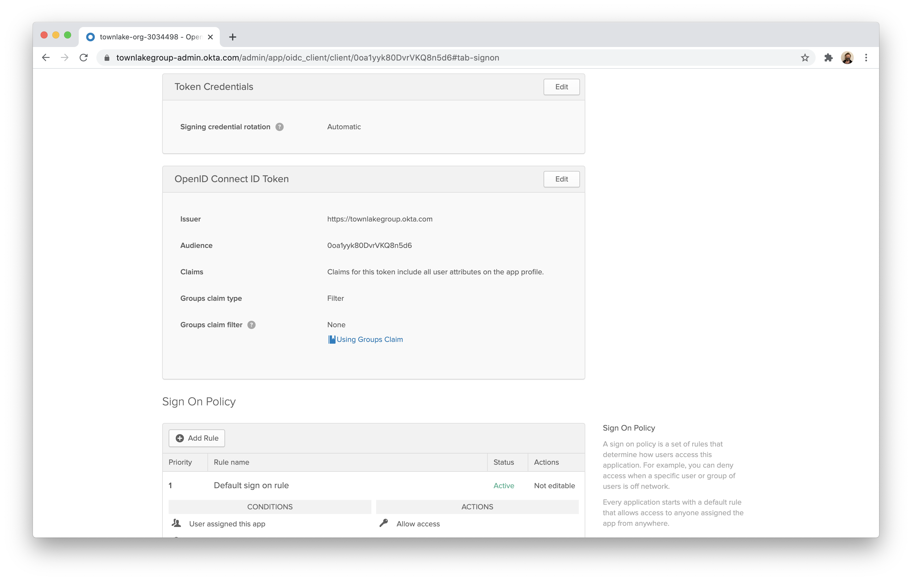

9. Click **Edit** and edit the Groups claim filter to `Starts with` and the value `.*`.

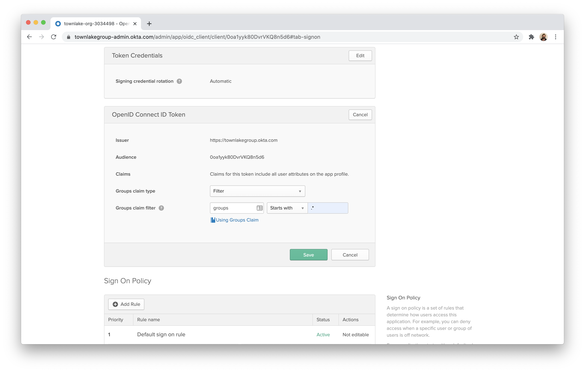

10. Next, click the `Assignments` tab.

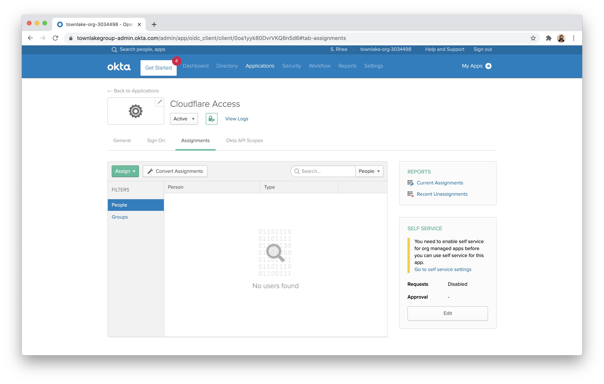

11. Click **Assign** and assign the application to all users in your organization.

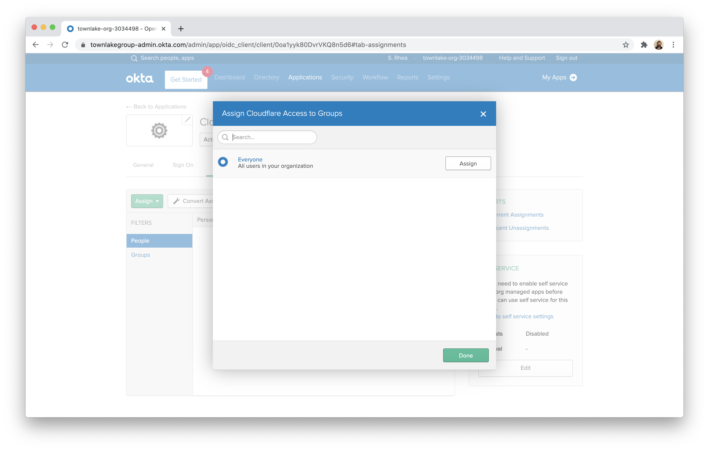

12. Return to the `General` tab. Scroll down to find your credentials. Copy the ID and secret.

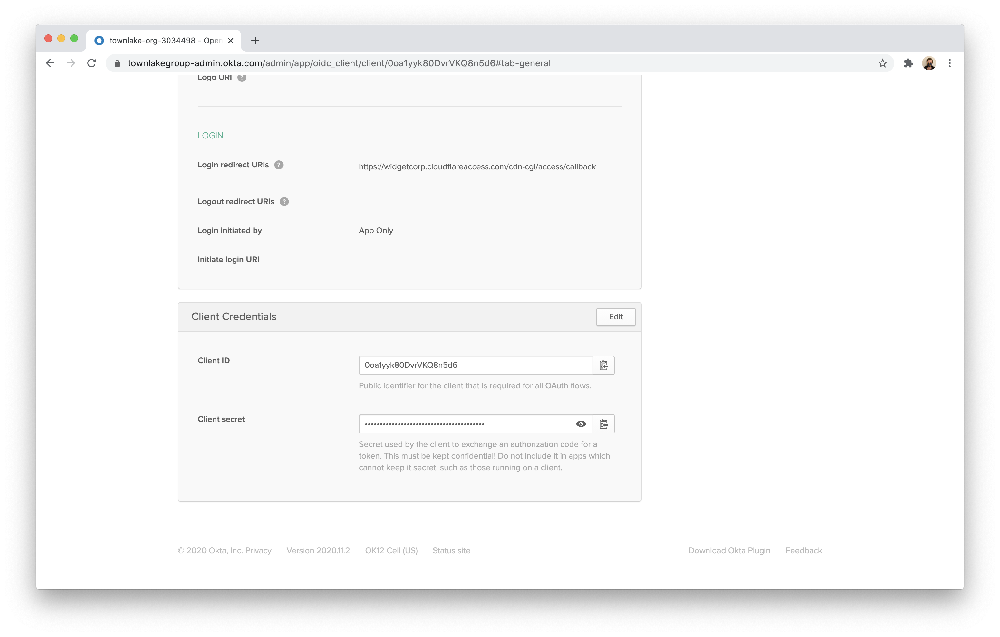

13. Visit the Cloudflare for Teams dashboard and navigate to the `Authentication` page of the Access section. Click **+Add** to add a new identity provider. Choose `Okta`.

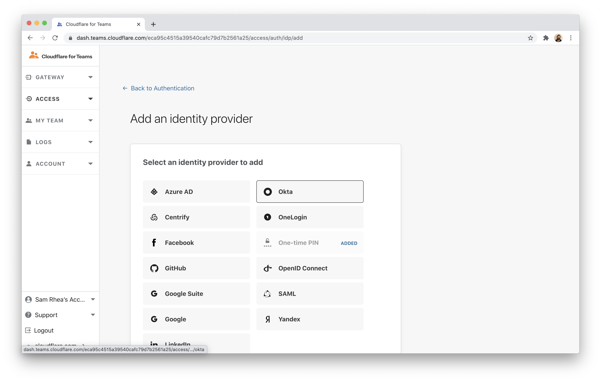

14. Input the ID, secret, and the Okta account URL. Click **Save**.

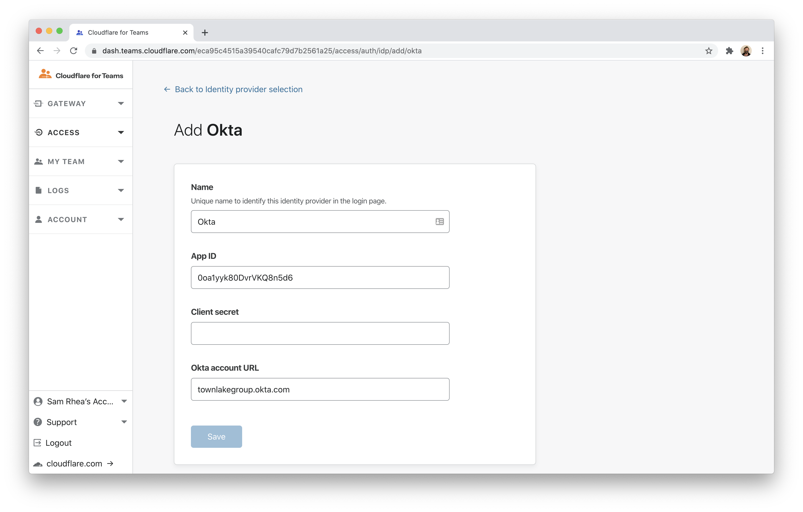

15. In the application list, you can now test the connection by clicking the **Test** button.


## Example API Configuration

```json
{
    "config": {
        "client_id": "<your client id>",
        "client_secret": "<your client secret>",
        "okta_account": "https://dev-abc123.oktapreview.com",
    },
    "type": "okta",
    "name": "my example idp"
}
```
