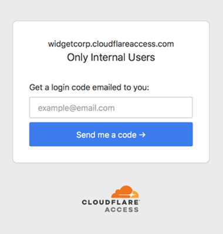

# One-Time Pin Login

<Aside type='warning' header='⚠️ THIS PAGE IS OUTDATED'>

We're no longer maintaining this page. **It will be deleted on Feb 8, 2021**. Please visit the new [Cloudflare for Teams documentation](https://developers.cloudflare.com/cloudflare-one/teams-docs-changes) instead.

</Aside>

Cloudflare Access can send a one-time PIN (OTP) to approved email addresses as an alternative to configuring an identity provider (IdP). You can simultaneously configure an OTP and IdP to allow users to use their own authentication method.

For example, if your team uses Okta® but you’re collaborating with someone outside your organization, use OTP to grant them access.

## Set up OTP

To set up OTP to allow guest-user access, you simply add the guest user’s email address to a [Policy rule](/setting-up-access/configuring-access-policies/) and to the [Access Group](/setting-up-access/access-groups/) that allows your team to reach the application.

This is the workflow for your guest user:

1. Select OTP on login to your application.
2. Enter their email address and click **Send me a code**.

    

    Access sends a one-time PIN they use to authenticate. This secure PIN expires 10 minutes after the initial request.

3. Receive a PIN when the email address matches a Policy.
4. Paste PIN in login page and click **Sign in**.

    

5. Access logs them in.

## Example API Config

```json
{
    "config": {},
    "type": "onetimepin",
    "name": "my example idp"
}
