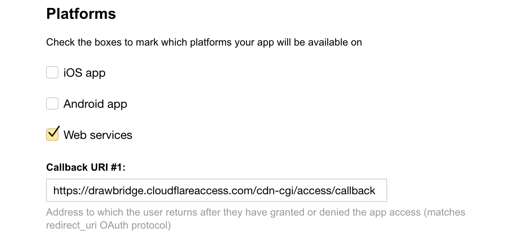
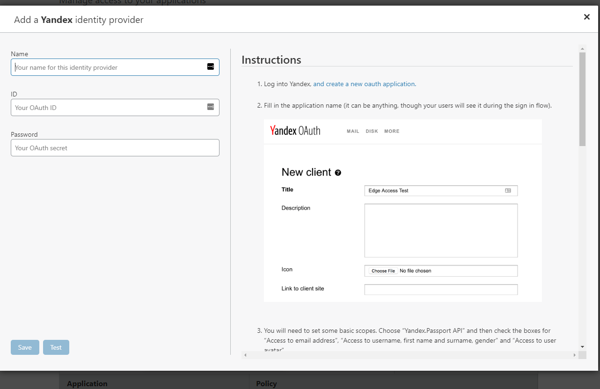

# Yandex

<Aside type='warning' header='⚠️ THIS PAGE IS OUTDATED'>

We're no longer maintaining this page. **It will be deleted on Feb 8, 2021**. Please visit the new [Cloudflare for Teams documentation](https://developers.cloudflare.com/cloudflare-one/teams-docs-changes) instead.

</Aside>

Yandex is a web search engine that also offers identity provider (IdP) services.

## Set up Yandex

To set up Yandex for Cloudflare Access:

1. Log into your Yandex account.
1. Select **Open a new OAuth Application**.

    

1. Select **New client**.
1. Complete the required fields.
1. Choose **Yandex.Passport API** to set the basic scopes.
1. Select the **Access to email address**, **Access to user avatar,** and **Access to username, first name and surname, gender** options.

    

1. Select **Platform** and click **Web Services.**
1. In the **Callback URL #1** field, input your authorization domain.

    Replace “your-domain” with the authentication domain listed in Cloudflare Access, and include the callback in the path:

    ```txt
    https://your-domain.cloudflareaccess.com/cdn-cgi/access/callback
    ```

    

1. Click **Add**.
1. Scroll to the **Platforms** card, and click **Submit**.

    **Yandex OAuth** card titled **Cloudflare Access App** displays.

1. Copy the **ID** and **Password**.

    

1. In **Cloudflare Access**, scroll to **Login Methods**, click **Add** and select the **Yandex** icon.

    

    The **Add a Yandex identity provider** dialog displays.

1. Paste the ID and password in the appropriate fields.

    

1. In the right pane, scroll to **Platforms** and click **Web services**.

    

1. In the Callback URI #1 field, input your authorization domain.

    ```txt
    https://your-domain.cloudflareaccess.com/cdn-cgi/access/callback
    ```

    Replace “your-domain” with the authentication domain listed in Cloudflare Access, and include the callback in the path.

1. Click **Save and test**.

    On successful connection to your Yandex IdP, a confirmation card displays.

    

## Example API Config

```json
{
    "config": {
        "client_id": "<your client id>",
        "client_secret": "<your client secret>"
    },
    "type": "yandex",
    "name": "my example idp"
}
```
