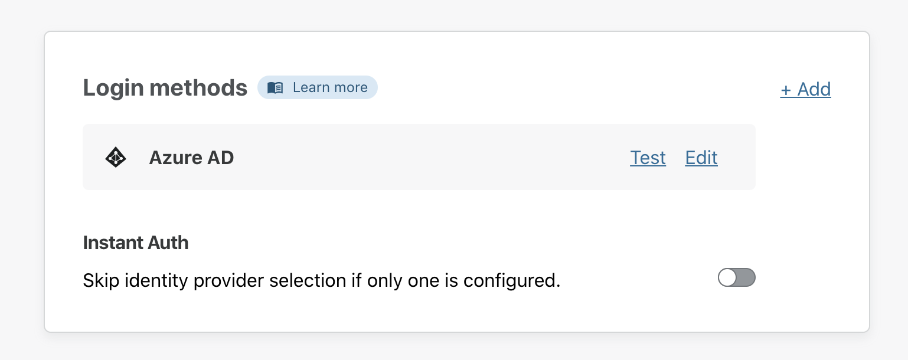
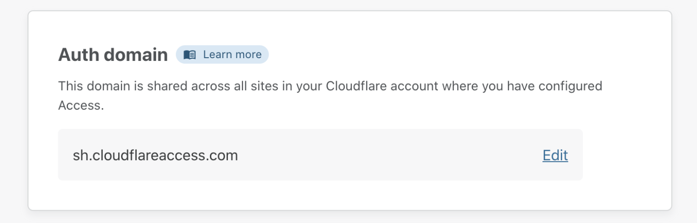
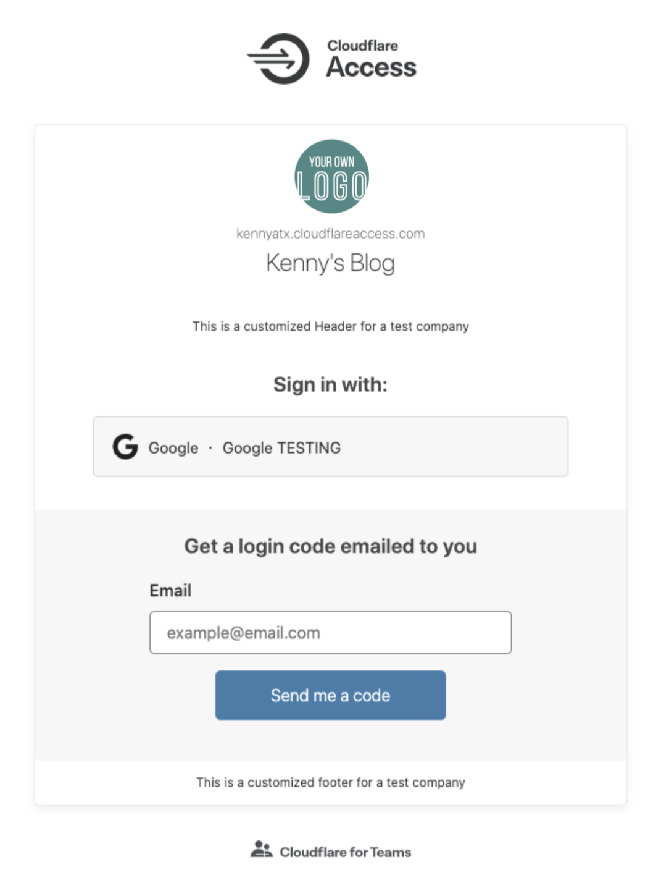

# Login customization

In the **Authentication > Login** tab, you can customize the login process for your end users.

## Login methods

Use the **Login Methods** card to add new login methods, or edit/test any login methods you may have already added.

## Auth domain

Use the **Auth domain** card to edit your auth domain. To do so, click Edit and input your desired domain name.

 This domain is shared across all sites in your Cloudflare account where you have configured Access.

## Login page

Use the **Login Page** card to customize the login page your end users will see. To do so, click *Customize*.

This will allow you to add an organization name, a custom header and footer, a logo, and a preferred background color to your login page.

Once you’re satisfied with your customization, click **Save**.

Your login page will now reflect your changes.

