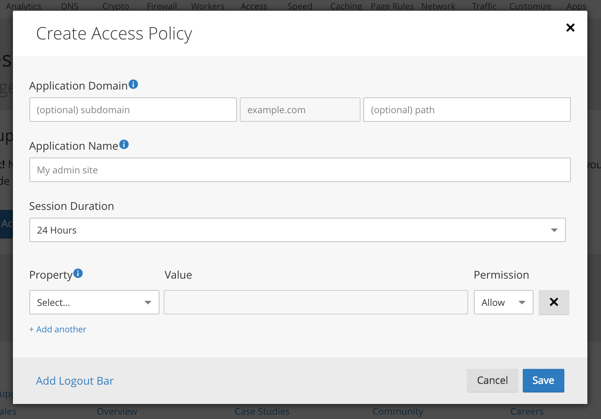
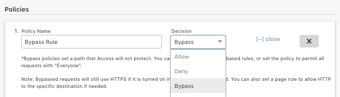
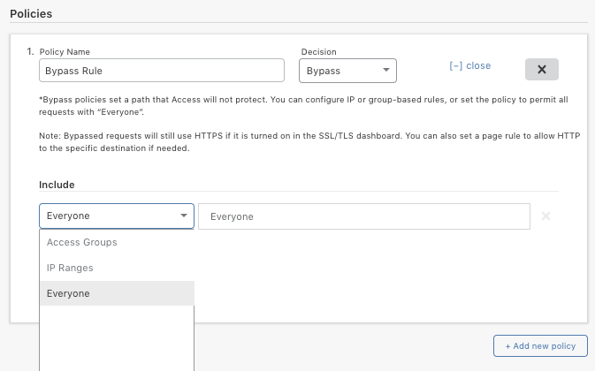
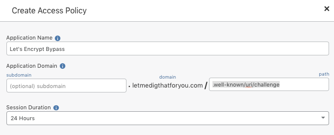

# Bypass policy configurations

When an Access policy includes the _Bypass_ decision, requests that satisfy the policy are exempt from evaluation—they  _bypass_ Cloudflare Access. This behavior is useful in cases where you want to expose specific resources to third-party services, such as WordPress and Let's Encrypt in the examples below.

When creating bypass policies, be careful not to expose sections of your site that require protection.

## WordPress®

WordPress relies on the `wp-admin/admin-ajax.php` endpoint to establish an API connection between the browser and the server. Other components and plugins often use the connection as well.

After you've created an Access policy to lock down your WordPress application, use the following pattern to create a bypass policy for `wp-admin/admin-ajax.php`:

1. From the Cloudflare Dashboard, open the **Access** app and locate the **Access Policies** card. Click the **Create Access Policy** button.

2. In the **Create Access Policy** dialog, supply an **Application Name** and enter `wp-admin/admin-ajax.php` in the **Application Domain path** input.

3. In the **Policies** section, provide a **Policy Name** and select _Bypass_ from the **Decision** drop-down list.

4. Select _Everyone_ from the **Include** drop-down list.

5. Review the policy and click **Save**.

## Let’s Encrypt®

[Let’s Encrypt](https://letsencrypt.org/) is a free, automated, and open certificate authority (CA) that enables an HTTPS server to automatically obtain a browser-trusted certificate, without any human intervention. As part of that process, Let's Encrypt issues a challenge to your application to prove control of its domain. One of the ways your application can do that is to provide access to a well-known URI on that domain.

If you have an Access policy that applies to your application domain at that well-known URI or any level higher in the hierarchy, Cloudflare blocks any attempts to access the endpoint.

Once you create a policy to lock down your application, create a bypass policy so that Let’s Encrypt traffic can access the specified path.

2. From the Cloudflare dashboard, open the **Access** app and locate the **Access Policies** card. Click the **Create Access Policy** button.

3. Provide an **Application Name**. In the **Application Domain path** input, enter the path specified by Let’s Encrypt. In this example, the path is `.well-known/uri/challenge`.

4. In the **Policies** section, provide a **Policy Name** and select _Bypass_ from the **Decision** drop-down list.

5. Select _Everyone_ from the **Include** drop-down list.

6. Review your policy configuration and click **Save**.

