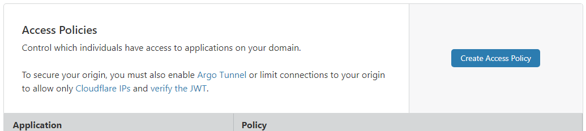
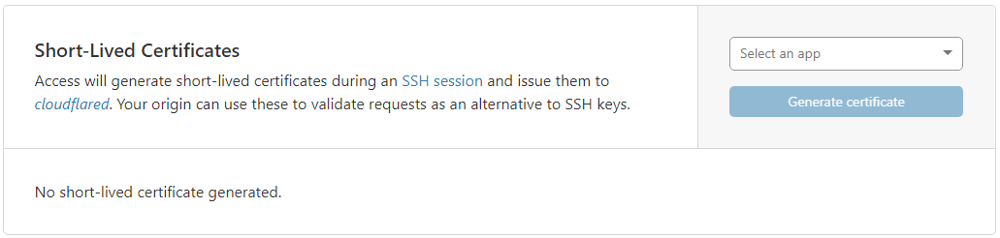
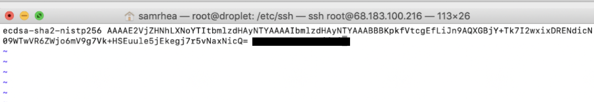
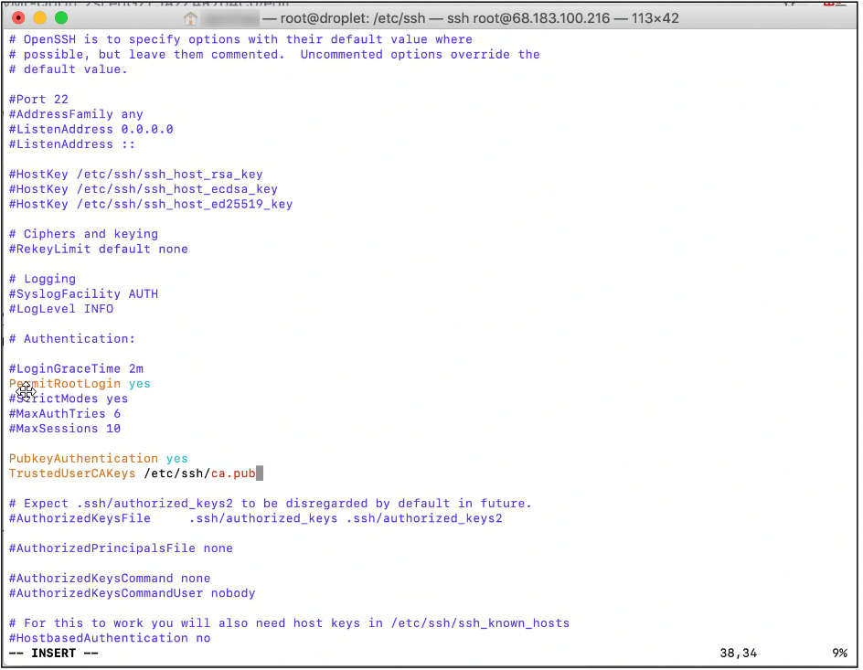
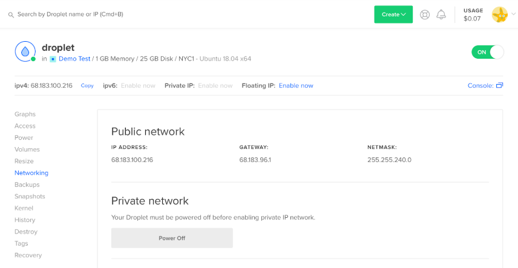
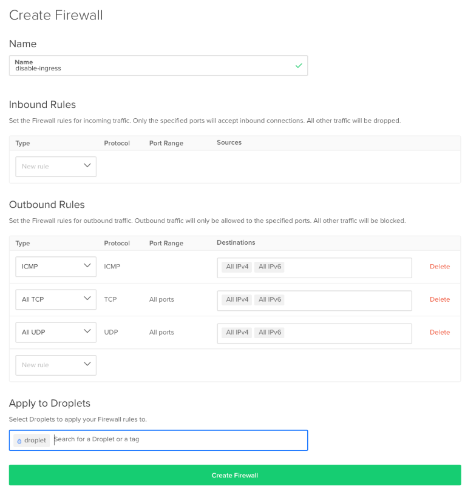

# DigitalOcean® and virtual infrastructure

[DigitalOcean](https://cloud.digitalocean.com/login) is a cloud infrastructure provider with a user-friendly UI that creates and manages virtual infrastructure. DigitalOcean refers to the virtual servers provided as _droplets_. This is the general workflow for protecting a DigitalOcean droplet behind Cloudflare Access.

## Create your droplet

After you log in to your [DigitalOcean](https://cloud.digitalocean.com/login) account:

1. On your DigitalOcean dashboard, click **Create > Droplets**.

The _Create Droplets_ dialog displays.


You can use a droplet of any size and a plan of any time. Cloudflare Access SSH has GA support for servers with x86, AMD64 and ARMv6 architectures. The instructions in this document use Ubuntu. You do not need to select additional options, such as Private Network or Add SSH keys to proceed.

2. Click **Create** at the top-right of the _Create Droplets_ window.

## Configure your droplet

Once created, DigitalOcean provides a temporary public IP address to use to reach your droplet to configure Cloudflare Access. DigitalOcean sends you an email with the initial root password.

1. Copy the password from the email and use the IP the following command:

```json
ssh root@68.183.100.216
```

Run the command from your local terminal, replacing the demo IP with the IP from DigitalOcean for your droplet.


The output confirms the SSH connection to your droplet.


1. In the **root password** field, paste the password sent in the DigitalOcean email.
1. Complete the new password request.
1. Securely save your new password.

Now, let's set up an Access policy.

## Create an Access policy

Cloudflare Access controls who reaches your resource by evaluating every request made to that destination for authentication in the form of a JSON Web Token (JWT). Cloudflare generates this token based on a login event with the [configured IdP](/configuring-identity-providers/).

To use Access, you must have at least one registered domain using its authoritative Domain Name System (DNS) on Cloudflare. You can then generate subdomains to represent the resources protected by Access. We use the domain `widgetcorp.tech` in our example; the subdomain `droplet.widgetcorp.tech` represents the DigitalOcean droplet. You don’t need to configure DNS for that subdomain at this time.

To create an Access policy:

1. Login to your Cloudflare dashboard and navigate to the **Access** app.
2. In the _Access Policies_ section, click **Create Access Policy**.



3. Enter the subdomain that represents the resource to protect with Access.
4 (optional) Configure rules to allow members of your organization to reach this subdomain in the _Policies_ section.

In our example, the policy allows anyone with an `@cloudflare.com` email address to reach the machine.


5. Click **Save**.

## Generate a certificate public key

You generate a public key to validate certificates presented during the SSH session, and issue them to `cloudflared`.

**Note:** Your origin can use these short-lived certificates as an alternative to SSH keys for validating requests.

1. On the **Access** app in your Cloudflare dashboard, navigate to the _Short-Lived Certificates_ card.



2. Click the **Select an app** drop-down list and select the name of the application you created in from the drop-down menu.
3. Click **Generate certificate**.

The new public key displays.

4. Click **Copy** to place public key on your clipboard.

This public key is now always available on this page.


## Match Unix usernames to SSO IDs

Cloudflare Access takes the identity from a token and short-lived certificates to authorize the user. Access matches rely on the identity that precedes an email domain. For example, if the user identity in your Okta or GSuite IdP is `jdoe@example.com`, Access attempts to match that identity to the Unix user `jdoe`.

Return to the SSH session with your droplet to complete this step. Our example user is `srhea@cloudflare.com`, which matches the Access policy because the identity belongs to the `@cloudflare.com` domain.

In a terminal window, issue the following command to ensure that a corresponding Unix user exists:

```sh
$ sudo adduser srhea
```


## Save your public key

Now we’ll save the public key previously generated by Access as a new PUB file on your system.

1. In the terminal, change directories to the SSH configuration directory on the machine:

```sh
$ cd /etc/ssh
```

2. Generate the file and open a text editor to input the public key:

```sh
$ vim ca.pub
```



3. Ensure that you are in insert mode (`i`) and paste the public key in the new file.

**Important:** Do not modify any other content.

4. Save the file (`:wq`).

**Note:** Command use may depend on your permissions. Some systems require this command to force save and quit:

```json
:w !sudo tee % :q!
```

## Modify your SSHD Configuration

Cloudflare Access requires two changes to the `sshd_config` file on the target machine. The first change requires uncommenting a field already set in most default configurations; the second change adds a new field.

To modify the `sshd_config` file:

1. In the terminal window, stay in the `/etc/ssh` directory and open the `sshd_config` file:

```sh
$ vim /etc/ssh/sshd_config
```

2. Navigate to the `PubkeyAuthentication` row.

In most default configurations, the row appears uncommented. This example shows it commented out using the hash ( `#` ) symbol:

```sh
# PubkeyAuthentication yes
```

3. Enter insert ( `i` ) mode, and delete the hash symbol to uncomment the line.

**Note:** Make no other changes.

4. Insert this new line below `PubkeyAuthentication`:

```txt
TrustedUserCAKeys /etc/ssh/ca.pub
```



This adds the public key you previously saved to authorize users to your SSH configuration.

5. Save the file (`:wq`).

**Note:** Command use may depend on your permissions. Some systems require this command to force save and quit:

```bash
:w !sudo tee % :q!
```

## Restart the SSH server

After modifying your SSHD configuration, restart the SSH service on the machine. Our example is for servers running `systemd`, as well as `systemctl`. Execute both commands:

```sh
$ sudo service ssh restart
$ sudo systemctl restart ssh
```

## Configure Argo Tunnel

Argo Tunnel is a Cloudflare feature that uses a lightweight daemon, `cloudflared`, to securely connect your server to the Cloudflare network using only outbound calls. Each Argo Tunnel consists of multiple, highly available connections to at least two Cloudflare data centers.

Review these instructions for [setting up Argo Tunnel](https://developers.cloudflare.com/argo-tunnel/quickstart/).

## Create Your Argo Tunnel

You first create the subdomain that represents your machine. When Access authenticates a request,  `cloudflared` proxies requests to that subdomain through the Cloudflare network to port 22 on the server.

Run the following command to create the Argo Tunnel and subdomain. You do not need to manually configure DNS records in the Cloudflare dashboard:

```sh
$ nohup cloudflared tunnel --hostname droplet.widgetcorp.tech --url ssh://localhost:22 &
```

**Note:** This example uses a `nohup` prefix to keep the Argo Tunnel running after the session terminates. Production use cases may need to run `cloudflared` as a `systemd` process. Read more about running `cloudflared` in production environments [in these guidelines](https://developers.cloudflare.com/argo-tunnel/reference/service/). The output should resemble this:


You can confirm that the DNS record was created by visiting the DNS page in the Cloudflare dashboard for the domain.


## Configure your Client SSH connection

On the client side, follow the instructions in [_Connecting over SSH_](/protocols-and-connections/ssh) to configure the device to use Cloudflare Access to reach the protected machine. To use short-lived certificates, include the following settings in the SSH configuration file:

```json
Host vm.example.com ProxyCommand bash -c '/usr/local/bin/cloudflared access ssh-gen --hostname %h; ssh -tt %r@cfpipe-vm.example.com >&2 <&1' Host cfpipe-vm.example.com HostName vm.example.com ProxyCommand /usr/local/bin/cloudflared access ssh --hostname %h IdentityFile ~/.cloudflared/vm.example.com-cf_key CertificateFile ~/.cloudflared/vm.example.com-cf_key-cert.pub
```

You can save time by printing the configuration required for your specific instance with the following `cloudflared` command:

```sh
$ cloudflared access ssh-config --hostname vm.example.com --short-lived-cert
```

Test your SSH configuration by running this command from your local terminal:

```sh
$ ssh srhea@droplet.widgetcorp.tech
```

`cloudflared` launches a browser window and prompts for authentication with your IdP. On success, Access generates a JWT (JSON Web Token) and a short-lived certificate, and authorizes the user into the server.


## Lock down all ingress

In this example, `cloudflared` only makes outgoing calls to the Cloudflare network for the `droplet.widgetcorp.tech` hostname. With that, you can restrict all ingress to the machine to secure the server in case the origin IP is ever exposed.

To lock down ingress in DigitalOcean:

1. Select your droplet and pick **Networking** from the sidebar.



2. Scroll to the bottom of the page and click **Create Firewall**.
3. In the next screen, remove any rules that allow ingress to the server.

When no rules are listed DigitalOcean restricts all ingress. You must keep egress open.

4. Select the droplet name where this rule applies, and click **Create Firewall**.



Ingress to the droplet is now locked down.
