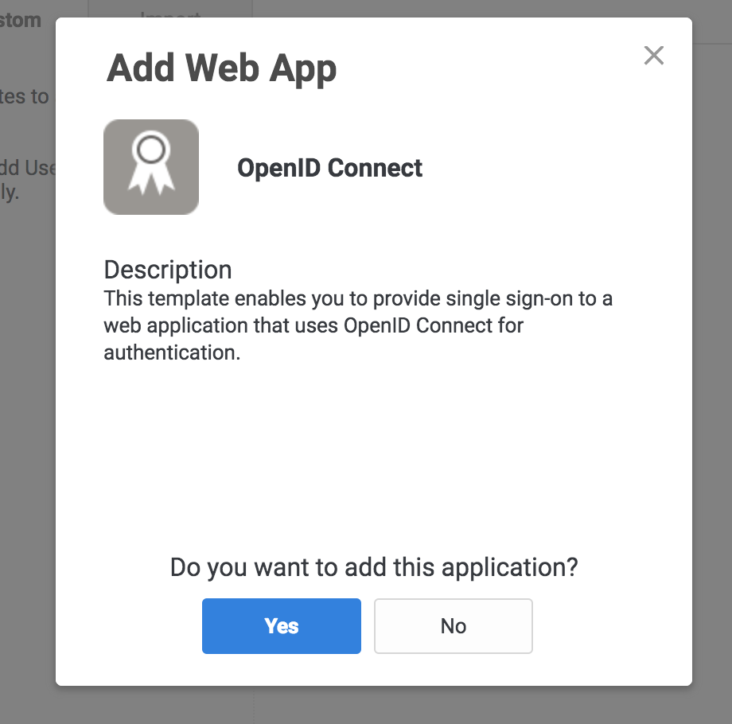

# Centrify


Centrify secures access to infrastructure, DevOps, cloud, and other modern enterprise so you can prevent the #1 cause of breaches – privileged access abuse.

## Set up Centrify

These steps help you set up Centrify as your identity provider (IdP).

1. Log in to the Centrify administrator panel.
2. Click **Apps**.

    

3. Click **Add Web Apps**.

    

4. Select the **Custom** tab and click **Add OpenID Connect**.
5. On the **Add Web App** screen click **Yes** to create an OpenID Connect application.

    

6. Enter an **Application ID**.

    

7. Click **Save**.
8. Click **Trust** in the **Settings** menu.
9. Enter a strong application secret on the **Trust** section.
10. Under **Service Provider Configuration** enter your application’s authentication domain as the resource application URL.
11. Under **Authorized Redirect URIs** click **Add**.

    

12. Under **Authorized Redirect URIs** enter your authentication domain as `/cdn-cgi/access/callback`.
13. Click **Save**.

    

14. Copy the Client ID, Client Secret, and OpenID Connect Issuer URL.

    <Aside>
    
    Do not use the forward slash from the <strong>Settings</strong> tab.
    </Aside>

15. Copy the Application ID from the Settings tab in the Centrify dashboard, and paste them into the Cloudflare Access.
16. Navigate to the **User Access** tab.
17. Select the roles to grant access to your application.

    

18. In the **Cloudflare Access** app, under click **Add** under **Login Methods**, and select Centrify as your IdP.
19. Paste in the **Client ID** and **Client Secret**.
20. Click **Save and Test**.

    On success, a confirmation displays that your connection works.

    

## **Example API Config**

```json
{
    "config": {
        "client_id": "<your client id>",
        "client_secret": "<your client secret",
        "centrify_account": "https://abc123.my.centrify.com/",
        "centrify_app_id": "exampleapp",
    },
    "type": "centrify",
    "name": "my example idp"
}
