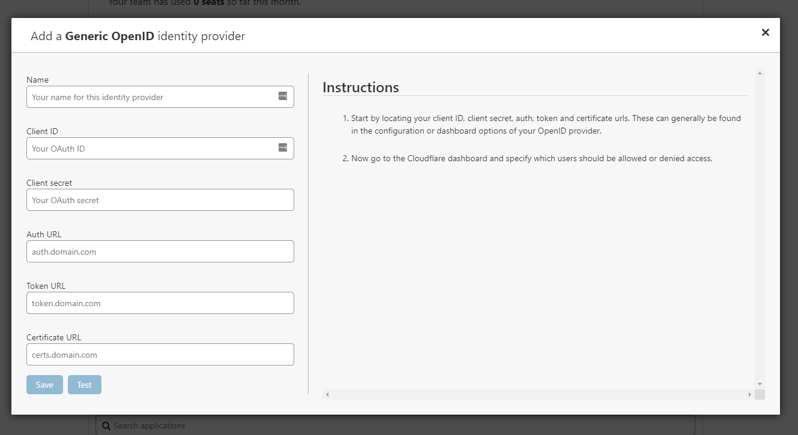

# Generic OIDC

Cloudflare Access has a generic OpenID Connect (OIDC) connector to help you integrate IdPs not already set in Access.

## Setting up a generic ODIC

To set up a generic OIDC:

1. Visit your identity provider and create a client/app.
2. Copy the content of these fields:
   * Client ID
   * Client secret
   * Auth URL: The `authorization_endpoint` URL of your IdP
   * Token URL: The token_endpoint URL of your IdP
   * Certificate URL: The `jwks_uri` endpoint of your IdP to allow the IdP keys to sign the tokens

    You can find these values on your identity provider’s OIDC discovery endpoint. Some providers call this the “well-known URL.”

3. In **Cloudflare Access**, scroll to **Login Methods**, click **Add** and select **OIDC Provider**.

   

   The Add a Generic OpenID identity provider window displays.
   

4. Enter your IdP in the **Name** field.
5. Paste in the **Client ID** and **Client secret**.
5. In the **authorized redirect URI** field for your IdP, enter your authentication domain `/cdn-cgi/access/callback` URL.
8. Click **Save and Test**.
   On success a confirmation screen displays.

    

## Example API Configuration

```json
{
	"config": {
		"client_id": "<your client id>",
		"client_secret": "<your client secret>",
		"auth_url": "https://accounts.google.com/o/oauth2/auth",
		"token_url": "https://accounts.google.com/o/oauth2/token",
		"certs_url": "https://www.googleapis.com/oauth2/v3/certs",
	},
	"type": "oidc",
	"name": "Generic Google"
}
```
