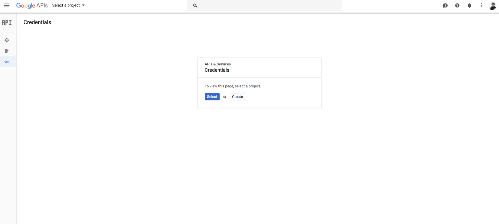
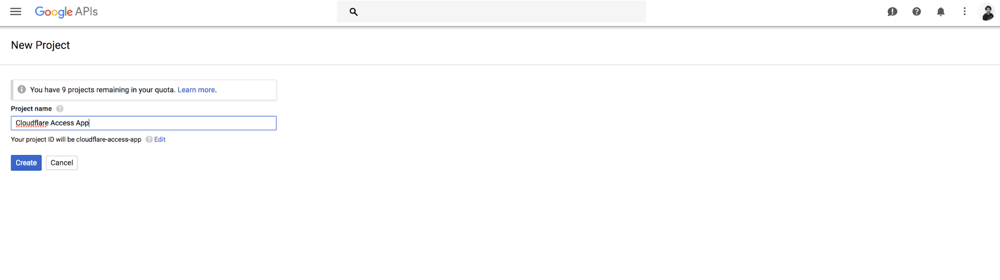
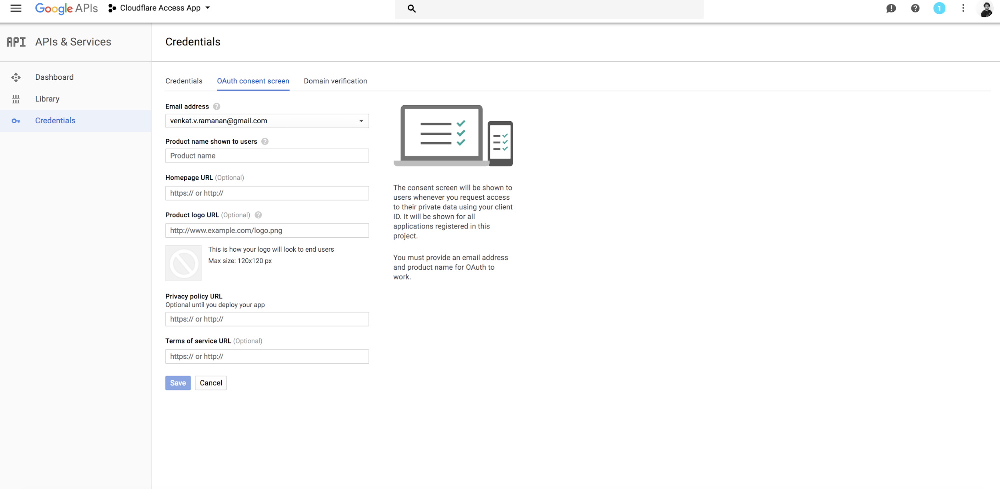
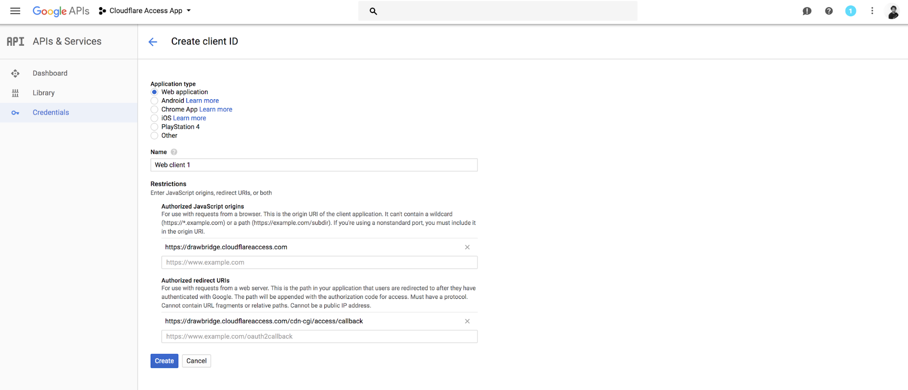
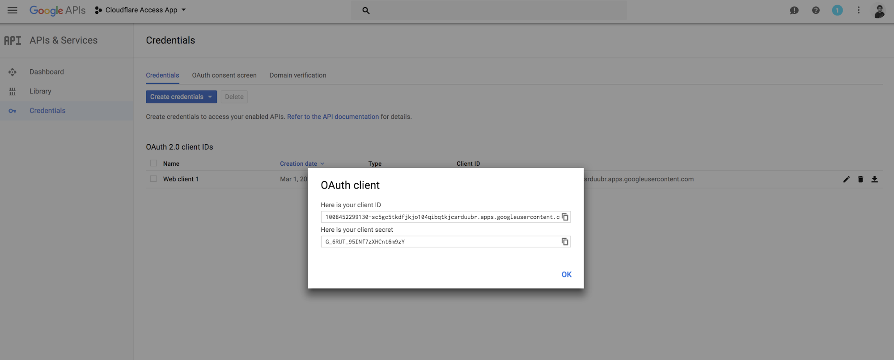

# Google

Cloudflare Access can integrate with Google as an IdP. Use these steps to configure Google as your IdP.

## Configure Google as your IdP

1. Sign into the [API Manager](https://console.developers.google.com/projectselector/apis/credentials?pli=1) in the Google Cloud console.
1. Click **Create** to begin a new project in Google Cloud.

    

    The **New Project** card displays.

1. Enter a name for your project.
1. Click **Create**.

    
    The _Credentials_ window displays.

1. In the **APIs Credentials** card, click **Create credentials > OAuth client ID**.

    
    The _Create client ID_ window displays.

1. Click **Configure consent screen**.

    
    The _OAuth consent screen_ tab displays.

1. Enter a name in the **Product name shown to users** field.
1. Click **Save**.

    
    The _Create client ID_ window displays.

    

1. In **Application type**, select **Web application**.
1. Enter a **Name** for your application.
1. Enter your account’s authorization domain in the **Authorized JavaScript origins** field.

    You can find this in the **Authorization Domain** section of the **Cloudflare Access** app.

    The domain is something like, `https://xyz.cloudflareaccess.com`.

1. Under **Authorized redirect URIs**, enter your authorization domain and add this to the end of the path:

    ```txt
    /cdn-cgi/access/callback
    ```

1. Click **Create**.

    The OAuth client card displays.

    

1. Copy your client ID and client secret.
1. Paste the ID and secret in the **Cloudflare** dashboard.

    **Tip**: If there is no connection to Google, restart the project form.

1. Click **Save and Test** on the Cloudflare dashboard.

     On successful connection to your identity provider, a confirmation window displays.

    

## Example API Config

```json
{
    "config": {
        "client_id": "<your client id>",
        "client_secret": "<your client secret",
    },
    "type": "google",
    "name": "my example idp"
}
