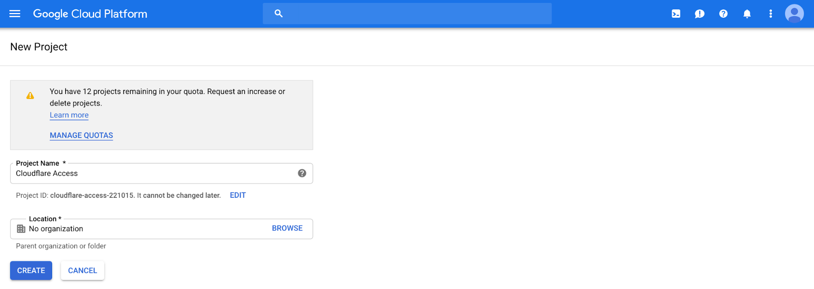
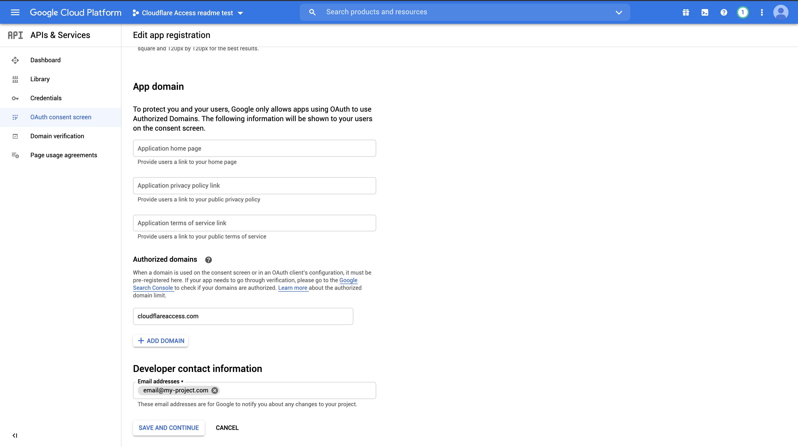
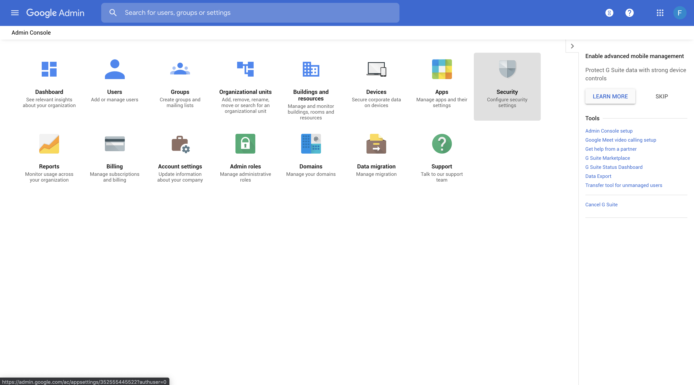
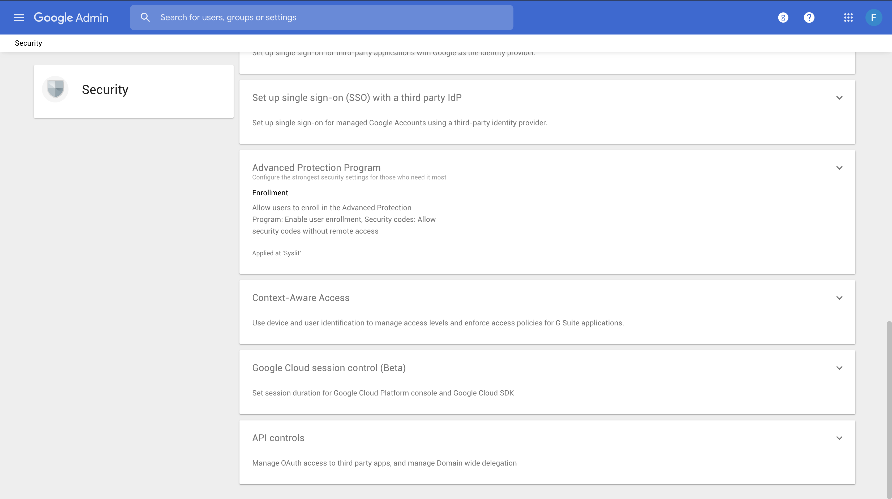
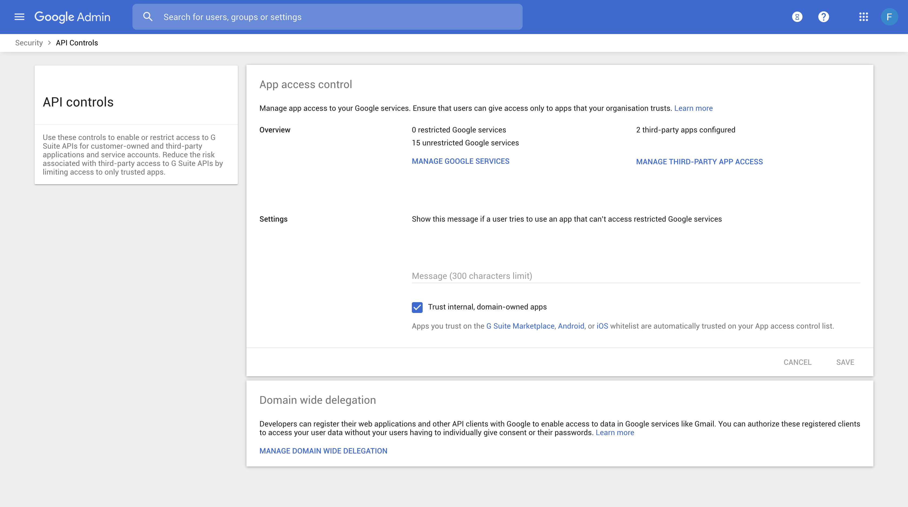
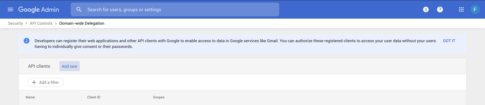
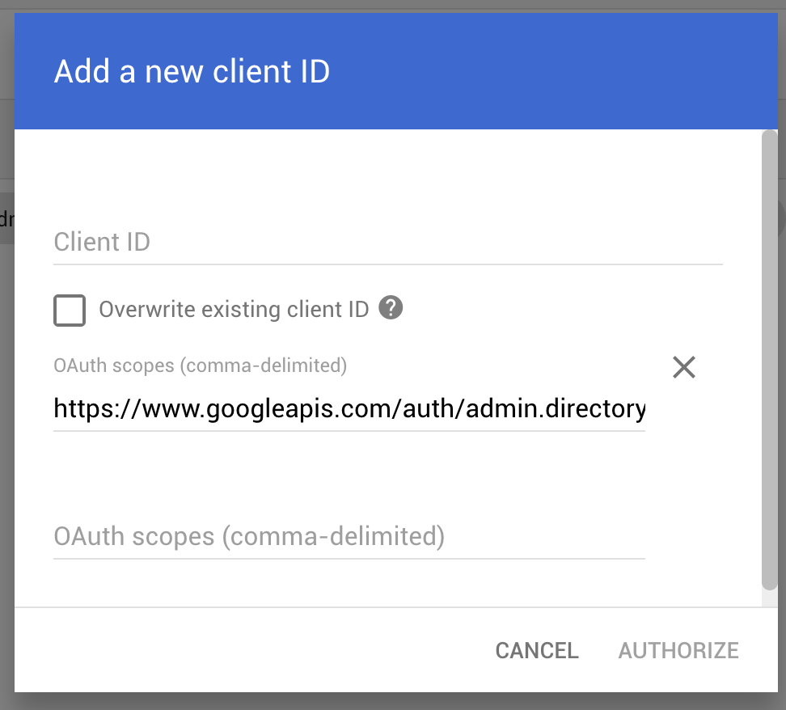

# G Suite

G Suite provides OpenID Connect (OIDC) Identity Provider support that you can use with many SaaS apps in the G Suite Marketplace, and adds support for SAML 2.0 (Security Assertion Markup Language) for more than 15 popular SaaS providers. Cloudflare Access supports G Suite as an IdP.

<Aside>

You must be an administrator for the G Suite organization you are connecting in order to connect your G Suite account to Cloudflare.
</Aside>

## Set up G Suite as your IdP

Use these steps to set up G Suite as your IdP.

1. Log in to the **Google Cloud** console at [https://console.cloud.google.com/](https://console.cloud.google.com/).

   This console is separate from your G Suite Admin console.

1. Create a new Google Cloud Platform (GCP) project.

1. Enter **Cloudflare Access** in the **Project Name** field.
1. Ensure that the setting in the **Location** field matches your G Suite domain.

   

1. In the APIs card, click **→ Go to APIs overview**.
   

1. Follow the Admin SDK link [here](https://console.cloud.google.com/apis/api/admin.googleapis.com/overview) (or find Admin SDK in the API Library) and click enable.

   

1. Return to the APIs overview page. Select **Credentials** in the left menu pane.

   

1. Click **Create credentials > OAuth client ID**.

   

1. Configure OAuth via **CONFIGURE CONSENT SCREEN** button.

   

1. In **Application type**, select the **Internal** option.

   

1. In **App information** fill:
   - App Name (you can write e.g. Cloudflare Access)
   - User support email (pick from dropdown)
   - As **Authorized domains** enter `cloudflareaccess.com`.
   - In Developer contact information you can write the same address as in support email.

1. Click **Save and continue**, skip Scopes (there is nothing to do) and check Summary.

   

1. Go back to **Credentials**, if you were not redirected and continue creating **OAuth Client ID**.
   - Application type: **Web Application**.
   - Pick some name (you can write e.g. Cloudflare Access)
   - In **Authorized JavaScript Origins**, enter the authentication domain from **Cloudflare Access**.

     For example, `https://example.cloudflareaccess.com`.

   - Enter your authentication domain in the **Authorized redirect URIs** field, and add this to the end of the path: `/cdn-cgi/access/callback`

     For example: `https://example.cloudflareaccess.com/cdn-cgi/access/callback`

1. A window displays with your **OAuth Client ID** and **Client Secret**. Copy these to enter in your **Cloudflare Access** app.

1. Return to your G Suite Admin console (https://admin.google.com/), and click **Security**.

   

1. Choose **API Controls**.

   

1. Click **Domain wide delegation** on the bottom of the screen.

   

1. **Add new**.

   

1. Enter your copied **Client ID**.
1. Paste these URLs in the **OAuth Scopes** field:

    ```txt
    https://www.googleapis.com/auth/admin.directory.group.member.readonly, https://www.googleapis.com/auth/admin.directory.group.readonly
    ```

   

1. Click **Authorize**.
1. In the **Cloudflare Access** app, under click **Add** under **Login Methods**, and select G Suite as your IdP.
1. Paste in the **Client ID** and **Client Secret**.
1. In the Cloudflare Access **Configuration** panel, enter your Google domain, including the TLD (e.g.: my-project.com).
1. Click **Save and Test**.

   On success, a confirmation displays that your connection works.

   

## Example API Configuration

```json
{
    "config": {
        "client_id": "<your client id>",
        "client_secret": "<your client secret",
        "apps_domain": "mycompany.com"
    },
    "type": "google-apps",
    "name": "my example idp"
}
