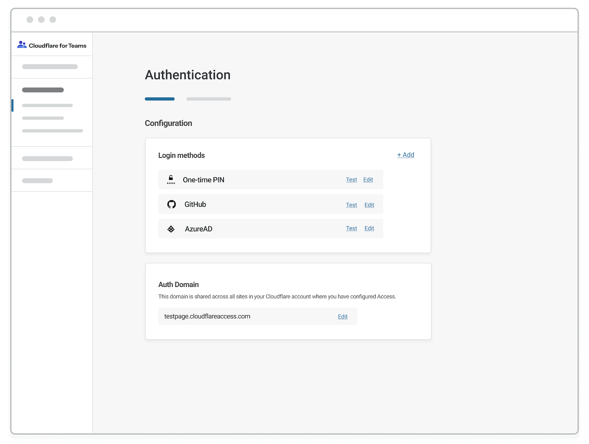
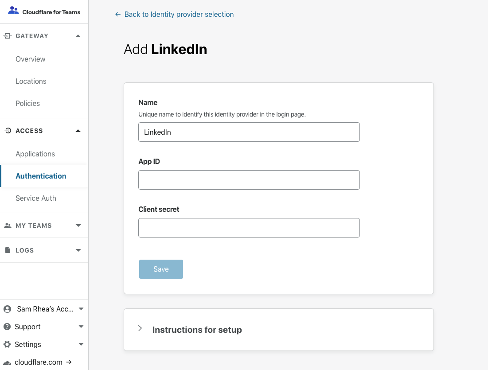

# Configuring identity providers

You can integrate your organization's identity provider with Cloudflare Access. Your team can simultaneously use multiple providers, reducing friction when working with [partners or contractors](https://blog.cloudflare.com/multi-sso-and-cloudflare-access-adding-linkedin-and-github-teams/).

Guides are available for specific providers as well as generic OIDC or SAML integrations. Cloudflare Access supports social identity providers that do not require administrator accounts, open source providers, and corporate providers. Cloudflare also supports using [signed AuthN requests](http://developers.cloudflare.com/access/configuring-identity-providers/signed_authn/) with SAML providers.

You can use the documentation linked below or the same material in the Cloudflare for Teams dashboard.

|Guide|Type|Description|
|---|---|---|
|[One-Time Pin](https://developers.cloudflare.com/access/configuring-identity-providers/one-time-pin/)|Default|You can use Cloudflare Access without an identity provider with the one-time pin integration.|
|[Facebook®](https://developers.cloudflare.com/access/configuring-identity-providers/facebook-login/)|Social|Guide to integrating Facebok as an identity option.|
|[Google®](https://developers.cloudflare.com/access/configuring-identity-providers/google/)|Social|Guide to integrating Google® without a G Suite® organization.|
|[GitHub®](https://developers.cloudflare.com/access/configuring-identity-providers/github/)|Social|Guide to integrating GitHub, including GitHub Teams.|
|[LinkedIn](http://developers.cloudflare.com/access/configuring-identity-providers/linkedin/)|Social|Guide to integrating LinkedIN.
|[Keycloak](http://developers.cloudflare.com/access/configuring-identity-providers/keycloak/)|Open Source|Guide to integrating Keycloak|
|[G Suite®](https://developers.cloudflare.com/access/configuring-identity-providers/gsuite/)|Corporate|Guide to integrating G Suite®, including groups.|
|[Okta®](https://developers.cloudflare.com/access/configuring-identity-providers/okta/)|Corporate|Guide to integrating Okta®|
|[Okta® with SAML](https://developers.cloudflare.com/access/configuring-identity-providers/saml-okta/)|Corporate|Guide to integrating Okta® as a SAML provider.|
|[OneLogin®](https://developers.cloudflare.com/access/configuring-identity-providers/onelogin-oidc/)|Corporate|Guide to integrating OneLogin®|
|[Azure AD®](https://developers.cloudflare.com/access/configuring-identity-providers/azuread/)|Corporate|Guide to integrating Azure AD®|
|[Centrify®](https://developers.cloudflare.com/access/configuring-identity-providers/centrify/)|Corporate|Guide to integrating Centrify®|
|[Yandex®](https://developers.cloudflare.com/access/configuring-identity-providers/yandex/)|Corporate|Guide to integrating Yandex®|
|[Citrix ADC SAML](http://developers.cloudflare.com/access/configuring-identity-providers/citrixadc-saml/)|Corporate|Guide to integrating Citrix ADC, formerly Citrix NetScaler ADC.|
|[PingIdentity®](http://developers.cloudflare.com/access/configuring-identity-providers/ping-saml/)|Corporate|Guide to integrating PingFederate and PingOne.|
|[Active Directory](http://developers.cloudflare.com/access/configuring-identity-providers/adfs/)|Corporate|Guide to integrating self-hosted Active Directory.|

## Configure identity providers in the Access app

Adding an identity provider as a login method requires configuration in the Cloudflare Access dashboard as well as with the identity provider. Navigate to the Cloudflare for Teams [dashboard](https://dash.teams.cloudflare.com) to get started.

To configure an identity provider in Cloudflare:

1. Open the **Access** section of the navigation bar and select **Authentication**. The dashboard will display all identity providers currently configured. Cloudflare Access defaults to enable the one-time pin option for new accounts. Select `+ Add` to add a new provider.

1. Choose the provider you plan to integrate. You can integrate multiple providers of the same type.

1. You can input the required fields in the identity provider screen. If you need more help, step-by-step instructions can be expanded below the input form.

## Using the API

We recommend that you use our dashboard to configure your identity providers. However, if you would like to use the Cloudflare API, each of the identity provider topics covered here include an example API configuration snippet as well.