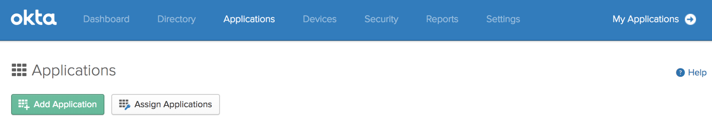
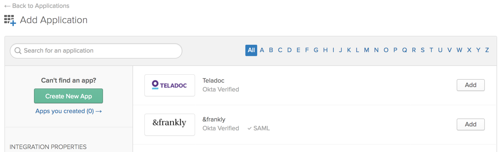
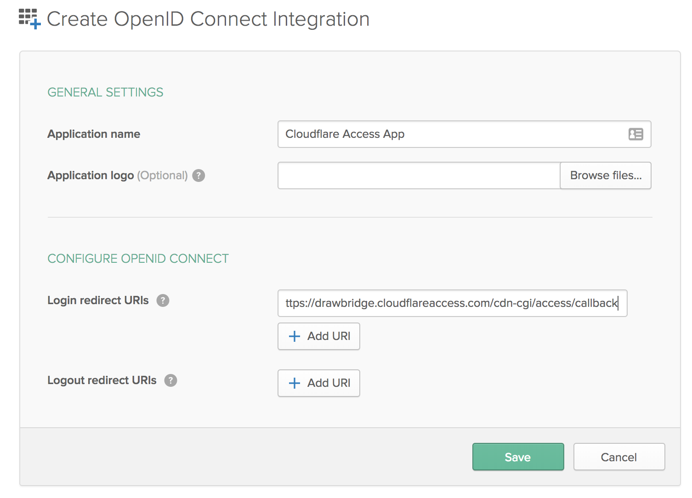
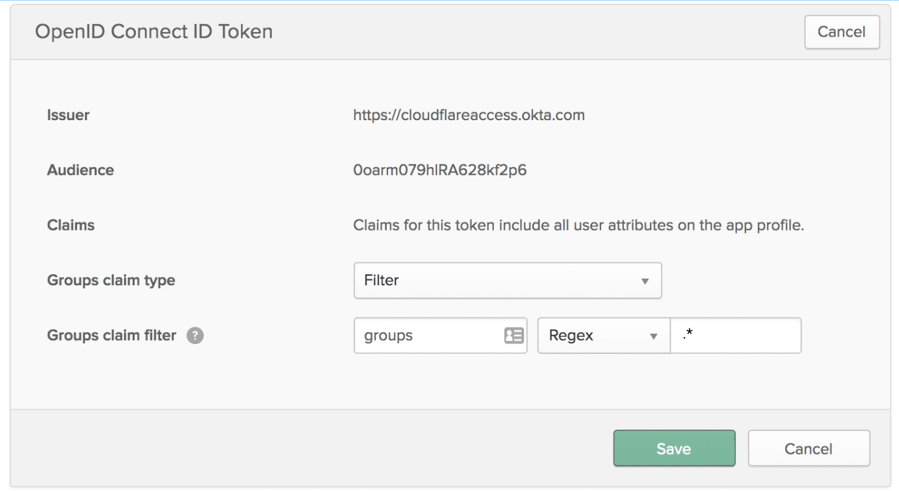
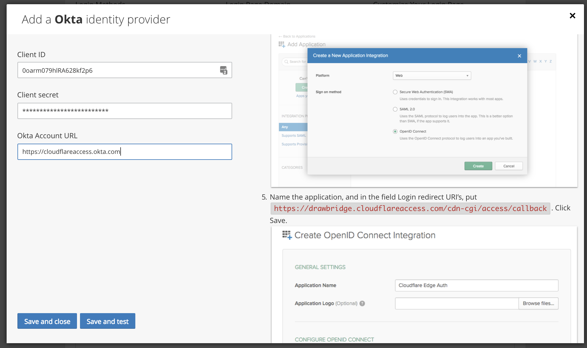
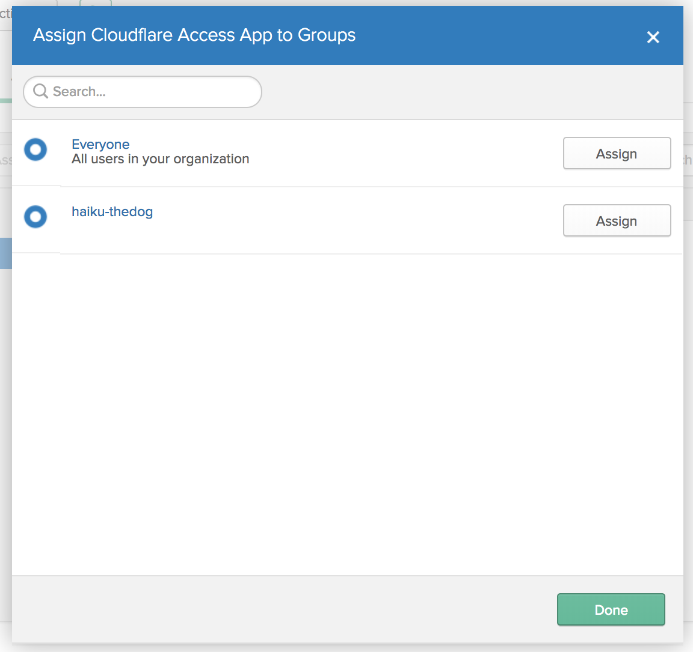
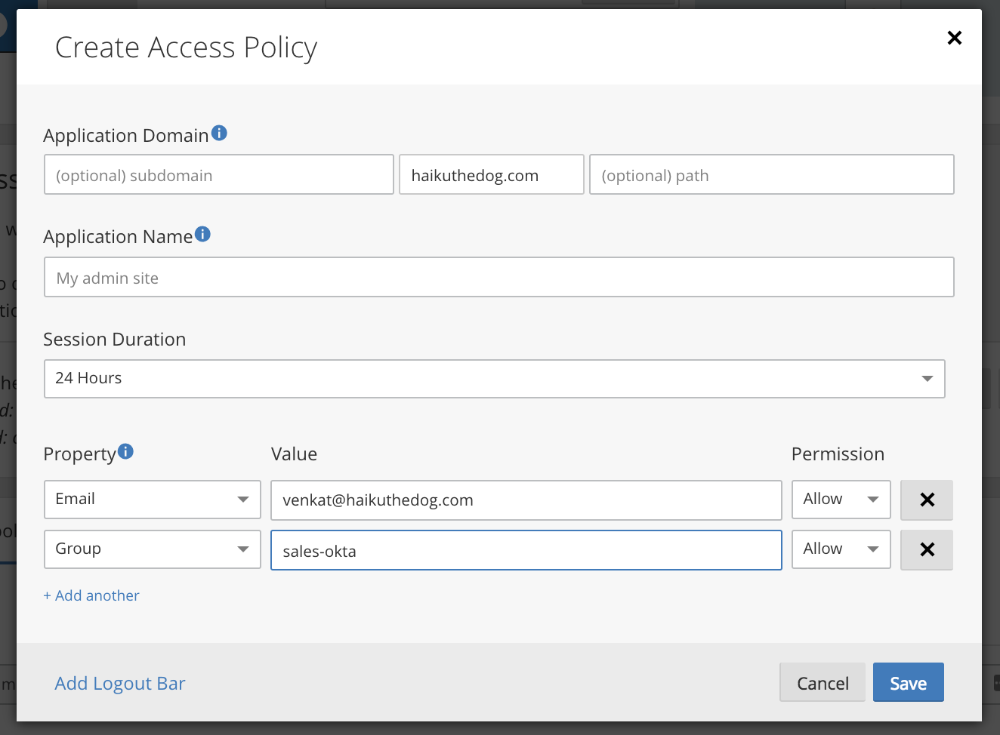

# Okta

Okta provides cloud software that helps companies manage secure user authentication, and helps developers build identity controls into applications, website web services, and devices. Cloudflare Access can integrate Okta as an IdP.

## Set up Okta as your IdP

To set up Okta as your IdP:

1. In your Okta dashboard, choose **Applications** from the menu.
1. Click **Add Application**.

    

1. On the **Add Application** card click **Create New App**.

    

1. On the **Create a New Application Integration** card, select **OpenID Connect** as the **Sign on method**.

    

1. Click **Create**.

    The _Create OpenID Connect Integration_ card displays.

    

1. In the **Login redirect URIs** field enter your authorization domain, and include this  callback at the end of the path: `/cdn-cgi/access/callback`.

    **Tip**: You can find your organization’s authorization domain in Cloudflare Access. It begins with a subdomain unique to your organization and ends with the domain `cloudflareaccess.com`, including the callback path specified above.

1. Click **Save**.

    The completed application page displays.

    

1. Scroll to the **OpenID Connect Token** section and click **Edit**.

    The **OpenID Connect ID Token** card displays.

    

1. Scroll to the **Groups claim filter** field, switch **Starts with** to **Regex**, and enter  `.*` in the field on the right.
1. Click **Save**.
1. Select the **General** tab.

    The _General Settings_ card displays.

    

1. Scroll to _Client Credentials_ and copy your **Client ID** and **Client Secret**.
1. In **Cloudflare Access**, scroll to **Login Methods**, click **Add** and select the **Okta** icon.

   

   The **Add a Okta identity provider** card displays.
2. Paste in your copied **Client ID** and **Client secret**.

    

3. In the Okta dashboard, click **Assign > Assign to Groups**.

    

4. Create your assignments.

    

5. Click **Done**.

   You return to the Cloudflare Access App card.

    

6. In **Cloudflare Access** scroll to **Access Policies** and click **Create Access Policy**.
7. In the **Property** fields, select the appropriate Property type, specify your Okta groups and users, and select **Allow** in the **Permission** drop-down list.

    

8. Click **Save**.
9. On the **Login Methods** card, click **Save and test**.

    On successful connection to your Okta IdP, a confirmation displays.

    

## Example API Configuration

```json
{
    "config": {
        "client_id": "<your client id>",
        "client_secret": "<your client secret",
        "okta_account": "https://dev-abc123.oktapreview.com",
    },
    "type": "okta",
    "name": "my example idp"
}
```
