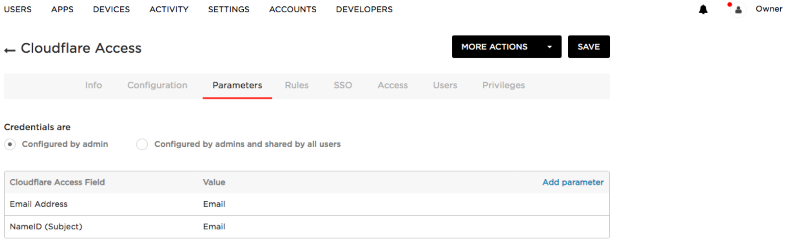
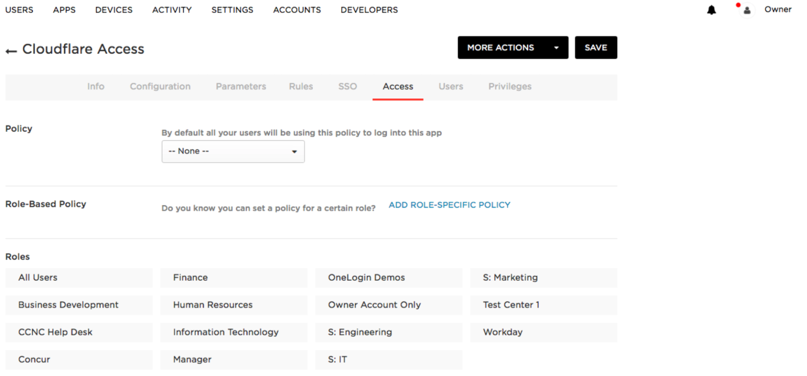

# OneLogin SAML

<Aside type='warning' header='⚠️ THIS PAGE IS OUTDATED'>

We're no longer maintaining this page. **It will be deleted on Feb 8, 2021**. Please visit the new [Cloudflare for Teams documentation](https://developers.cloudflare.com/cloudflare-one/teams-docs-changes) instead.

</Aside>

OneLogin provides SSO identity management. Cloudflare Access supports OneLogin as an SAML IdP.

## Set up OneLogin SAML as your IdP

To set up OneLogin SAML as your IdP:

1. Log in to your OneLogin admin portal.
1. Select  **Apps > Add Apps**.

    

1. Under **Find Applications** search for **Cloudflare Access**.
1. Select the result sponsored by **Cloudflare, Inc**.

    

    You can customize the name or logo.

1. Select **Save**.

    You can change this information at any time.

    

1. In **Cloudflare Access**, scroll to **Login Methods**, click **Login Page Domain** to put the domain on your clipboard.
1. In **OneLogIn** select the **Configuration** tab.
1. In the **Cloudflare Access Authorization Domain** field paste the copied domain.

    

1. Select the **Parameters** tab, click **Add Parameter** and enter your values for **Cloudflare Access Field**.

    

1. Select the **Access** tab
1. In Roles, use the mapping to programmatically and automatically assign users that can access the application.

    

1. Select the **SSO** tab.
1. Copy the OneLogin **SAML 2.0 Endpoint (HTTP)** to the Cloudflare Single Sign On URL.
1. Copy the OneLogin **Issuer URL** to the Cloudflare **IdP Entity ID**.
1. Copy the **X.509 Certificate** to the Cloudflare **Signing Certificate**.

    

1. In **Cloudflare Access**, scroll to **Login Methods**, click **Add** and select the **SAML** icon.

    

1. Input the details from your OneLogin account in the fields.

    If other headers and SAML attribute names were added to OneLogin be sure to add them to Cloudflare under **SAML attributes** and  **SAML header attributes**.

    **Tip**: Name the attributes the same in both OneLogin and Cloudflare.

    

1. Click **Save** and then **Test**.

    This tests your SAML integration and provides descriptive errors if Access cannot authenticate with your OneLogin identity deployment.

    On successful connection to your OneLogin IdP, a confirmation displays.

    

1. Return Cloudflare Access and click **Save.**
1. Click **Close**.

## Download SP metadata (optional)

OneLogin SAML allows administrators to upload metadata files from the service provider.

To add a metadata file to your OneLogin SAML configuration:

1. Download your unique SAML metadata file at the following URL:

    ```txt
    https://auth-domain.cloudflareaccess.com/cdn-cgi/access/saml-metadata
    ```

1. Replace authentication domain with your account’s **Login Page Domain** found in the **Access** tab in **Cloudflare Access**.

    The link returns a web page with your SAML SP data in XML format.

1. Save the file as an XML document.
1. Upload the XML document to **OneLogin**.

## Example API Configuration

```json
{
    "config": {
        "issuer_url": "https://app.onelogin.com/saml/metadata/1b84ee45-d4fa-4373-8853-abz438942123",
        "sso_target_url": "https://sandbox.onelogin.com/trust/saml2/http-post/sso/123456",
        "attributes": ["email"],
        "email_attribute_name": "",
        "sign_request": false,
        "idp_public_cert": "MIIDpDCCAoygAwIBAgIGAV2ka+55MA0GCSqGSIb3DQEBCwUAMIGSMQswCQYDVQQGEwJVUzETMBEG\nA1UEC.....GF/Q2/MHadws97cZg\nuTnQyuOqPuHbnN83d/2l1NSYKCbHt24o"
    },
    "type": "saml",
    "name": "onelogin saml example"
}
```
