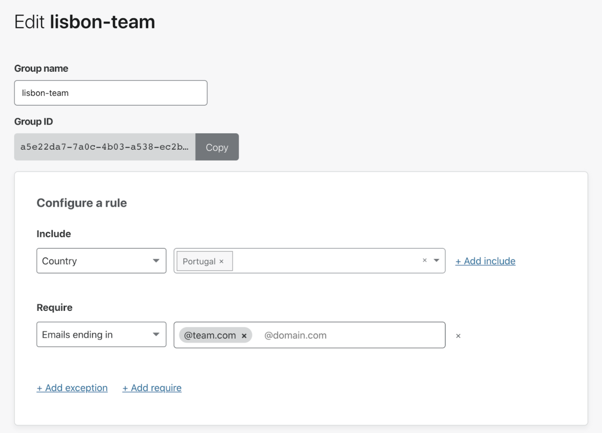
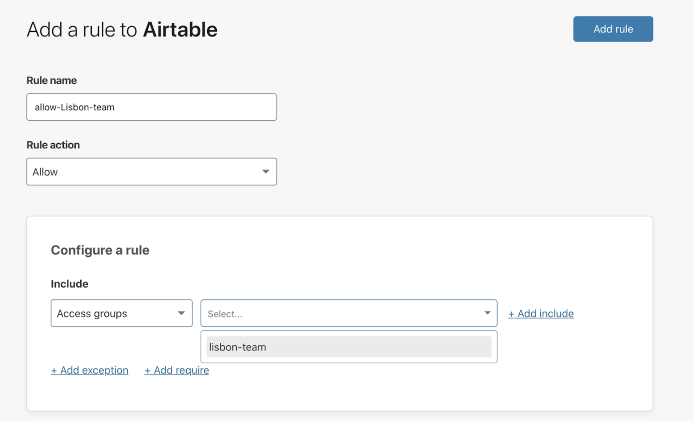
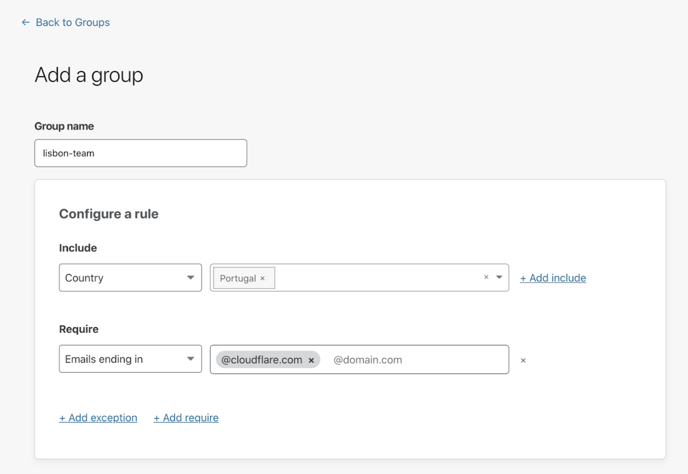

# Access Groups

## Managing Groups

Access Groups define a set of rules that can be defined once and then quickly applied across many applications. You can select an Access Group as an attribute in any Policy rule, and all the criteria from the selected Access Group will apply to that application.

Imagine you want to grant access to your applications to your team based in Lisbon, Portugal. In order to avoid building the same set of rules over and over across your applications, you can create an Access Group called `lisbon-team`, which comprises an Include rule granting access to everyone in Portugal, and a Require rule restricting access to users whose email ends in `@team.com`.

<Aside>

Access Groups are distinct from groups in your identity provider, like Okta groups. Access Groups can contain a mix of individual users, groups from identity providers, and service authentication options like service tokens.

</Aside>

Once the group is set up, you can use it to configure rules within your applications as follows:

To create and manage Access Groups:

1. On the [Teams dashboard](https://dash.teams.cloudflare.com), navigate to the **My Teams** section.
1. Open the Groups tab.
1. Click **Add a Group**.
1. Enter a name for the group.
1. Specify as many rules as needed to define your user group.

6. Click **Save**.

## Legacy Groups
Cloudflare Access supported a flow in the UI to build policies with IdP groups, called *Legacy groups*. Native integration with groups surfaced from your IdP has replaced this feature.

If your account built policies with Legacy groups, these are still available and continue to work as you intend.

If your account uses Legacy groups, a banner displays in the Access dashboard.

Unfortunately, Access cannot automatically migrate your Legacy groups. This is due to the risk of Legacy group names not matching identity provider group names or, in some cases, IdP groups consisting of a unique ID unknown to Access.
To migrate from Legacy groups:

1. Open policies using Legacy groups.

1. Navigate to your Access policies and open any using Legacy groups.

1. Replace Legacy groups with identity provider groups.

1. Replace the policy rules using Legacy groups by adding a new, mirrored rule that pulls groups from your identity provider.
For example, if you have a Legacy group that allows “Engineers,” and that Legacy group maps to the same membership of an Okta® group, add a new rule based on Okta groups to allow “Engineers.”

1. Remove the Legacy group rule.

1. Once you create a new rule with the group from your identity provider, remove the rule that uses Legacy groups.

1. Click **Save**.

**Note**: If you continue to use policies with Legacy groups, Access still prevents unauthorized users from reaching your applications; however, users who are members of Legacy groups are also prevented from being authenticated.