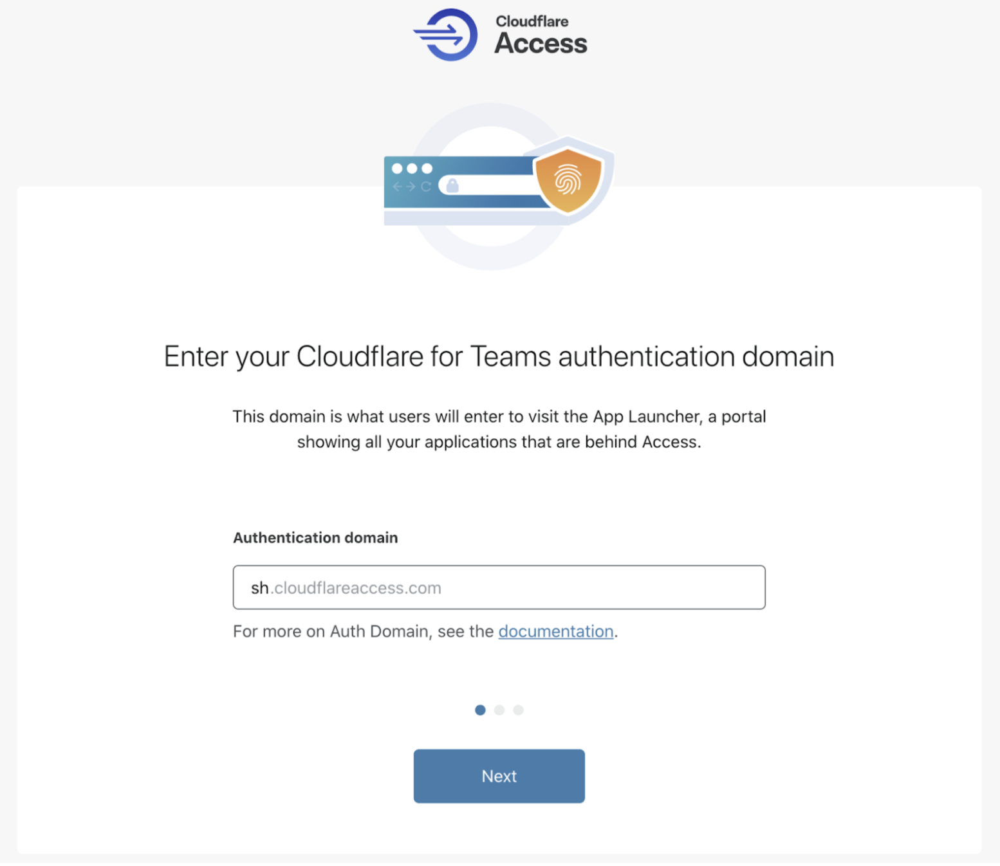
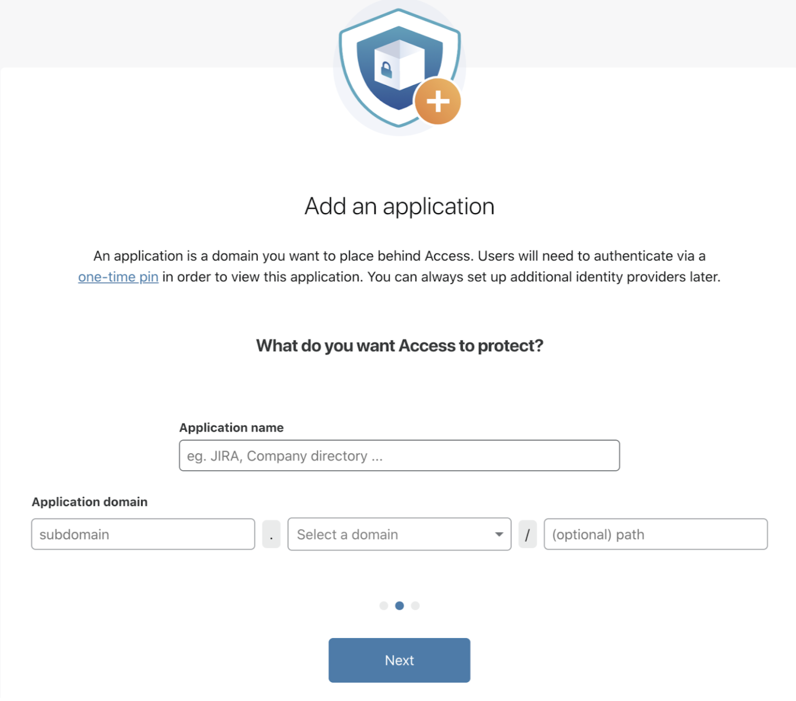

# Set up Access

<Aside>

<b>Before you start</b>

* **<a href="https://support.cloudflare.com/hc/articles/201720164-Creating-a-Cloudflare-account-and-adding-a-website">Add a website to Cloudflare</a>**
* **<a href="https://support.cloudflare.com/hc/articles/205195708">Change your domain nameservers to Cloudflare</a>**

</Aside>

Follow these steps to set up Cloudflare Access.
1. Navigate to the [Cloudflare for Teams dashboard](https://dash.teams.cloudflare.com).

2. Navigate to **Access > Applications**.

3. Click on **Begin setup**.

4. Choose an authentication domain. The authentication domain will represent your Cloudflare for Teams account across Access and Gateway. The URL will also serve as the launch page for end users.

6. Next, create your first **application**. You can also skip this step and return to it later.

Provide a name and input the subdomain where your application will be served. The subdomain must be part of a zone in your Cloudflare account.

7. Now, create the first **policy** for the app you are securing with Access.

Provide a name and then specify an *Include* rule for the policy.

The *Include* rule will determine which users will be allowed to access the application.
You can either select:
  * *Emails* - this option restricts access to users whose email addresses match the ones you define.
  * *Emails ending in* - this option restricts access to users whose email addresses end with the email endings you define.

You can return to edit the policy with more complex rules like identity provider groups or hard key requirements.

8. Click **Next**.

9. You have now successfully configured Cloudflare Access.

  → To view your application on the *Teams dashboard*, click **View your application**.
  → To explore the dashboard, click **Proceed to Teams dashboard**.

