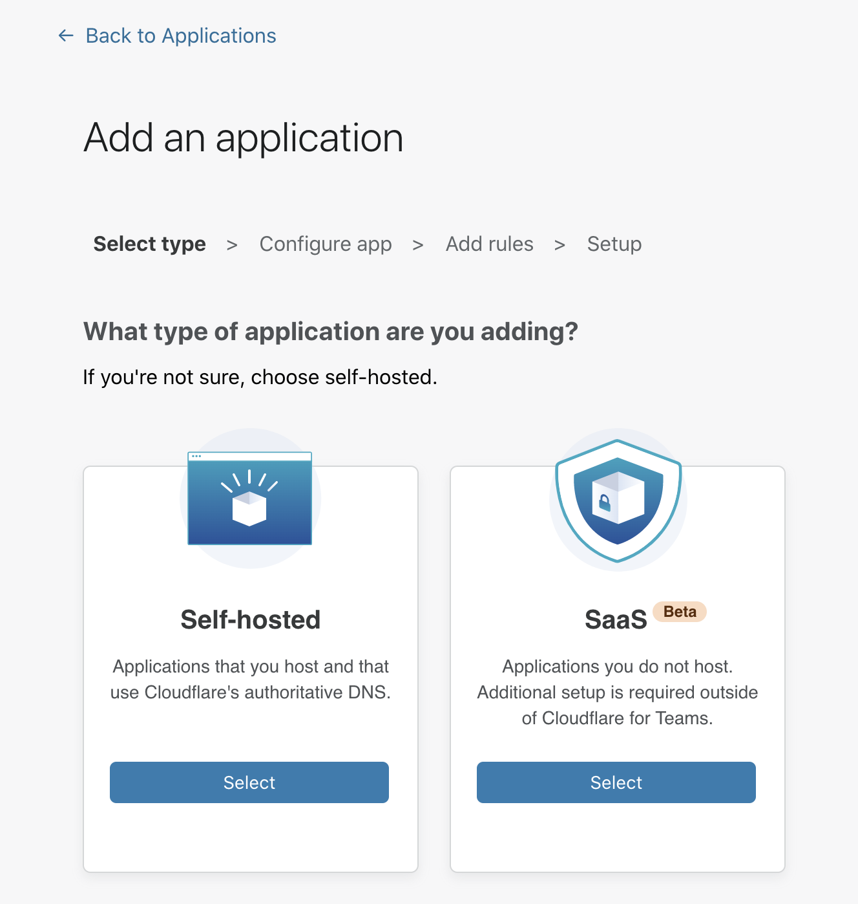
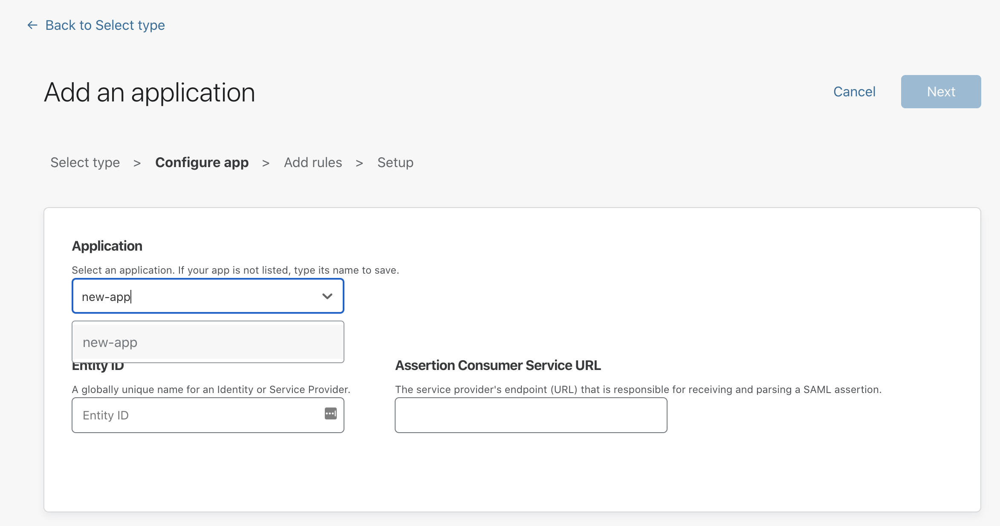
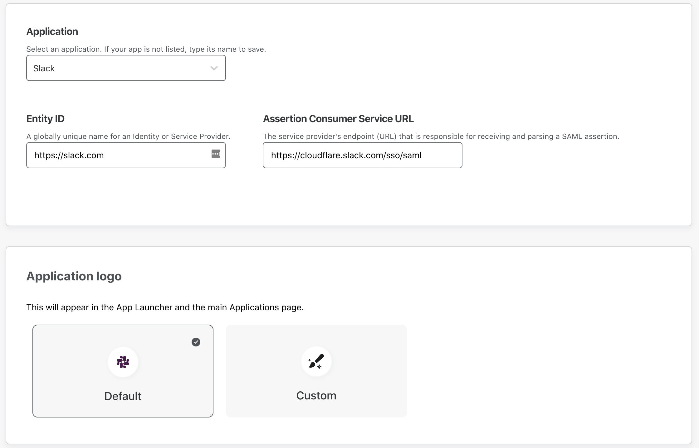
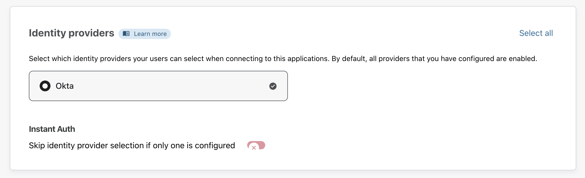
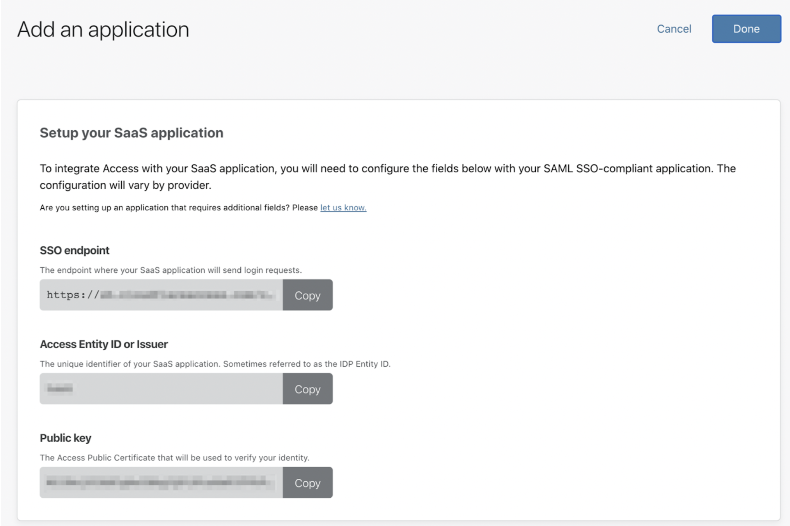
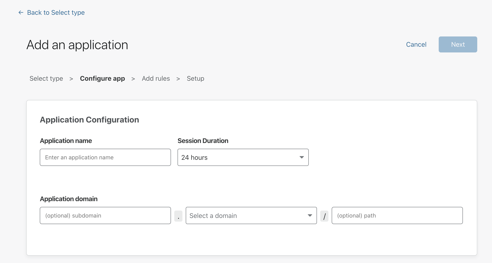
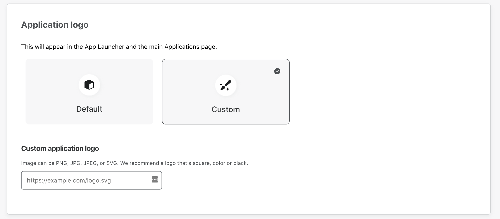

# Applications

With Access, you can protect two types of applications: **SaaS** and **self-hosted**.

SaaS applications include applications your team relies on that are not hosted by your organization, such as Slack or Airtable.

Self-hosted applications include your internal tools and applications, such as Jira or Grafana. You must secure self-hosted applications with Cloudflare's authoritative DNS to use Cloudflare Access.

## Connecting SaaS Applications

Cloudflare Access allows you to integrate your SaaS products by acting as an identity aggregator, or proxy. This way, users cannot login to SaaS applications without first meeting the criteria you want to introduce.

### 1. Add Your Application

1. On the [Teams dashboard](https://dash.teams.cloudflare.com), navigate to the **Applications** tab.
2. Click **Add an application**.
3. Select **SaaS**.

4. In the **Configure app** section, select an application from the Application drop-down menu.
If your application is not listed, type its name in the textbox and select it.

5. In the **Entity ID** field, provide the unique identifier of your SaaS application.
SaaS applications store this information in different ways.

6. In the **Assertion Consumer Service URL** field, input the service provider’s endpoint for receiving and parsing SAML assertions.

7. Scroll down to the **Application logo** card to choose a logo that will represent the application in the App Launcher and in the Applications page.
You can either:
  * Select **Default** if you want to show the SaaS application’s logo.
  * Select **Custom** if you want to assign a custom logo to the application.

8. Next, scroll down to the **Identity Providers** card to select the identity providers you want to enable for your app.

9. Click **Next**.

### 2. Add a policy
You can now configure a policy to control who can access your app.

To learn more about how policies work, read our [Policies section](/getting-started/policies/).
<!-- To learn more on how to effectively combine rule actions and conditions, read our [Policy Management]() section. -->

1. First, specify a name for your rule. This is a mandatory field.
2. Specify a policy action.
3. Specify one or more rules in the **Configure a rule** box. You can add as many include, exception, or require statements as needed.
4. Click **Next** to add your application to Access.

### 3. Integrate Your SaaS Application With Access
Before you begin using your application through Access, your last step is to integrate your SaaS application to Access.

1. First, configure these fields with your SAML SSO-compliant application. Take note of these fields before you click **Done**:

* Your SSO endpoint
* Your Access Entity ID or Issuer
* Your Public key

2. Click **Done** to see your application listed on your Applications tab.

## Connecting Self-Hosted Applications

<Aside>

<b>Before you start</b>

* **<a href="https://support.cloudflare.com/hc/articles/201720164-Creating-a-Cloudflare-account-and-adding-a-website">Add a website to Cloudflare</a>**
* **<a href="https://support.cloudflare.com/hc/articles/205195708">Change your domain nameservers to Cloudflare</a>**

</Aside>

Cloudflare Access allows you to securely publish internal tools and applications to the Internet, by providing an authentication layer using your existing identity providers to control who has access to your applications.

Before you begin setting up your self-hosted application, you will need an active domain on Cloudflare. Access rules will be built to secure that domain.

Create Access rules before connecting your application to Cloudflare. To connect your origin to Cloudflare, you can use [Argo Tunnel](https://developers.cloudflare.com/argo-tunnel/). If you do not wish to use Argo Tunnel, you must [validate the token](/learning/json-web-tokens/) issued by Cloudflare on your origin.

### 1. Add Your App
1. On the [Teams dashboard](https://dash.teams.cloudflare.com), navigate to the **Applications** tab.
2. Click **Add an application**.
3. Select **Self-hosted**.

You are now ready to start configuring your app.

4. Choose an **application name** and set a **session duration**.
The session duration will determine the minimum frequency a user will be prompted to authenticate with the configured provider.

5. From the drop-down menu under **Application domain**, select a hostname that will represent the application. The hostname must be an active zone in your Cloudflare account.

6. Scroll down to the **Application logo** card to configure your application logo.
To add a custom logo, click **Custom** and input a link to your desired image.

7. Next, scroll down to the **Identity Providers** card to select the identity providers you want to enable for your app.

9. Click **Next**.

### 2. Add a policy
You can now configure a policy to control who can access your app.

To learn more about how policies work, read our [Policies section](/getting-started/policies/).
<!-- To learn more on how to effectively combine rule actions and conditions, read our [Policy Management](/learning-and-examples/policy-management/) section. -->

1. First, specify a name for your rule. This is a mandatory field.
2. Specify a policy action.
3. Specify one or more rules in the **Configure a rule** box. You can add as many include, exception, or require statements as needed.
4. Click **Next** to add your application to Access.

### 3. Configure Advanced Settings
The **Setup section** allows you to configure CORS settings. To learn more about CORS, read our [Cross-Origin Resource Sharing (CORS) section](/setting-up-access/cors/).

 

Click **Add application**.

Your application is now connected to Access, and will appear in your Applications list. You can proceed with connecting your origin to Cloudflare at this URL.
