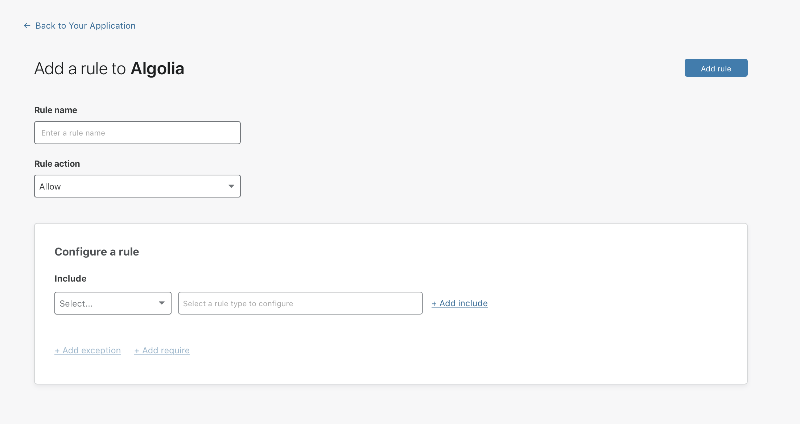
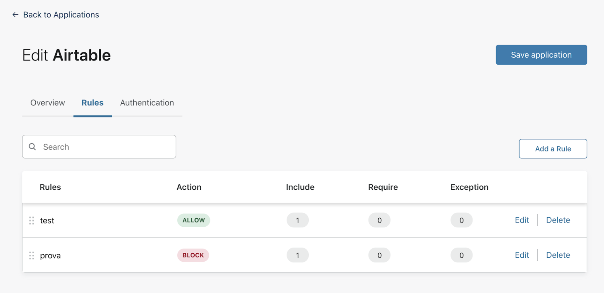

# Policy management

<Aside type='warning' header='⚠️ THIS PAGE IS OUTDATED'>

We're no longer maintaining this page. **It will be deleted on Feb 8, 2021**. Please visit the new [Cloudflare for Teams documentation](https://developers.cloudflare.com/cloudflare-one/teams-docs-changes) instead.

</Aside>

<Aside>

To learn more about policies, visit the dedicated section [Policies and rules](/policies-and-rules).
</Aside>

Policies are properties of applications. Creating the first policy for an application is part of the set up process for that application.

You can then choose to edit or delete that first policy after completing the application setup, or you can decide to add new policies to the application, all from the Applications section of the Teams dashboard.

There is no limit to the number of policies you can set up for your applications.

## Add a policy

To add an Access policy:

1. On the Teams dashboard, navigate to the **Access > Applications** page.
1. Locate the application for which you want to create the policy.
1. Click **Add a Rule**.

 

1. Select a **Rule name**. This name will identify your policy in the list of application policies.
1. Select a **[Rule action](/policies-and-rules#actions)**. 
1. Configure as many **[Rules](/policies-and-rules#rules)** as needed.
1. Click **Save rule**.

Your policy has now been added to the application.

## Edit a policy

To make any changes to an application’s policies:

1. On the Teams dashboard, navigate to the **Access > Applications** page.
1. Locate the application for which you want to change the policies.
1. Click **Edit**. This will automatically redirect you to the app’s **Rules** section.

1. Once in the **Policies** section, you can edit the **Rule name**, the **Rule action**, and any rules you had configured.
1. Once you’ve made all the necessary changes, click **Save application**.

## Delete a policy

To delete an Access policy:

1. On the Teams dashboard, navigate to the **Access > Applications** page.
1. Locate the application for which you want to delete the policy.
1. Click **Edit**. This will automatically redirect you to the app’s **Rules** section.
1. Locate the policy you want to delete and click **Delete**.
1. A pop-up message will ask you to confirm your decision to delete the policy. Click **Delete**.
1. Click **Save application**.

Your policy has now been deleted.

 

<!--

<Aside>

If you configure one policy for an application, and then decide to delete that one policy, Access will block everyone from reaching that application, by default. When clicking Delete on the only policy you have configured for an application, you will be asked to confirm that you wish to save the application without policies.
</Aside> -->
