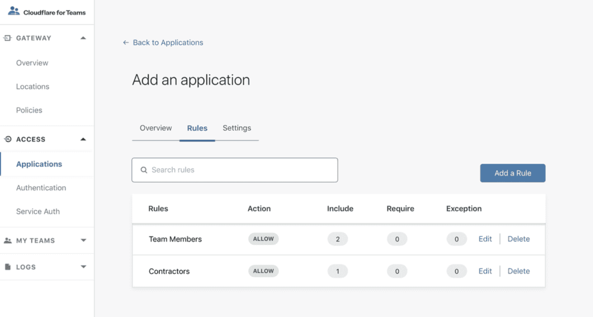
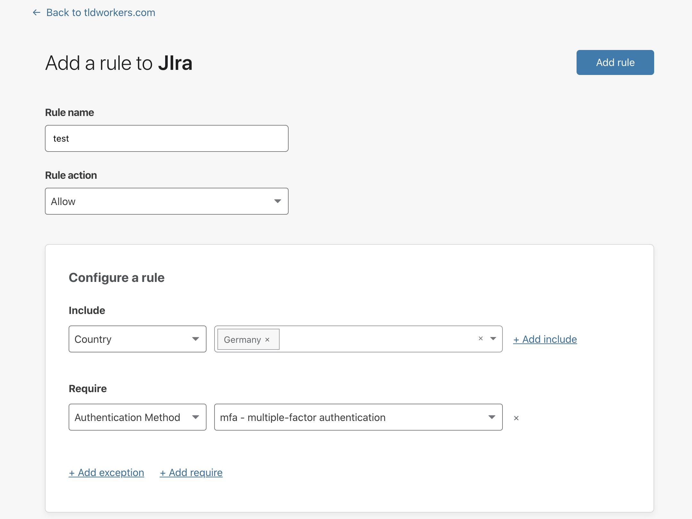

# Policies and rules

This section addresses a few common policy configurations and best practices.

For a basic overview of how to create, edit, and delete Policies on the dashboard, please see the [Policies](/getting-started/policies/) page in the Setup section.

## Combining policy actions and rules

### Allow

All rule actions must have at least one Include. For example, an Allow action with an Include rule defined as `Emails Ending In: @example.com` lets any user with an `@example.com` email address, as validated against an IdP, reach the application. Exception and Require rules enforce more granular control in Allow actions.

Add a Require rule in the same policy action to enforce additional checks. When the Require rule defines a set of IP ranges, a user must be a member of `@example.com` and their request must originate from the defined IP range.

Finally, if the policy contains an Exclude rule, users meeting that definition are prevented from reaching the application. When the Exclude rule defines a single email, such as `johndoe@example.com`, then all users in `@example.com` within the defined IP range are granted access, except for `johndoe@example.com`.

### Block

Use this rule action to explicitly prevent users from reaching an application behind Access. Block actions enforce similar behavior to allow actions that contain an Exclude rule without the need to allow specific users.

For example, a Block action that contains an Include decision defined as “Everyone” restricts access to any requests that attempt to reach the application.

***Caution.*** An Exclude rule will allow any user meeting that criteria to access an application when a Block Action is configured.

### Bypass

Use this rule action to bypass Access for a specific path of the application, a subset of users or for the entire application. The bypass rule action disables any Access enforcement for traffic that meets the defined rule criteria.

Let’s take an example website secured with Access with a third-party service that needs access to a specific endpoint. You can configure traffic to bypass Access and access that endpoint. You can also whitelist a range of IP addresses to bypass Access or allow all traffic by setting the rule to include everyone.

If the service does not publish its IP range or it changes periodically, you can choose to include Everyone in the Bypass action so that any request can access the specified path.

### Service Auth
Service Auth rules enforce authentication flows that do not require an identity provider IdP) login, such as service tokens and mutual TLS.

## Rule ordering

Access policies trigger sequentially, based on their position in your Cloudflare dashboard, except for Bypass actions; Access evaluates Bypass actions first, in the order they appear.
For Allow, Block and Service Auth actions, Access enforces the decision starting at the top of the list in the rules menu. You can modify the order in which rules trigger by dragging and dropping.

## Application Paths
You can create unique rules for parts of an application that share a root path. When multiple rules are set for a common root path, they do not inherit rules. Instead, the more specific rule takes precedence. For example:

* An example application is deployed at `dashboard.com/eng` that anyone on the engineering team should be able to access.
* Policy A restricts access to that path to members of the engineering team.
* A tool deployed at `dashboard.com/eng/exec` that only the executive team should be able to access.
* When using only policy A, this path inherits the rules from policy A and members of the engineering team can access that path. You can instead create a second policy, policy B, to restrict access to the executive team only.
* When applying Policy B to `dashboard.com/eng/`exec, the more specific policy takes precedence. The `/exec` path is gated by policy B instead of relying on the rules in policy A.

## Subdomains and Wildcards

You can configure an Application for an apex domain, a particular subdomain, or all subdomains using a wildcard rule. Similarly, you can apply an Access Application to an entire website or protect a specific path. When protecting the entire website, leave the path field empty. You specify paths, for example `/admin`, as well.

Access does not support overlapping definitions. For example, when setting rules for `/admin` and `/admin/specific` separately, `/admin/specific` does not inherit the rule set for `/admin`. The more specific rule is enforced.

Access does not support port numbers in the URL. Requests to URLs with port numbers are redirected to the URL and the port numbers stripped.

## Using Wildcards In Rules

You can secure any subdomain of the apex domain in Cloudflare Access by using a wildcard in the rule. Wildcard rules use an asterisk (`*`) in the Subdomain field in the Application Overview menu.

When using wildcards in rules, keep in mind that:

* **Using a wildcard in the *Subdomain* field does not cover the apex domain.** That is, a wildcard rule that controls access using the format, `*.example.com`, covers `alpha.example`.com and `beta.example.com`, but not `example.com`. You must create separate rules for the apex domain.

* **Using a wildcard in the *Subdomain* field does not cover multi-level subdomains**. For instance, a wildcard rule like `*.example.com` would cover `test.example.com` but not `test.beta.example.com`.

## Enforcing MFA

You can build rules into policies that require users to authenticate with certain types of MFA methods (if supported by your IdP). When added, Cloudflare Access will reject user logins that did not use the required MFA method.

To add an MFA requirement to your application, follow the instructions below.

1. Navigate to the application in the Cloudflare for Teams dashboard, or create a new application.

2. In the **Policies** section of the a application, edit an existing rule that contains an identity requirement or add a new rule.

 The rule must contain an Include rule which defines an identity. For example, the Include rule should allow for users who are part of an email domain, identity provider group, or Access Group.

3. In the rule builder, add a *Require* action.

4. Select *Authentication Method* and choose `mfa - multiple-factor authentication`.

5. Save the rule.

<Aside>

**What happens if the user fails to present the required MFA method?**

Cloudflare Access will reject the user, even if they successfully login to the identity provider with an alternative method.
</Aside>

