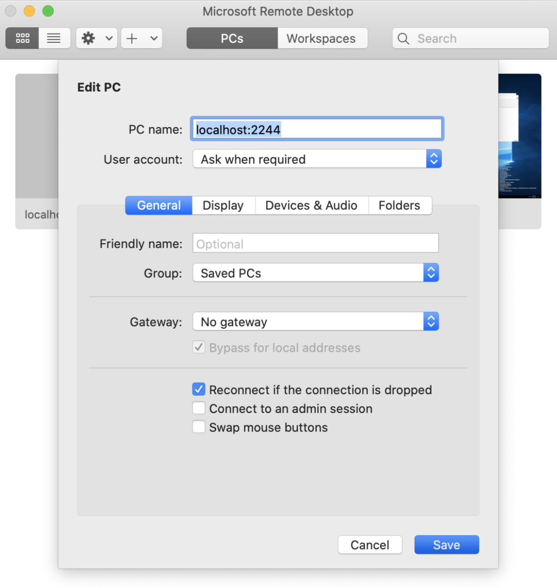

# RDP

<Aside type='warning' header='⚠️ THIS PAGE IS OUTDATED'>

We're no longer maintaining this page. **It will be deleted on Feb 8, 2021**. Please visit the new [Cloudflare for Teams documentation](https://developers.cloudflare.com/cloudflare-one/teams-docs-changes) instead.

</Aside>

<Aside>

<b>Requirements</b>

* A Cloudflare account
* An **<a href="https://support.cloudflare.com/hc/articles/201720164-Creating-a-Cloudflare-account-and-adding-a-website">active zone</a>**  on Cloudflare
* The `cloudflared` daemon installed on client machines

</Aside>

The Remote Desktop Protocol (RDP) allows end users to connect to a desktop from a different machine.

Cloudflare Access provides a mechanism for end users to authenticate with their single sign-on (SSO) provider and connect to RDP without being on a virtual private network (VPN).

You can choose to deploy the Cloudflare agent on every target desktop or deploy it once, in a bastion or jump host model, in your target environment.

This section will cover:
1. [How to connect the remote desktop to Cloudflare](#remote-desktop)
1. [How to connect from a Client machine](#client-machine)
1. [How to configure desktop shortcuts for end users](#desktop-shortcuts)

**NOTE**: If you have an origin that serves both RDP and HTTP requests, you need to place those services on separate domains or subdomains. Otherwise, errors occur when attempting to access the machine over different protocols. For example, requests made in a web browser will route over RDP and fail.

## Connect the remote desktop to Cloudflare

### 1. Install cloudflared On The Remote Machine

`cloudflared` will maintain a secure, persistent, outbound-only connection from the machine to Cloudflare. RDP traffic will be proxied over this connection using [Cloudflare Argo Tunnel](https://developers.cloudflare.com/argo-tunnel/).
1. Download and install `cloudflared` on the machine hosting the file share. If you need help, you can find the relevant instructions for your OS here.

2. Select the version depending on your architecture, 64-bit or 32-bit.

3. Place the cloudflared executable in a location accessible to the OS, for example:

```bash
C:\Cloudflared\bin\cloudflared.exe
```

4. Next, run CMD as an administrator to install the service.

```bash
C:\Cloudflared\bin\cloudflared.exe service install
```

By default, the agent will run as a Local Account service and will look for the configuration and certificate file in the systemprofile.

5. Run the following command to create a new directory within systemprofile.

```bash
mkdir C:\Windows\System32\config\systemprofile\.cloudflared
```
<Aside>

Ensure that the machine's firewall permits egress on ports `80`, `443`, and `3389`, otherwise cloudflared will return an error.
</Aside>

### 2. Authenticate `cloudflared`

  1. Run the following command to authenticate `cloudflared` into your Cloudflare account.

```bash
C:\Cloudflared\bin\cloudflared.exe login
```

  2. `cloudflared` will open a browser window where you will be asked to login to your Cloudflare account.

  If you are working on a machine that does not have a browser, or a browser window does not launch, you can copy the URL from the command-line output and visit the URL in a browser on any machine.

  3. Once you login, Cloudflare will display the applications that you added to your account. Select the site where you want to create a subdomain to represent the remote desktop.

  For example, if you plan to share the desktop at `rdp.site.com`, select `site.com` from the list.

  Each remote desktop requires a unique subdomain.

  4. The file will now download to the user profile.
  5. Copy the file to the `systemprofile` directory created previously.

```bash
copy C:\Users\%USERNAME%\.cloudflared\cert.pem C:\Windows\System32\config\systemprofile\.cloudflared
```

  6. Once selected, `cloudflared` will download a wildcard certificate for the site.

  This certificate allows `cloudflared` to create a DNS record for a subdomain of the site.

 7. Finally, `cloudflared` will use a YML file for configuration. Run `Notepad.exe` as an administrator.

  Make sure you do so as an administrator, as this file will be saved to the system directory.

```bash
hostname: rdp.site.com
url: rdp://localhost:3389
logfile: C:\Windows\System32\config\systemprofile\.cloudflared\tunnel.log
```

8. Save this file to the following location:
```bash
C:\Windows\System32\config\systemprofile\.cloudflared\config.yml`
```

### 3. Secure The Subdomain With Cloudflare Access

1. Create an [Access application](/getting-started/applications/) for the subdomain of your RDP.

For example, if you share the desktop at `rdp.site.com`, that is the subdomain you will configure for the application).

2. Build a [policy](/getting-started/policies/) to restrict user access to that subdomain.

### 4. Connect The Remote Desktop To Cloudflare

1. Confirm which port your remote desktop protocol uses.

 By default, the RDP protocol listens on port `3389`, but you can also use nonstandard ports.

2. Depending on your RDP configuration, consider one of the following options to connect:

* If you are **not using a configuration file**, you can run the following command to connect the desktop to Cloudflare, replacing the `rdp.site.com` and `445` values with your site and port.

```bash
\cloudflared.exe tunnel --hostname rdp.site.com --url rdp://localhost:3389
```

   * If you are **using an internal DNS and the target machine is running on a hostname**, you will need to modify the command to start the Tunnel without TLS verification to avoid certificate mismatches. For example, if the remote desktop server is available at `rdp.internal.com,` the following command can be run.

```sh
$ cloudflared tunnel --hostname rdp.site.com --no-tls-verify --origin-server-name rdp.internal.com --url rdp://localhost:433
```
   * If you are using the configuration file created as part of the *Authenticate cloudflared process* above, you can start the service from the Windows services panel, or run:

```bash
sc start cloudflared
```
In both operations, `cloudflared` will confirm that the connection has been established. The process needs to be configured to stay alive and autostart.

If the process is killed, end users will not be able to connect.

### 5. Bastion or jump host Models (optional)

Instead of deploying `cloudflared` on each target machine, you can deploy it once in a private subnet in the bastion or jump host model.

<Aside>

Ensure that an Access policy is in place before creating this connection, as the connection will allow lateral traffic within the subnet.
</Aside>

To do so:

1. Follow steps 1 through 3 above to configure the target bastion/jump host machine.

2. Use this configuration when establishing the tunnel:

```sh
$ cloudflared tunnel --hostname rdp.site.com --bastion
```

This command will allow everything that can be routed from cloudflared to be reachable through the Tunnel. Ensure your network is properly segmented to avoid issues.

<Aside>
The command above will allow traffic to be proxied through cloudflared and to one of many target desktops in your network. End users will need to specify the destination of the specific desktop, which is documented below.
</Aside>

3. Use this command to start an RDP listener on the client machine:

```bash
cloudflared access rdp --hostname YOURDOMAIN.domain.com --url localhost:2244 --destination rdpserver:3389
```
`rdpserver:3389` is a default value and could differ based on what was configured in your instance.

4. Now run the RDP client with the server set to `localhost:2244`:



You will then be prompted for an access login in the browser.

## Connect from a client machine

### 1. Install cloudflared On The Client Machine

Follow steps 1 through 3 above to download and install cloudflared on the client desktop that will connect to the remote desktop.
cloudflared will need to be installed on each user device that will connect.

### 2. Connect To The Remote Desktop

1. Run the following command to create a connection from the device to Cloudflare. Any available port can be specified.

```bash
\cloudflared.exe access rdp --hostname rdp.site.com --url localhost:2244
```

This command can be wrapped as a desktop shortcut so that end users do not need to use the command line.

2. Open your RDP client and configure the client to point to `localhost:2244`. Do not input the hostname.

3. When the client launches, `cloudflared` will launch a browser window and prompt the user to authenticate with your SSO provider.

### 3. Bastion or Jump Host Model (optional)

If you are deploying Cloudflare Access for RDP in a bastion or jump host model:

1. End users will need to specify the local address of the specific desktop they want to reach. In most cases, this will be the names used when connecting over RDP on a VPN.

```bash
\cloudflared.exe access rdp --hostname rdp.site.com --url localhost:2244 --destination rdpserver:3389
```

2. Next, open the RDP client on the machine.

3. Point it to `localhost:2244` and initiate the connection.

## Configuring A Desktop Shortcut

### Windows

You can help end users connect without requiring the command line by providing them with a shortcut that can be launched from the desktop.

1. Ensure that `cloudflared.exe` is installed on the end user device and available in the Windows Path.

2. Right-click on the Windows desktop and select **New > Shortcut**.

3. In the wizard that appears, paste in the following command with the hostname your team uses:

```sh
$ cloudflared access rdp --hostname monday.example.com --url localhost:2244
```
4. Click **Next** and complete the wizard.

At this point the shortcut will appear on the desktop, and users can launch with a double-click. The shortcut can then be distributed to end users along with `cloudflared`.

## Common issues

* You may get a warning indicating that the `.exe` (`cloudflared.exe`) is unknown. This can be skipped by clicking `More Info` in the dialog box and then clicking **Run Anyway**. This will only appear one time.

* Ensure that RDP is enabled on the target Windows machine. If not, you may encounter an error: `No connection could be made because the target machine actively refused it`.

### MacOS

MacOS users can save a command shortcut that will launch the RDP flow.

1. The command below can be saved as a `.command` file that can be launched on login:

```bash
var=/Applications/CF-RDP-Tunnel.command &&
echo "`which cloudflared` access rdp --hostname monday.example.com --url localhost:2244 &" > $var &&
chmod +x $var
```

2. Check that everything is successful by running the following command:

```sh
$ lsof -nP -iTCP:2244 | grep LISTEN
```
If needed, you can kill the process by running the following command:

```sh
$ sudo kill -9 [process id]
```

The command from Step 1 can then be configured to run at device login by navigating to **System Preferences > Users & Groups**.

3. Select the `+` sign.

4. Navigate to **Macintosh HD/Applications**.

5. Double click on the previously created `CF-RDP-Tunnel.command` file.

The default behavior in MacOS is for the Terminal window to stay open. You can configure it to close automatically.

<Aside>

Ensure that the machine's firewall permits egress on ports `80`, `443`, and `2244`, otherwise cloudflared will return an error.
</Aside>

## Video Guides

In this video, you’ll learn how to use Cloudflare Access to protect a Remote Desktop Protocol (RDP) connection by setting up a secure link with Argo Tunnel.

<StreamVideo id="2a3073fb7881b4fcba4b9e3709dfaacf"/>
