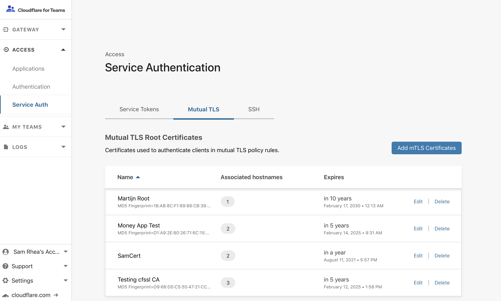

# Mutual TLS authentication

<div class="notices info">
Cloudflare Access can add mTLS to your application, but it requires a Cloudflare enterprise plan. To enforce mTLS in your application with Access, please contact your Cloudflare Customer Success Manager.
</div>

Mutual TLS (mTLS) authentication ensures that traffic is both secure and trusted in both directions between a client and server. It allows requests that do not log in with an identity provider (like IoT devices) to demonstrate that they can reach a given resource. Client certificate authentication is also a second layer of security for team members who both log in with an identity provider (IdP) and present a valid client certificate.

With a root certificate authority (CA) in place, Access only allows requests from devices with a corresponding client certificate. When a request reaches the application, Access responds with a request for the client to present a certificate. If the device fails to present the certificate, the request is not allowed to proceed. If the client does have a certificate, Access completes a key exchange to verify.


## Add mTLS authentication to your Access configuration

To enforce mTLS authentication from the Cloudflare dashboard:

1. In the Cloudflare Access dashboard, open the row titled **Service Auth** and select the tab **Mutual TLS**. Click `Add mTLS Certificate`.

    

1. Paste the content of the `ca.pem` file in the `Certificate content` field. Assign the Root CA a name and add the fully-qualified domain names (FQDN) that will use this certificate. These FQDNs will be the hostnames used for the resources being protected in the Access policy. You must associate the Root CA with the FQDN that the application being protected uses. Click `Save`.

    If your zone is using an intermediate certificate in addition to the root certificate, upload the entire chain.

1. Once saved, navigate to the section titled "Access Policies". Create a new policy that will enforce mTLS authentication. The policy must be built with a hostname that was associated in the certificate upload modal.

    Under the `Policies` section, select "Non Identity" from the drop-down for `Decision`. In the Include rule, you can pick from two options for mTLS authentication.


|Option|Result|
|---|---|
|Common Name|Only client certificates with a specific common name will be allowed to proceed.|
|Valid Certificate|Any client certificate that can authenticate with the Root CA will be allowed to proceed.|

### Test using `curl`

1. Test for the site using mTLS by attempting to `curl` the site without a client certificate.

    This `curl` command example is for the site `example.com` that has an Access policy set for `https://auth.example.com`:

    ```sh
    $ curl -sv https://auth.example.com
    ```

   Without a client certificate in the request, a “403 forbidden” response displays and the site cannot be accessed.

1. Add your client certificate information to the request:

    ```sh
    $ curl -sv https://auth.example.com --cert example.pem --key key.pem
    ```

    When the authentication process completes successfully, a `CF_Authorization Set-Cookie` header returns in the response.

### Validation

Cloudflare Access evaluates every request to your application based on your rule set. Client certificates allow request authentication when you are not using an identity provider (like IoT devices). When you use an IdP, mTLS authentication adds a second layer of security to control who can reach your application.

This is the validation workflow when you enable this Access policy:

1. Access evaluates all requests to the origin for a valid client certificate.

    The client device sends the client `“hello”`. Cloudflare Access responds with `“hello”` and a request for the client certificate.

1. The client returns a valid certificate.
1. Cloudflare Access completes the client authentication handshake against the root certificate authority and, if applicable, intermediate variables that were configured for the policy.
1. For chains, Access checks for expired certificates.

    Chain verification is applicable to certificate validation.

1. When the client certificate is trusted by the root certificate, Cloudflare Access generates a signed JSON Web Token (JWT) for the client that allows the request and subsequent requests to proceed.

If a request has no valid client certificate,  [403 Forbidden](https://support.cloudflare.com/hc//articles/115003014512#code_403) returns in the response.

### Session duration settings

By default, Cloudflare Access generates and signs a JWT for all requests that complete a successful mTLS handshake. The token is valid for the session duration configured in the Access policy. Teams can configure automated services to reuse the token in subsequent requests. When mTLS is a component of users authenticating to a service, this removes the burden of an individual completing the client certificate prompt in their browser on each request.

In some cases, particularly IoT examples, the expected behavior is that Access will force a new mTLS handshake for each request. This is when a token is not required, and you must ensure that the token expires immediately to remove the risk of reuse.

To edit session duration from the **Access** app, open the **Edit Access Policy** dialog and select  _No Duration_ from the **Session Duration** drop-down list. Cloudflare still generates a token, but the token is only valid for the lifecycle of an individual request, and is not sent in the response.