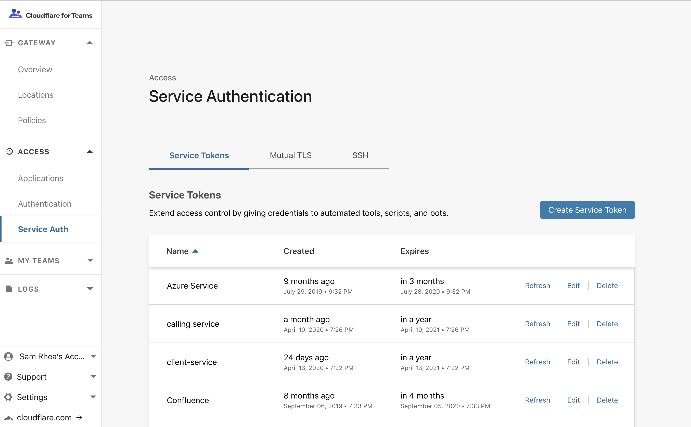
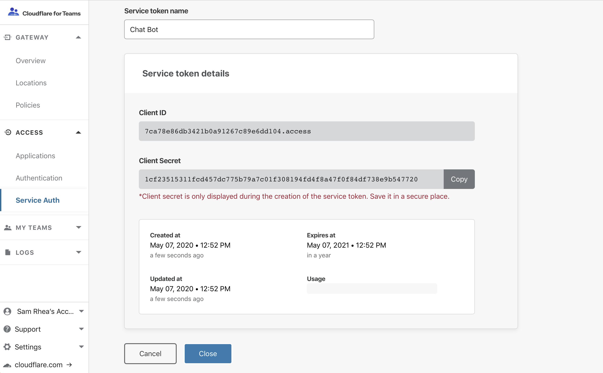

# Service Tokens

Cloudflare Access secures your application by evaluating each request for authentication. A great many users authenticate using an identity provider (IdP). For these users, Cloudflare generates a JSON Web Token (JWT) that is scoped to the applications they are authorized to access.

Cloudflare Access also supports service tokens for applications that service automated requests, such as those generated by other applications and services. Cloudflare Access service tokens or mutual TLS (mTLS) authentication are ideal for these use cases.

## Create a service token

1. In the Cloudflare for Teams dashboard, navigate to the **Access** > **Service Auth**.

1. Click the `Create Service Token` button.

  

1. Next, name the service token.
 The name allows you to easily identify events related to the token in the logs and to revoke the token individually.

  

1. Click `Generate token`.
The next page will display the generated `Client ID` and `Client Secret` for the service token.

1. Copy the `Client Secret` in this view.

  

<div class="notices info">
This is the only time Cloudflare Access will display the <b>Client Secret</b>. If you lose the <b>Client Secret</b>, you must generate a new service token.
</div>

  You can now use the service token in [non-identity policies](/setting-up-access/configuring-access-policies/).

## Renew a service token

By default, service tokens expire one year after creation. You can extend the lifecycle by navigating to the **Service Token** tab and clicking the `Refresh` button for a single token. The `Refresh` operation will extend the token's lifetime by one year from the current date.


## Configure your service for tokens

Cloudflare Access service tokens consist of a Client ID and Client Secret. When a request is made to an application behind our network, the request will submit them both to Access. If the service token is valid, Cloudflare Access generates a JWT scoped to the service. The request then proceeds, using the JWT to demonstrate its permissions to reach the application.

Cloudflare Access expects both values as headers in the request sent to the application. Name them as follows:

* `CF-Access-Client-Id: <Client ID>`
* `CF-Access-Client-Secret: <Client Secret>`

## Revoke service tokens

By default, Cloudflare Access service tokens expire one year after they’re created. If you need to revoke access earlier, simply delete the token.

To revoke a service token immediately:
1. Navigate to the **Service Tokens** page of the **Access** section of the Cloudflare for Teams dashboard.
1. Click `Delete` for the token you need to revoke and delete.


When revoking service tokens, keep in mind:

* **Services that rely on a deleted service token can no longer reach your application.**
* Clicking **Revoke Existing Tokens** when editing a policy in the **Edit Access Policy** dialog revokes existing sessions but **does not** revoke access.

As long as the Client ID and Client Secret are still valid, they can be exchanged for a new token on the next request. To revoke access, you must _delete_ the service token.

## FAQ

* **Where can a service find the `CF-Access-Client-ID` which was used to generate a JWT from a Cloudflare Access service token?**
The information is captured in the JWT payload.
The ID of the service token is stored in the `common_name` field of the JWT.

```json
{
  "aud": "32eafc7626e974616deaf0dc3ce63d7bcbed58a2731e84d06bc3cdf1b53c4228",
  "common_name": "a42834ce5e101fe5cbd1a37c2a47cf05.access.almightyzero.com",
  "exp": 1581622725,
  "iat": 1581620925,
  "iss": "https://site.cloudflareaccess.com",
  "sub": ""
}
```

* **I created a new service token, but when I try to use it in my policies, it doesn't work.**

Sometimes it takes a few minutes for a newly created token to activate. If you experience any issues in using service tokens right after you have created them, wait a few minutes and try again.