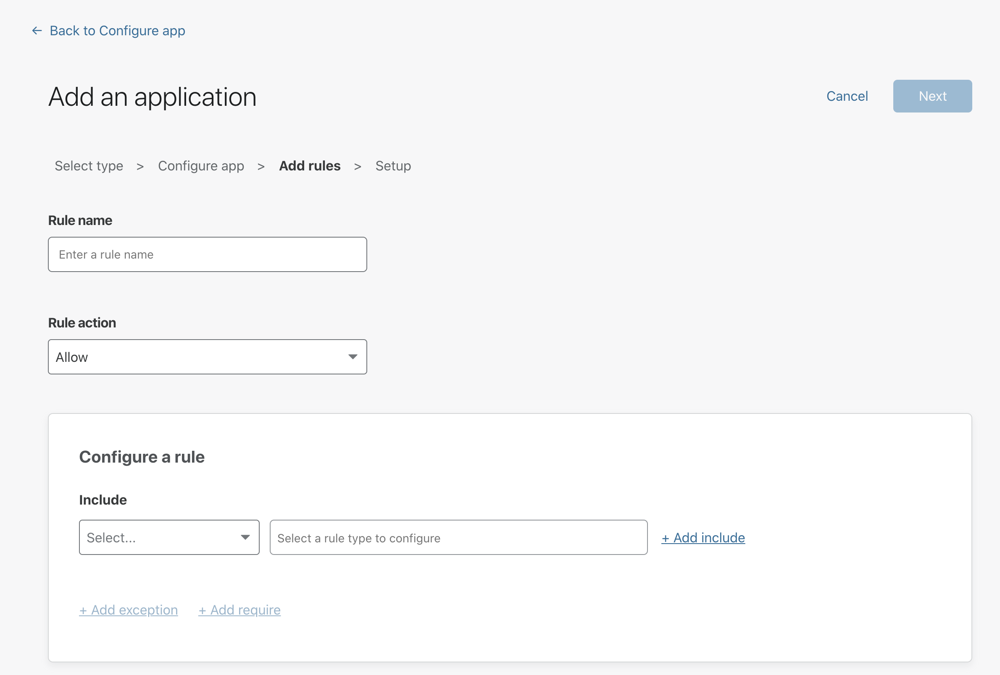

---

order: 1
---

# Connecting SaaS Applications

Cloudflare Access allows you to integrate your SaaS products by acting as an identity aggregator, or proxy. This way, we ensure that users cannot login to SaaS applications without first meeting the criteria you want to introduce. 

## 1. Add and configure your app

1. Navigate to the **Applications** tab on the Teams dashboard.

2. Click **Add an application**.

3. Select **SaaS**.

4. In the **Configure app** section, select an application from the **Application** drop-down menu.  
If your app is not listed, type its name in the textbox and select it.

5. In the **Entity ID** field, provide the unique identifier of your SaaS application. SaaS applications store this information in different ways.

6. In the **Assertion Consumer Service URL** field, input the service provider’s endpoint for receiving and parsing SAML assertions.

7. Scroll down to the **Application logo** card to choose a logo that will represent the app in the App Launcher and in the Applications page. You can either:
    * Select **Default** if you want the SaaS application’s logo to show.
    * Select **Custom** if you want to assign a custom logo to the application.

8. Next, scroll down to the **Identity Providers** card to select the identity providers you want to enable for your app.

9. Click **Next**.

## 2. Add rules for your app

The **Add rules** step lets you configure rules to control who can access your app.

1. First, specify a **Rule name**.

2. Specify a **Rule action**. By specifying an action, you define how this rule protects your application. You can set up a rule to either *block*, *allow*, or *bypass* certain users or user categories.

3. In the **Configure a rule** card, you can add rules to define which users or user categories are affected. You can add rules of the following types:
   * Include
   * Exclude
   * Require

4. Click **Next**.

4. By clicking **Next**, you will add your application to Access.

## 3. Integrate your SaaS app with Access

To begin using your application through Access, your last step is to integrate your SaaS application to Access. You can do so by configuring:

   * Your SSO endpoint
   * Your Access Entity ID or Issuer
   * Your Public key  

   with your SAML SSO-compliant application.  

   **Take note of these fields before you click `Done`**.

5. Click **Done** to see your application listed on your Applications tab.

