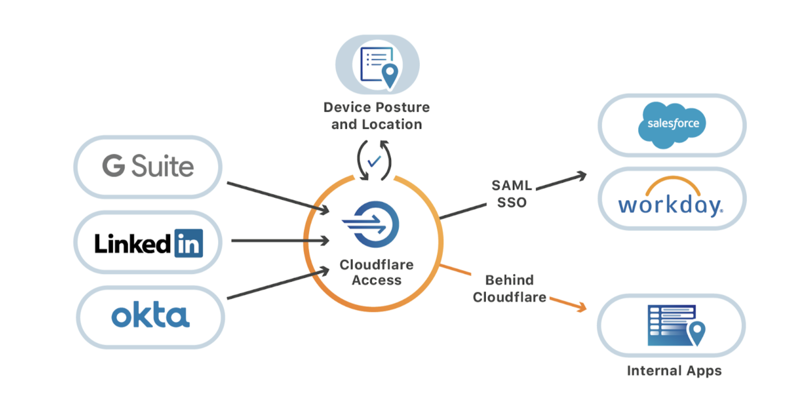

---

order: 1
hidden: true
---

# Access Applications

<Aside type='warning' header='⚠️ THIS PAGE IS OUTDATED'>

We're no longer maintaining this page. **It will be deleted on Feb 8, 2021**. Please visit the new [Cloudflare for Teams documentation](https://developers.cloudflare.com/cloudflare-one/teams-docs-changes) instead.

</Aside>

Cloudflare Access allows you to securely publish **self-hosted applications** to the Internet by providing an authentication layer using your existing identity providers to control who has access to your applications.

Cloudflare Access also allows you to integrate your **SaaS applications** by acting as an identity aggregator, or proxy. Cloudflare Access can then apply additional rules to each login or integrate multiple SSO provider types.

## How Access works with self-hosted applications

Access connects teams to their internal applications through a secure outbound connection, Argo Tunnel, which runs in your infrastructure and connects the applications and machines to Cloudflare. Tunnel makes outbound-only calls to the Cloudflare network, which allows organizations to replace complex firewall rules with just one: disable all inbound connections.

Administrators then build rules to decide who should authenticate to and reach the tools protected by Access. Whether those resources are virtual machines powering business operations or internal web applications, like Jira or iManage, when a user needs to connect, they pass through Cloudflare first.

When users request access to an internal application behind Cloudflare Access, they are prompted to authenticate with their team’s SSO. If the request is valid, the user instantly connects to the application. Access integrates with popular identity providers, like GSuite and Okta, so that you don’t have to manage a new set of credentials.

Every request made to those internal tools hits Cloudflare first, where we enforce identity-based policies. Access evaluates and logs every request to those apps for identity, giving administrators more visibility and security than a traditional VPN.

#### Secure your origin

To fully secure your application, you must ensure that no one can access your origin server directly and bypass the zero trust security checks Cloudflare Access enforces for the hostname. For example, if someone discovers an exposed external IP they can bypass Cloudflare and attack the origin directly.

The instructions below provide options for locking down the infrastructure secured by Cloudflare Access.

1. **Set up Argo Tunnel**. To defend against attackers addressing IPs directly, Argo Tunnel can help secure the interface and force outbound requests through Cloudflare Access. With Argo Tunnel, and firewall rules preventing inbound traffic, no request can reach those IPs without first hitting Cloudflare, where Access can evaluate the request for authentication. For details see _[Getting started](https://developers.cloudflare.com/argo-tunnel/quickstart/)_ in the Argo Tunnel developers documentation.

2. **Validate JSON web tokens (JWTs)**. You can use the JWT created by Cloudflare Access to validate requests on your origin. For more, see [_Validating JSON web tokens_](/setting-up-access/validate-jwt-tokens/).

3. **Restrict inbound ingress so that only connections from [Cloudflare IP ranges](https://www.cloudflare.com/ips/) are allowed**. This should be done in conjunction with validating the tokens sent by Cloudflare Access. This is not sufficient alone without JWT validation.

4. **Do not create CNAME records that points to your protected hostname**. Adding a CNAME record within your account that points to the protected hostname can allow traffic to bypass the protected hostname. This is limited to CNAME records within the account. CNAME records from other accounts will still be blocked.

## How Access works with SaaS applications
Many applications rely on a popular standard, SAML, to securely exchange identity data and user attributes between two systems. Cloudflare Access uses that relationship to force SaaS logins through Cloudflare’s network by acting as the SAML identity provider.
When users attempt to log in to the application, the application sends the user to log in with Cloudflare Access. Access then redirects the user to the identity provider, in the same way that it does when users request a site that uses Cloudflare’s reverse proxy. This way, Access can apply the additional contextual rules and log the event.

The way Access provides a standard proof of identity is by generating a JWT for every login. The JWT is then converted through Cloudflare Workers into a SAML assertion that is sent to the SaaS application. The application receiving the SAML assertion will then treat Access as the identity provider, even though it is aggregating identity signals from the user’s SSO provider and other sources into the JWT, and sending that summary to the app via SAML.

## Secure Grafana and other web applications

Just getting started? Learn how to set up Cloudflare Access to secure the popular database dashboard Grafana, with an approach that can be used to protect and provide remote access to many different applications.

<StreamVideo id="31a370fb4aac62a4f59a4b70b5aa3355"/>
