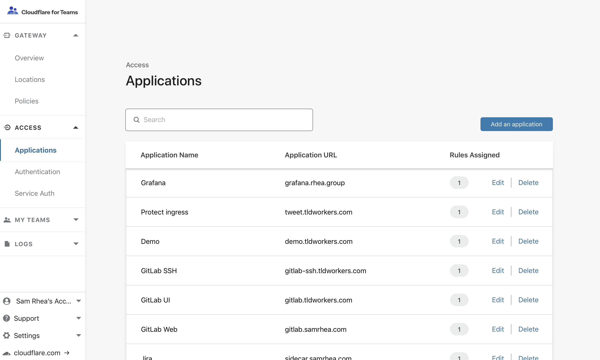
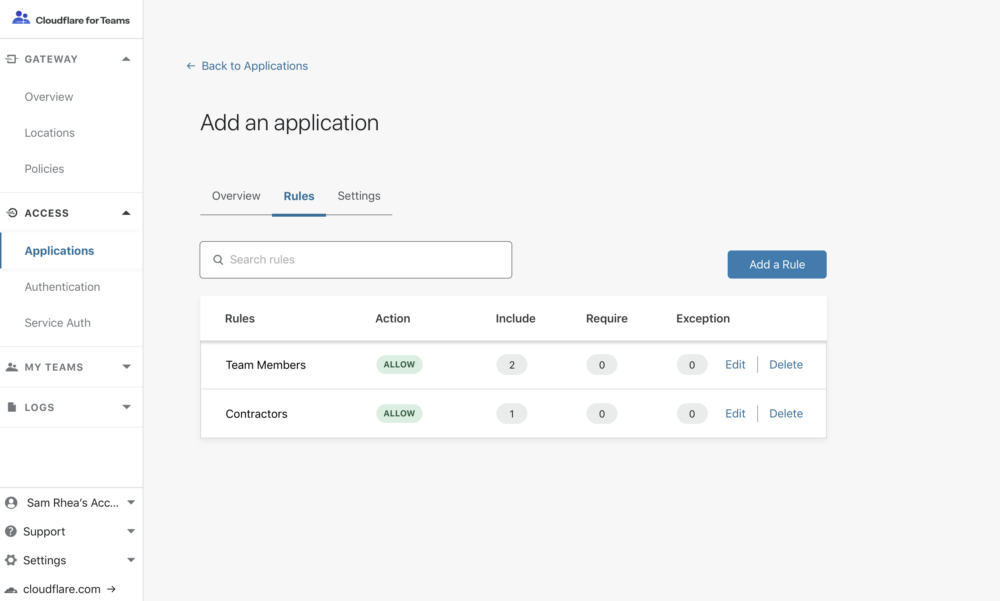

---

hidden: true
order: 1
---

# Access Applications

Cloudflare Access evaluates every request to the hostname of your application or resource.

## Secure your origin

To fully secure your application, you must ensure that no one can access your origin server directly and bypass the zero trust security checks Cloudflare Access enforces for the hostname. For example, if someone discovers an exposed external IP they can bypass Cloudflare and attack the origin directly.

The instructions below provide options for locking down the infrastructure secured by Cloudflare Access.

#### 1. Set up Argo Tunnel
To defend against attackers addressing IPs directly, Argo Tunnel can help secure the interface and force outbound requests through Cloudflare Access. With Argo Tunnel, and firewall rules preventing inbound traffic, no request can reach those IPs without first hitting Cloudflare, where Access can evaluate the request for authentication.

Argo Tunnel runs in your infrastructure to connect the applications and machines to Cloudflare. That tunnel makes outbound-only calls to the Cloudflare network and organizations can replace complex firewall rules with just one: disable all inbound connections.

For details see _[Getting started](https://developers.cloudflare.com/argo-tunnel/quickstart/)_ in the Argo Tunnel developers documentation.

#### 2. Validate JSON web tokens (JWTs)

You can use the JWT created by Cloudflare Access to validate requests on your origin.

For more, see [_Validating JSON web tokens_](/setting-up-access/validate-jwt-tokens/).

Restrict inbound ingress so that only connections from [Cloudflare IP ranges](https://www.cloudflare.com/ips/) are allowed. This should be done in conjunction with validating the tokens sent by Cloudflare Access. This is not sufficient alone without JWT validation.

#### 3. Do not create CNAME records that points to your protected hostname
Adding a CNAME record within your account that points to the protected hostname can allow traffic to bypass the protected hostname. This is limited to CNAME records within the account. CNAME records from other accounts will still be blocked.

## Configure Cloudflare Access

Cloudflare Access secures applications using rules built around the application's hostname. For example, you can deploy self-managed GitLab as a subdomain of a hostname that you control, `gitlab.hostname.com` and build rules to control who can reach the subdomain. You can also build broad rules by protecting any subdomain of a hostname you control, or more specific rules that protect specific paths.

To use Cloudflare Access, you must have at least one registered domain name using Cloudflare's authoritative DNS. Domains can be added in Cloudflare's infrastructure dashboard. A [guided walk-through](/videos/using-cloudflare/) is available.

Once a hostname has been added, you can begin to deploy applications as subdomains of that hostname and create Cloudflare Access policies to secure them.

> **⚠️ Create policies first** It is important to build policies before connecting your application to ensure they are protected by Cloudflare Access when they come online.

1. Open the **Access** section of the navigation bar in the Cloudflare for Teams dashboard and select **Applications**. Click the button `Add an application`.

    

1. Name the application and set a session duration. The session duration will determine the minimum frequency a user will be prompted to authenticate with the configured provider.

    

1. You can build a rule that applies to a specific subdomain, wildcards of subdomains, or a path. Select the dropdown menu to load the hostnames active in your Cloudflare account. Choose the hostname that will represent the application.

1. Select the **Rules** tab to create rules that will apply to the URL defined in the **Overview** tab in the step prior. Click `Add a rule` to get started.

    

1. Name the rule and determine the action it will take in the **Rule action** dropdown. Once a rule is added, Cloudflare Access will block requests that do not meet the criteria. You do not need to explicitly create a rule the deny everyone.

    

1. In the configuration section, determine the users or services that will be able to meet the rule action defined above. For example, if the rule action is `Allow`, and you include emails ending in `@team.com`, only users who authenticate as `team.com` will reach the application.

    You can build exceptions to these rules, as well as requirements that can force additional checks. For example, if you want to include users in `team.com` and require that they also use a trusted device. More detailed information on rule structure is available in the [Configuring Access policies page](/setting-up-access/configuring-access-policies/).

1. You can build multiple policies within an application. Cloudflare Access will enforce these in the order they appear in the UI, starting with the top-most policy. The only exception are bypass policies, which are enforced first.

    

1. Save the application and test the user flow to confirm the application work as expected.

## Secure Grafana and other web applications

Just getting started? Learn how to set up Cloudflare Access to secure the popular database dashboard Grafana, with an approach that can be used to protect and provide remote access to many different applications.

<StreamVideo id="31a370fb4aac62a4f59a4b70b5aa3355"/>
