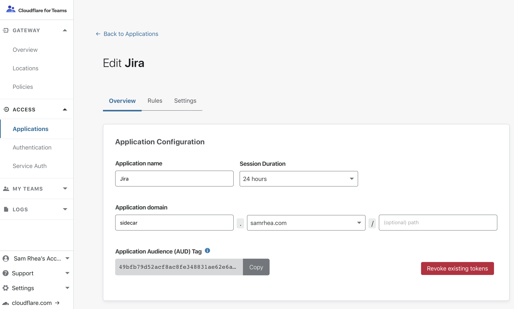

# Revoke user sessions

<Aside type='warning' header='⚠️ THIS PAGE IS OUTDATED'>

We're no longer maintaining this page. **It will be deleted on Feb 8, 2021**. Please visit the new [Cloudflare for Teams documentation](https://developers.cloudflare.com/cloudflare-one/teams-docs-changes) instead.

</Aside>

Access provides two options for revoking user sessions: per-application and per-user.

The authentication process involves Cloudflare Access issuing a signed JSON Web Token (JWT) when a user authenticates and meets the criteria defined in your Access application policy. The token is valid for the duration configured in the application (default is 24 hours). The user can access the application for the entire duration of that token’s lifecycle without re-authenticating until the session expires.

## Per-Application

You can immediately terminate all active sessions for a specific application by navigating to the Access policy configuration screen for the application, and clicking **Revoke Existing Tokens**.

Unless there are changes to rules in the policy, users can generate a new token during authentication if their profile in your identity provider is still active.

## Per-User

Access can immediately revoke a single user session across all applications in your account. Once revoked, the user cannot reach any application path protected by Access. However, if the user’s identity profile is still active, they can generate a new session.

If you want to permanently revoke a user access, first disable their account in your IdP so that they cannot authenticate, then revoke their Access user session.

Navigate to the **User** row in the **Logs** section of the Cloudflare for Teams dashboard. Users who have authenticated in the current calendar month will be displayed. Search for or select the user you need to revoke.

Click `Revoke session` and confirm.

## Subsequent Logins

When administrators revoke a user's Cloudflare Access token, that user will not be able to login again for up to 1 minute. If they attempt to do so, Cloudflare Access will display an error.