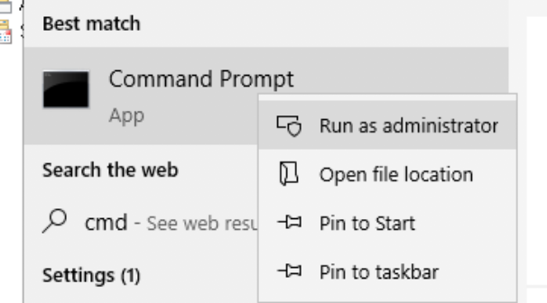

# Windows Deployments

Cloudflare Access can serve applications that run on Windows systems without requiring administrators to open firewall ports to the Internet.

## Cloudflare Argo Tunnel

Cloudflare [Argo Tunnel](https://www.cloudflare.com/products/argo-tunnel/) secures servers from direct attack by creating outbound-only connections to the Cloudflare network. Argo Tunnel relies on a lightweight daemon, `cloudflared`, that runs in your environment to establish that connection.

## Connect the server to Cloudflare

You can connect a Windows server to Cloudflare using Argo Tunnel. Alternatively, a DNS record can point requests to an external IP of the server, but will need to verify the JSON Web Token (JWT) sent by Access to ensure attacks do not connect to an exposed IP directly.

### 1. Install the Cloudflare daemon on the remote machine

The Cloudflare daemon, `cloudflared`, will maintain a secure, persistent, outbound-only connection from the machine to Cloudflare.

Follow [these instructions](https://developers.cloudflare.com/argo-tunnel/downloads/) to download and install `cloudflared` on the machine hosting the Windows server. Select the version depending on your architecture, 64-bit or 32-bit.

Place the `cloudflared` executable in a location accessible to the OS, for example:

```bash
C:\Cloudflared\bin\cloudflared.exe
```

Next, run CMD as an administrator to install the service.



```bash
C:\Cloudflared\bin\cloudflared.exe service install
```

By default, the agent will run as a Local Account service and will look for the configuration and certificate file in the `systemprofile`. Run the following command to create a new directory within `systemprofile`.

```bash
mkdir C:\Windows\System32\config\systemprofile\.cloudflared
```

### 2. Authenticate the Cloudflare daemon

Run the following command to authenticate `cloudflared` into your Cloudflare account.

```bash
C:\Cloudflared\bin\cloudflared.exe login
```

`cloudflared` will open a browser window and prompt you to login to your Cloudflare account. If you are working on a machine that does not have a browser, or a browser window does not launch, you can copy the URL from the command-line output and visit the URL in a browser on any machine.

Once you login, Cloudflare will display the sites that you added to your account. Select the site where you will create a subdomain to represent the remote desktop. For example, if you plan to share the desktop at `app.site.com`, select `site.com` from the list. Each remote desktop requires a unique subdomain.

The file will download to the user profile. This must be copied to the `systemprofile` directory created previously.

```bash
copy C:\Users\%USERNAME%\.cloudflared\cert.pem C:\Windows\System32\config\systemprofile\.cloudflared
```

Once selected, `cloudflared` will download a wildcard certificate for the site. This certificate will allow `cloudflared` to create a DNS record for a subdomain of the site.

Finally, `cloudflared` will use a YML file for configuration. Run `Notepad.exe` as an administrator. This must be done as an administrator since this file will be saved to the system directory.

```bash
hostname: app.site.com
url: localhost:80
logfile: C:\Windows\System32\config\systemprofile\.cloudflared\tunnel.log
```

Save this file to the following location.

```
C:\Windows\System32\config\systemprofile\.cloudflared\config.yml`
```

### Common issues

* Windows hides extensions, which can sometimes result in a configuration field appending an extra `.txt` extension. For example, the `config.yml` file might be `config.yml.txt` according to the service. This happens by default when Notepad is used to edit any file. Please ensure this is not present.