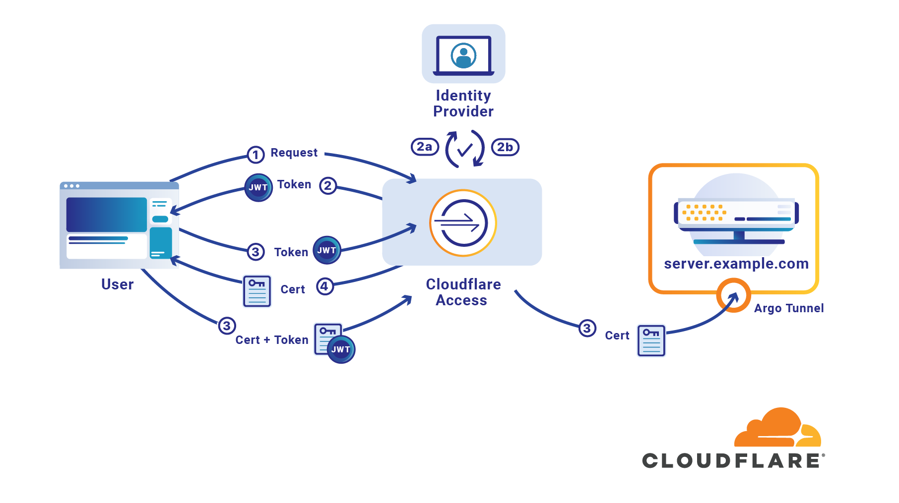
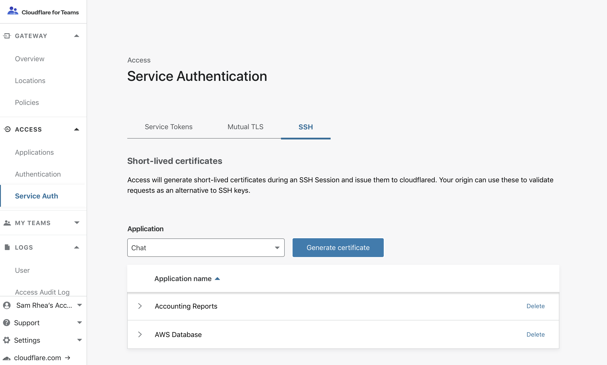

# Short-Lived Certificates

Cloudflare Access can replace traditional SSH key models with short-lived certificates issued to your users based on the token generated by their Access login.

Access short-lived certificates replace legacy public key authentication flows in SSH access. In traditional models, users generate a keypair and commit their public key into an infrastructure management tool, like [Salt](https://github.com/saltstack/salt), or otherwise upload it to an administrator. Cloudflare Access removes that burden on the end user while also improving security of access to infrastructure with ephemeral certificates.

## Background

Cloudflare Access uses the concept of an “application” to represent a resource you protect behind Access. An application consists of a hostname, typically a subdomain that you generate, used to reach the target resource. Access then generates a public key signed by Cloudflare. It then scopes this key to your application.



When you authenticate to a resource over SSH, you use `cloudflared`. You are prompted to login with your identity provider IdP). Once Cloudflare completes the authentication process, Access checks your identity credentials against the policy configured for that application. If you are permitted to reach the resource, Access generates a JSON Web Token ([JWT](https://blog.cloudflare.com/give-your-automated-services-credentials-with-access-service-tokens/)) signed by Cloudflare and scoped to the user and application, distributes that token to your device through `cloudflared`, and stores it locally.

Then `cloudflared` generates a key pair with the JWT and sends a request with the application public key to a certificate-signing endpoint. Access validates the key pair and generates an ephemeral certificate it returns to the client.  `cloudflared` then initiates the SSH session with that short-lived certificate. These steps are entirely transparent and require no unique SSH commands, wrappers, or flags.


On the server, administrators save their public key as a `TrustedUserCAKeys` file in their `SSHD` configuration. When the server receives the request, it validates the short-lived certificate against that public key and, if authentic, authorizes the user identity to a matching Unix user.

## Advantages over legacy models

* **Organizational control of keys to infrastructure.** Instead of user-generated certificates securing core resources, Access issues short-lived certificates based on a login with your SSO identity provider.

* **Limited certificate lifespan of minutes, not years.** In most organizations, a user generates a public key that remains unchanged for years.

* **Lower risk levels in the event of device loss or compromise.** A stolen device can still contain SSH keys that permit infrastructure access. Unless the infrastructure is protected by a password, a malicious user can exploit that vulnerability before an organization has time to revoke both the user identity login and the user-generated SSH key.

* **Consolidated access control and offboarding or revocation.** Cloudflare Access controls who can reach sensitive resources using your SSO identity provider. When users authenticate with your identity provider, Access generates a JWT scoped to the user and the application.

* **Comprehensive audit logs.** Regardless of your infrastructure, whether on-premisses, hybrid, or public cloud, administrators can control who can reach what environments in a single place. Audit logs are collected by Cloudflare Access and standardized across any protected resources. These logs let administrators know who accessed what and when.

### How can it be configured?
#### 1. Secure a Server behind Cloudflare Access
To protect a resource behind Cloudflare Access, first follow the instructions [here](/ssh/ssh-guide/) to secure the server.

#### 2. Generate a Short-Lived Certificate Public Key
In the Access section of the Cloudflare for Teams dashboard, navigate to the **Service Auth** row. In the drop-down, choose the application that represents the resource you secured in Step 1.



Click "Generate certificate" and a row will appear with a public key scoped to your application. Save the key or keep it somewhere convenient for configuring your server.


You can return to copy the public key any time in the dashboard card.

#### 3. Ensure Unix Usernames Match User SSO Identities
Cloudflare Access will take the identity from a token and, using short-lived certificates, authorize the user on the target infrastructure. Access matches based on the identity that precedes an email domain.

For example, if the user's identity in your Okta or GSuite provider is "jdoe@example.com" then Access will look to match that identity to the Unix user "jdoe".

For testing purposes, you can run the following command to generate a Unix user on the machine:

```sh
$ sudo adduser jdoe
```

#### 4. Save your Public Key
Save the public key generated from the dashboard in Step 2 as a new `.pub` file in your system. Use the following command to change directories to the SSH configuration directory on the machine.

```sh
$ cd /etc/ssh
```

Once there, you can use the following command to both generate the file and open a text editor to input the public key.

```sh
$ vim ca.pub
```

In the `ca.pub` file, paste the public key generated in Access without any modifications. Save the file. In some systems, you may need to use the following command to force the file to save depending on your permissions.

```bash
:w !sudo tee %
:q!
```

#### 5. Modify your SSHD Config
Cloudflare Access requires two changes to the `SSHD` config file used on the target machine. The first change requires that you uncomment a field already set in most default configurations; the second change adds a new field.

While staying within the "/etc/ssh" directory, open the ``"sshd_config"`` file.

```sh
$ vim /etc/ssh/sshd_config
```

Navigate to the row named "PubkeyAuthentication". In most default configurations, the row will appear uncommented as follows.

```bash
# PubkeyAuthentication yes
```

Remove the # symbol to uncomment the line; keep the setting "yes" enabled.

Next, add a new line below "PubkeyAuthentication" as follows:

```bash
TrustedUserCAKeys /etc/ssh/ca.pub
```

The change above will tell your SSH configuration to use the public key saved in Step 5 for authorizing users. Save the file and quit the editor. You might need to use the following command again to save and exit.

```bash
:w !sudo tee %
:q!
```

#### 6. Restart your SSH Server
Once you have modified your `SSHD` configuration, you still need to restart the SSH service on the machine. Commands are provided below that cover servers running `systemd`, as well. You can execute both.

```sh
$ sudo service ssh restart
$ sudo systemctl restart ssh
```

#### 7. Configure your Client SSH Config
On the client side, follow the instructions [here](/ssh/ssh-guide/) to configure your device to use Cloudflare Access to reach the protected machine. To use short-lived certificates, you must include the following settings in your SSH config file.

```bash
Host vm.example.com
    ProxyCommand bash -c '/usr/local/bin/cloudflared access ssh-gen --hostname %h; ssh -tt %r@cfpipe-vm.example.com >&2 <&1'

Host cfpipe-vm.example.com
    HostName vm.example.com
    ProxyCommand /usr/local/bin/cloudflared access ssh --hostname %h
    IdentityFile ~/.cloudflared/vm.example.com-cf_key
    CertificateFile ~/.cloudflared/vm.example.com-cf_key-cert.pub
```

You can save time by printing the configuration required for your specific instance with the following `cloudflared` command.

```sh
$ cloudflared access ssh-config --hostname vm.example.com --short-lived-cert
```
