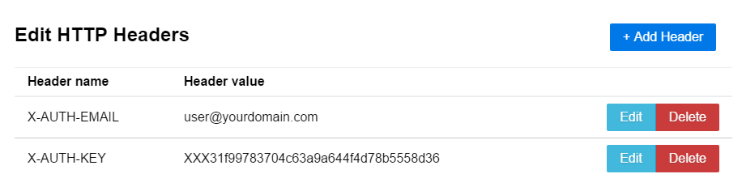

# Authenticate with a Cloudflare API key

API keys are unique to each Cloudflare user and used only for authentication. An API key does not authorize access to accounts or zones. To ensure that the GraphQL Analytics API authenticates your queries, retrieve your Cloudflare Global API Key.

* Learn how to [find your API Key](https://support.cloudflare.com/hc/articles/200167836) in the Cloudflare Dashboard
* Learn how to [retrieve your API Key](https://api.cloudflare.com/#getting-started-requests) using the Cloudflare API

## Edit HTTP headers for GraphiQL authentication

1. Launch _GraphiQL_

2. Click **Edit HTTP Headers**
   
   The _Edit HTTP Headers_ window appears.
   

3. Click **Add Header**
   

4. Enter **X-AUTH-EMAIL** in the _Header name_ field and your email address registered with Cloudflare in the _Header value_ field, and click **Save**

5. Click **Add Header**

6. Enter **X-AUTH-KEY** in the _Header Name_ field, then paste your Global API Key in the _Header value_ field, and click **Save**
   

7. Click anywhere outside the _Edit HTTP Headers_ window in _GraphiQL_ to return to the _Untitled Query 1_ tab

8. Enter `https://api.cloudflare.com/client/v4/graphql` in the _GraphQL Endpoint_ field
   

<Aside type='note' header='Note'>

The right-side response pane is empty when you enter your information correctly. An error displays when there are problems with your header credentials.

</Aside>

Now that you have configured authentication with a Cloudflare API key, you are ready to run queries using _GraphiQL_.
