# Configure an Analytics API token

Cloudflare recommends API tokens as the preferred authentication method with Cloudflare APIs. This article walks through creating API tokens for authentication to the GraphQL Analytics API.

For more detail on API tokens and the full range of supported options, see [_Creating API tokens_](https://developers.cloudflare.com/api/tokens/create).

To create an API token for authentication to the GraphQL Analytics API, use this workflow:

* [Access the Create API Token page](#access-the-create-api-token-page)
* [Configure a custom API token](#configure-a-custom-api-token)
* [Review and create your API token](#review-and-create-your-api-token)
* [Copy and test your API token](#copy-and-test-your-api-token)

## Access the Create API Token page

To access the **Create Custom Token** page, follow these steps:

1. Log in to your Cloudflare account and select _My Profile_ from the user account drop-down list.

  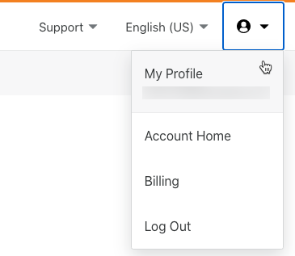

1. In your user profile page, select the **API Tokens** tab.

1. In the **API Tokens** page, click **Create Token**.

  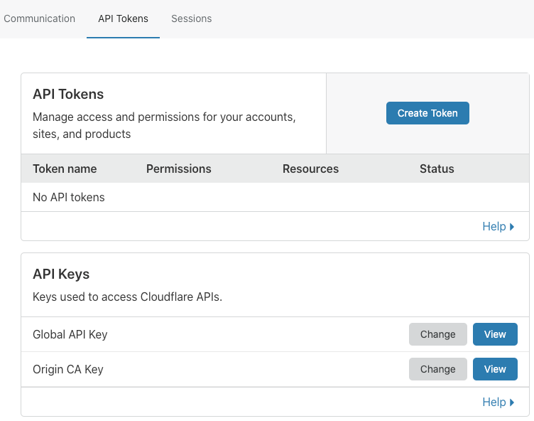

  The **Create API Token** page displays.

  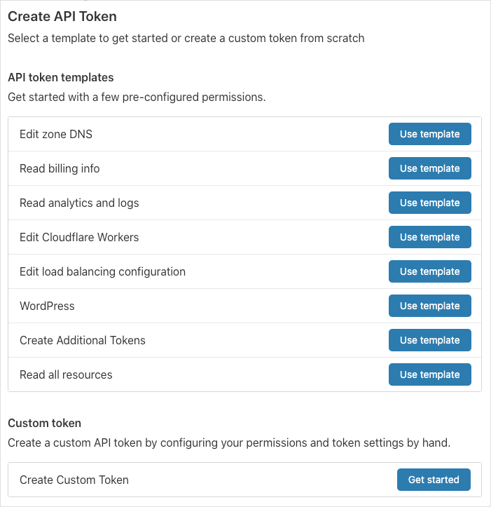

The next section of this walkthrough shows you how to [configure a custom token](#configure-a-custom-token) for access to the GraphQL Analytics API.

## Configure a custom API token

To configure a custom token, follow these steps:

1. Click **Get started** in the **Custom token** section of the  **Create API Token** page:

  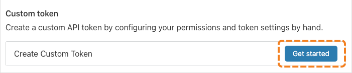

  The **Create Custom Token** page displays:

  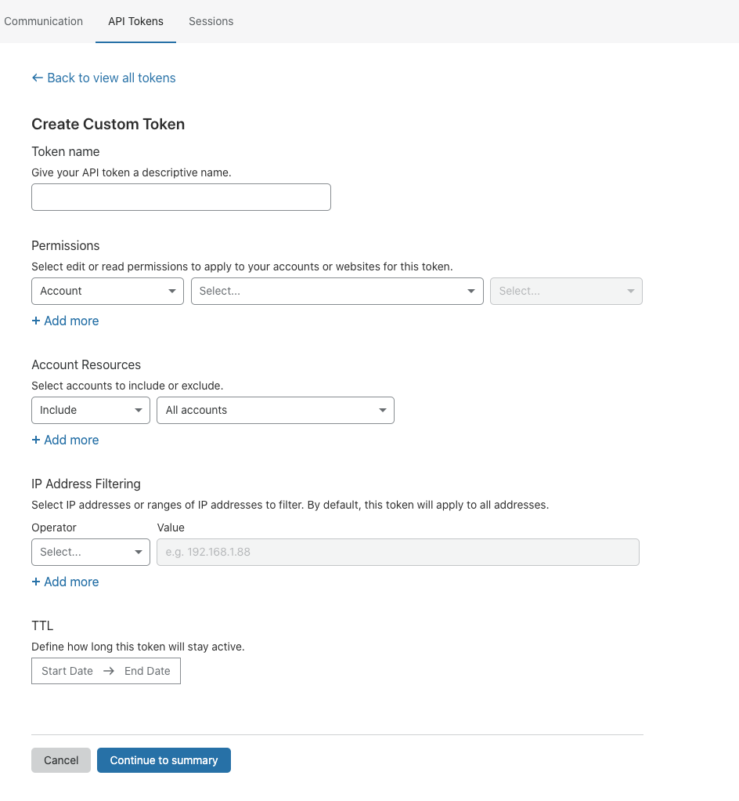

1. Use the **Token name** text input to enter a descriptive name for your token.

1. To configure access to the GraphQL Analytics API, use the **Permissions** drop-down lists. To set permissions for the GraphQL Analytics API, select _Analytics_ from the second drop-down list.

  This example scopes zone-level permissions for read access to the Analytics API:

  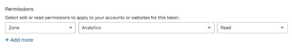

1. To configure the specific zones to which the token grants access, use the **Resources** drop-down lists. In this example, the token is set to grant access to all zones:

  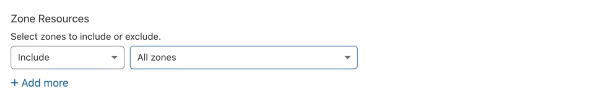

1. [Optional] To restrict the API token to specific IP addresses, use the **IP Address Filtering** controls.

  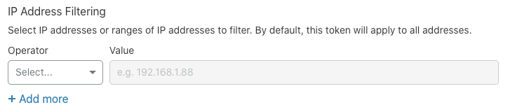

1. To define how long the token is valid, click the **TTL** (time-to-live) start/end date picker.

  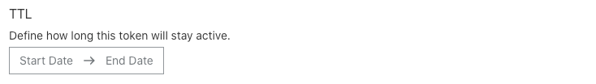

1. Click **Continue to summary**.

The next section of this walk through shows you how to [review and test your API token](#review-and-test-your-api-token).

## Review and create your API token

Once you click _Continue to summary_, the **API Token Summary** page displays.

Use the **API Token Summary** to confirm that you have scoped the API Token to the desired permissions and resources before creating it.

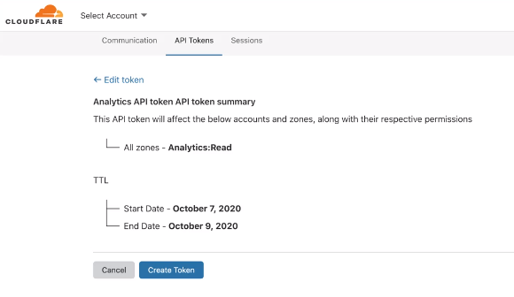

Once you have validated your API token configuration, click **Create Token**.

## Copy and test your API token

When you create a new token, a confirmation page displays that includes your token and a custom `curl` command.

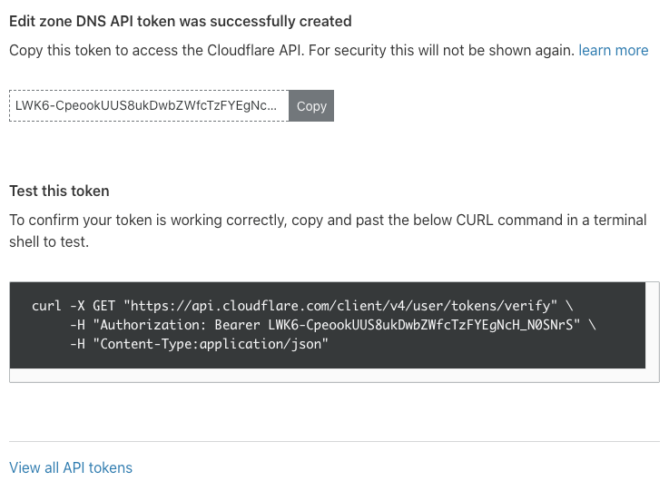

To copy the token to your device's clipboard, click the **Copy** button.  

<Aside type='note' header='Note'>

The confirmation page is the only time that you can see the token, so make sure you store it safely, since anyone who has token can use it to access your data.

If you lose the secret, you can [regenerate the token from the API Tokens page](https://support.cloudflare.com/hc/en-us/articles/200167836-Managing-API-Tokens-and-Keys#12345681), so that you do not have to configure all the permissions again.

</Aside>

To test your token, copy the `curl` command and paste it into a terminal.

When you have finished, click **View all API tokens**.
