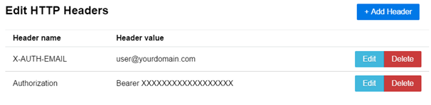

# Configure GraphQL client endpoint and HTTP headers

1. Launch _GraphiQL_.
1. Click **Edit HTTP Headers**.
   
   The _Edit HTTP Headers_ window appears.
   
1. Click **Add Header**.
   
1. Enter **X-AUTH-EMAIL** in the _Header name_ field and your email address registered with Cloudflare in the _Header value_ field, and click **Save**.
1. To configure authentication, click **Add Header**. You can use Cloudflare Analytics API token authentication (recommended) or Cloudflare API key authentication.
   * **Token authentication**:
   Enter **Authorization** in the _Header Name_ field, and enter **Bearer {your-analytics-token}**  in the _Header value_ field, then click **Save**.
   
   * **Key authentication**:
   Enter **X-AUTH-KEY** in the _Header Name_ field, and paste your Global API Key in the _Header value_ field, then click **Save**.
   
1. Click anywhere outside the _Edit HTTP Headers_ window in _GraphiQL_ to close it and return to the main _GraphiQL_ display.
1. Enter `https://api.cloudflare.com/client/v4/graphql` in the _GraphQL Endpoint_ field
   

<Aside type='note' header='Note'>

The right-side response pane is empty when you enter your information correctly. An error displays when there are problems with your header credentials.

</Aside>

Now that you have configured authentication with a Cloudflare API key, you are ready to run queries using _GraphiQL_.
