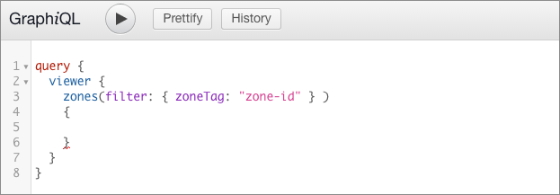
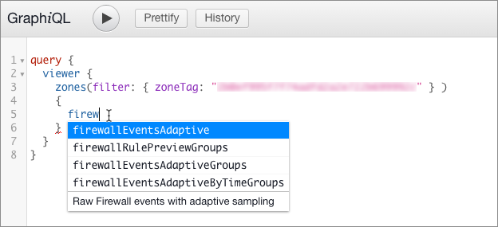
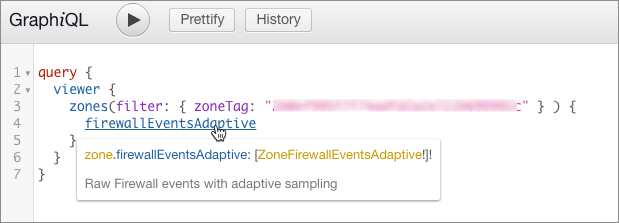
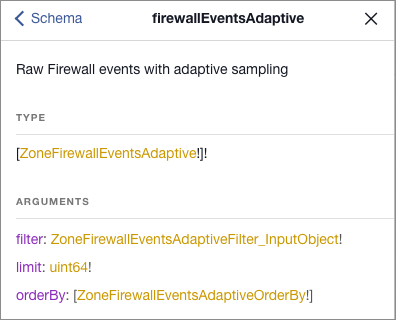
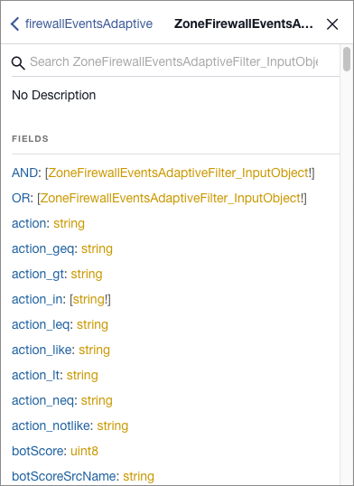
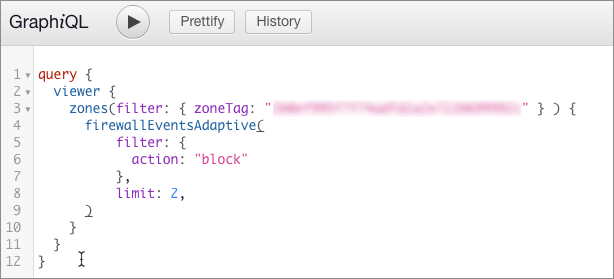
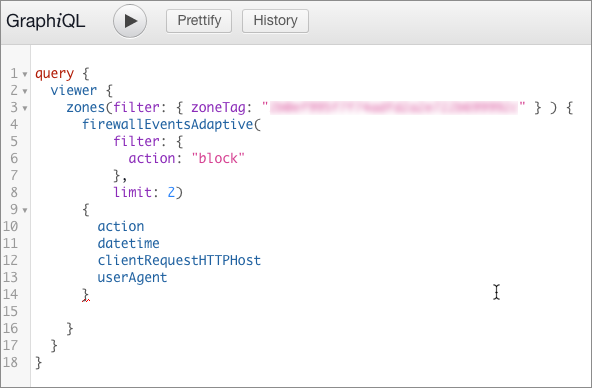
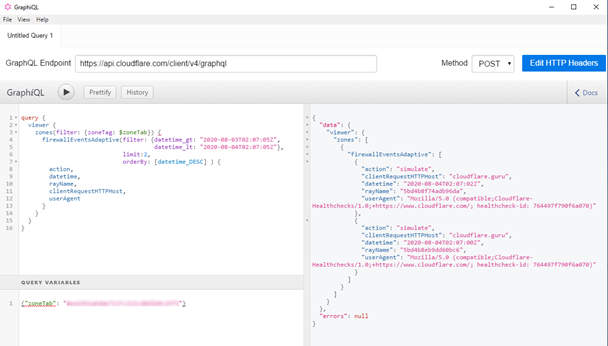
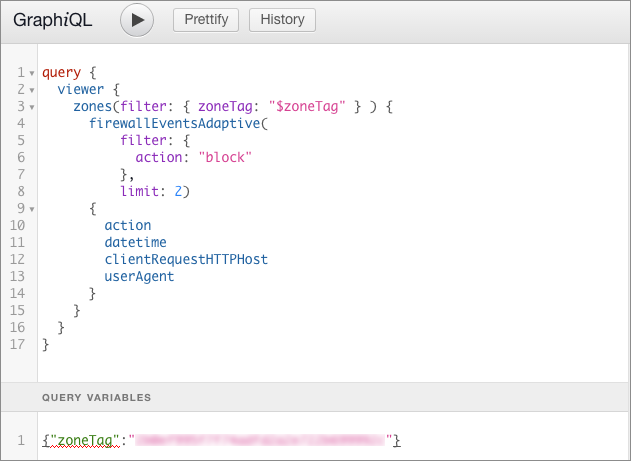

# Create a query in GraphiQL

You can use a GraphQL client to build and execute queries to the GraphQL API endpoint. The example below uses the [GraphiQL](https://github.com/graphql/graphiql/tree/main/packages/graphiql#readme) client.

## Prerequisites

This article assumes that you are already familiar with [_Querying basics_](/graphql-api/getting-started/querying-basics).

Before you begin, [configure the API endpoint and HTTP headers](/graphql-api/getting-started/authentication/graphql-client-headers) in the GraphiQL client.

<Aside type='tip' header='Tip'>

To explore the documentation for the data sets and fields in the Cloudflare GraphQL schema, click **Docs** to open the _Documentation Explorer_ pane.

For an introduction, see [Explore the GraphQL schema](/graphql-api/getting-started/explore-graphql-schema).

</Aside>

## Set up a query and choose a data set

Click on the editing pane of GraphiQL and add this base query, replacing `zone-id` with your Cloudflare zone ID:



<Aside type='tip' header='Tip'>

To find the ID for a zone, log in to your Cloudflare account and click the site for which you want to obtain the zone ID. In the Cloudflare dashboard **Overview** page, scroll to the **API** section in the right sidebar, which displays your zone ID and account ID.

</Aside>

To assist query building, the GraphiQL client has word completion. Insert your cursor in the query, in this case on the line below `zones`, and start entering a value to engage the feature. For example, when you type `firewall`, a popup menu displays the data sets that return firewall information:



The text at the bottom of the list displays a short description of the data that the node returns.

Select the data set you want to query and insert it. Either click the item in the list, or scroll using arrow keys and press <kbd>Return</kbd>. This example uses the `firewallEventsAdaptive` data set.

## Supply required parameters

Hover your mouse over a field to display a tooltip that describes the data set. In this example, hovering over the `firewallEventsAdaptive` node displays this description:



To display information about the data set, including required parameters, click the data set name (blue text). The **Documentation Explorer** opens and displays details about the data set:



Note that the `filter` and `limit` arguments are required, as indicated by the exclamation mark (`!`) after their type definitions (gold text). In this example, the `orderBy` argument is not required, though when used it requires a value of type `ZoneFirewallEventsAdaptiveOrderBy`.

To browse a list of supported filter fields, click the filter type definition (gold text) in the Documentation Explorer. In this example, the type is `ZoneFirewallEventsAdaptiveFilter_InputObject`:



This example query shows the required `filter` and `limit` arguments for `firewallEventsAdaptive`:



## Define the fields to return with your query

To browse the fields you can return with your query, hover your cursor over the dataset name in your query, and in the tooltip that displays, click the data type definition (gold text):


**The Documentation Explorer** opens and displays a list of fields:


To add the data fields that you want to display, type an opening brace (`{`) after the closing parenthesis for the parameters, then start typing the name of a field that you want to fetch. Use word completion to choose a field.

This example query returns the `action`, `datetime`, `clientRequestHTTPHost`, and `userAgent` fields:



Once you have entered all the fields you want your query to return, click the **Play** button to submit the query. The response pane contains the data fetched from the Cloudflare GraphQL API endpoint.



## Variable substitution

The GraphiQL client allows you to create variables for use in your queries.

To add a query variable, click the **Query Variables** pane and enter a JSON object that defines  your variable.

This example JSON object defines a query variable for a zone ID:

```json
{"zoneTag":"xxxxxxxxx"}
```

To use a variable in your query, prepend the `$` character to your variable name and use it to replace the desired value. When using a variable as a value in a query, do not wrap the variable in quotes as you would for a literal value.

This example query uses the `zoneTag` query variable to represent the zone ID:


